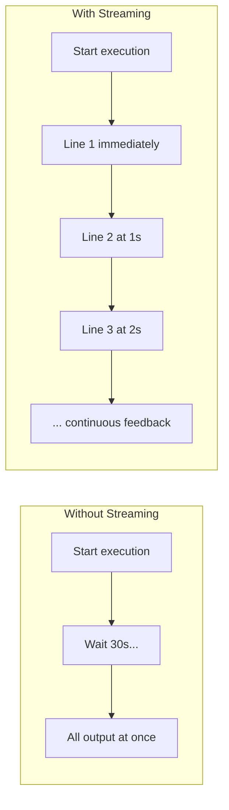
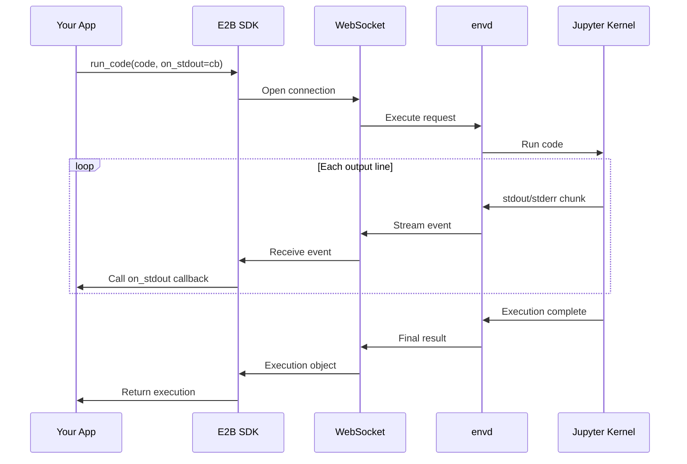
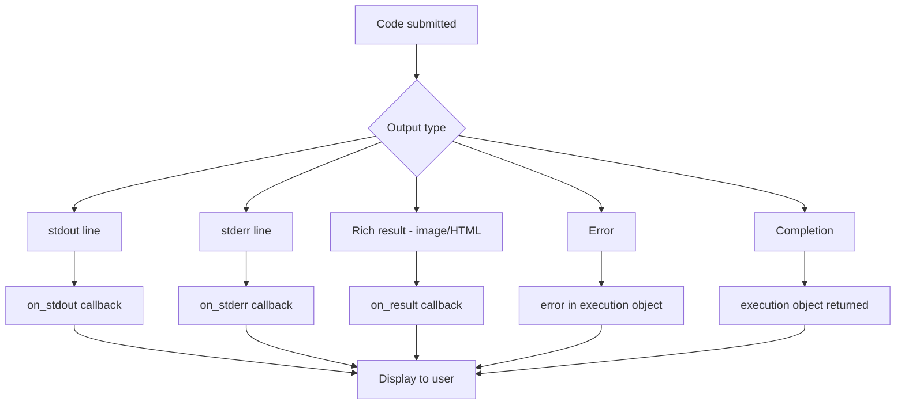

# Chapter 7: Streaming and Real-time Output

Welcome to **Chapter 7: Streaming and Real-time Output**. This chapter covers how to get live output from sandbox executions --- essential for interactive applications, long-running computations, and real-time agent feedback loops.

## Learning Goals

- stream stdout and stderr from code execution in real time
- handle streaming output from background processes
- build real-time execution UIs with E2B
- combine streaming with agent frameworks for live feedback

## Why Streaming Matters

Without streaming, your application waits until execution finishes before showing any output. For a 30-second data processing job, that means 30 seconds of silence followed by a wall of text.



## Streaming Code Execution Output

### Python SDK --- Streaming

```python
from e2b_code_interpreter import Sandbox

with Sandbox() as sandbox:
    execution = sandbox.run_code(
        """
import time
import sys

for i in range(10):
    print(f"Processing batch {i+1}/10...")
    sys.stdout.flush()
    time.sleep(0.5)

print("All batches complete!")
        """,
        on_stdout=lambda output: print(f"[LIVE] {output.line}"),
        on_stderr=lambda output: print(f"[ERR]  {output.line}"),
    )

    print(f"\nFinal result: {execution.text}")
```

### TypeScript SDK --- Streaming

```typescript
import { Sandbox } from '@e2b/code-interpreter';

async function main() {
  const sandbox = await Sandbox.create();

  const execution = await sandbox.runCode(
    `
import time
import sys

for i in range(10):
    print(f"Processing batch {i+1}/10...")
    sys.stdout.flush()
    time.sleep(0.5)

print("All batches complete!")
    `,
    {
      onStdout: (output) => console.log(`[LIVE] ${output.line}`),
      onStderr: (output) => console.error(`[ERR]  ${output.line}`),
    }
  );

  console.log(`\nFinal result: ${execution.text}`);
  await sandbox.close();
}

main();
```

## Streaming Architecture



Output travels from the Jupyter kernel through `envd`, over WebSocket to the SDK, and into your callback --- all in real time with minimal buffering.

## Streaming with Rich Output

```python
from e2b_code_interpreter import Sandbox

with Sandbox() as sandbox:
    execution = sandbox.run_code(
        """
import matplotlib.pyplot as plt
import numpy as np
import time

print("Generating data...")
time.sleep(1)

x = np.linspace(0, 4 * np.pi, 200)

print("Creating plot...")
time.sleep(0.5)

fig, axes = plt.subplots(1, 3, figsize=(15, 4))

for i, (func, name) in enumerate([(np.sin, 'sin'), (np.cos, 'cos'), (np.tan, 'tan')]):
    axes[i].plot(x, func(x))
    axes[i].set_title(name)
    axes[i].set_ylim(-2, 2)
    print(f"Plotted {name}")

plt.tight_layout()
plt.show()
print("Done!")
        """,
        on_stdout=lambda output: print(f"  > {output.line}"),
        on_result=lambda result: print(f"  [Result received: {'image' if result.png else 'text'}]"),
    )
```

## Streaming Process Output

For shell commands, use the `on_stdout` and `on_stderr` callbacks:

```python
from e2b_code_interpreter import Sandbox

with Sandbox() as sandbox:
    # Stream output from a long-running command
    result = sandbox.commands.run(
        "for i in $(seq 1 10); do echo \"Step $i\"; sleep 0.5; done",
        on_stdout=lambda data: print(f"[stdout] {data}"),
        on_stderr=lambda data: print(f"[stderr] {data}"),
    )
    print(f"Exit code: {result.exit_code}")
```

### Streaming from Background Processes

```python
from e2b_code_interpreter import Sandbox
import time

with Sandbox() as sandbox:
    sandbox.files.write("/home/user/logger.py", """
import time
import sys

for i in range(20):
    print(f"[{i:03d}] Log entry at tick {i}")
    sys.stdout.flush()
    time.sleep(0.3)
    """)

    # Start background process with streaming
    proc = sandbox.commands.run(
        "python /home/user/logger.py",
        background=True,
        on_stdout=lambda data: print(f"  LOG: {data.strip()}"),
    )

    # Do other work while process runs
    print("Background process started, doing other work...")
    time.sleep(3)

    # Check if still running
    print("Killing background process...")
    proc.kill()
```

## Building a Real-time Execution UI

### Server-Sent Events (SSE) with FastAPI

```python
from fastapi import FastAPI
from fastapi.responses import StreamingResponse
from e2b_code_interpreter import Sandbox
import asyncio
import json

app = FastAPI()


@app.post("/execute")
async def execute_code(request: dict):
    code = request["code"]

    async def event_stream():
        sandbox = Sandbox()
        try:
            execution = sandbox.run_code(
                code,
                on_stdout=lambda output: None,  # handled below
                on_stderr=lambda output: None,
            )

            # For SSE, we use a different approach:
            # Execute and stream results
            yield f"data: {json.dumps({'type': 'start'})}\n\n"

            execution = sandbox.run_code(code)

            # Stream logs
            for line in execution.logs.stdout:
                yield f"data: {json.dumps({'type': 'stdout', 'content': line})}\n\n"
                await asyncio.sleep(0)  # yield control

            for line in execution.logs.stderr:
                yield f"data: {json.dumps({'type': 'stderr', 'content': line})}\n\n"
                await asyncio.sleep(0)

            # Send results
            if execution.error:
                yield f"data: {json.dumps({'type': 'error', 'content': str(execution.error.value)})}\n\n"
            else:
                yield f"data: {json.dumps({'type': 'result', 'content': execution.text or ''})}\n\n"

            # Send images
            for result in execution.results:
                if result.png:
                    yield f"data: {json.dumps({'type': 'image', 'content': result.png})}\n\n"

            yield f"data: {json.dumps({'type': 'done'})}\n\n"
        finally:
            sandbox.close()

    return StreamingResponse(event_stream(), media_type="text/event-stream")
```

### WebSocket with FastAPI

```python
from fastapi import FastAPI, WebSocket
from e2b_code_interpreter import Sandbox
import json

app = FastAPI()


@app.websocket("/ws/execute")
async def websocket_execute(ws: WebSocket):
    await ws.accept()

    sandbox = Sandbox()
    try:
        while True:
            data = await ws.receive_json()
            code = data.get("code", "")

            await ws.send_json({"type": "executing"})

            execution = sandbox.run_code(code)

            # Send stdout
            for line in execution.logs.stdout:
                await ws.send_json({"type": "stdout", "content": line})

            # Send stderr
            for line in execution.logs.stderr:
                await ws.send_json({"type": "stderr", "content": line})

            # Send result or error
            if execution.error:
                await ws.send_json({
                    "type": "error",
                    "name": execution.error.name,
                    "message": execution.error.value,
                    "traceback": execution.error.traceback,
                })
            else:
                result_data = {"type": "result", "text": execution.text or ""}
                images = [r.png for r in execution.results if r.png]
                if images:
                    result_data["images"] = images
                await ws.send_json(result_data)

            await ws.send_json({"type": "done"})

    except Exception:
        pass
    finally:
        sandbox.close()
```

## Streaming with Agent Frameworks

### LangChain Streaming Agent

```python
from langchain_core.tools import tool
from langchain_core.callbacks import BaseCallbackHandler
from e2b_code_interpreter import Sandbox


class StreamingHandler(BaseCallbackHandler):
    """Handler that streams tool output to the user."""

    def on_tool_start(self, serialized, input_str, **kwargs):
        print(f"\n--- Executing code ---")

    def on_tool_end(self, output, **kwargs):
        print(f"--- Execution complete ---\n")


sandbox = Sandbox()


@tool
def execute_python(code: str) -> str:
    """Execute Python code in a secure sandbox with live output."""
    lines = []

    def on_stdout(output):
        print(f"  | {output.line}")
        lines.append(output.line)

    execution = sandbox.run_code(code, on_stdout=on_stdout)

    if execution.error:
        return f"Error: {execution.error.name}: {execution.error.value}"
    return execution.text or "\n".join(lines) or "Executed successfully"
```

## Streaming Flow Summary



## Cross-references

- For basic execution without streaming, see [Chapter 3: Code Execution](03-code-execution.md)
- For process streaming from background tasks, see [Chapter 4: Filesystem and Process Management](04-filesystem-and-process-management.md)
- For scaling streaming connections in production, see [Chapter 8: Production and Scaling](08-production-and-scaling.md)

## Source References

- [E2B Streaming Docs](https://e2b.dev/docs/code-interpreting/streaming)
- [E2B SDK Reference: Callbacks](https://e2b.dev/docs/sdk-reference/python/sandbox)
- [E2B Cookbook: Streaming Examples](https://github.com/e2b-dev/e2b-cookbook)

## Summary

Streaming transforms sandbox execution from a blocking wait into a real-time experience. Use `on_stdout` and `on_stderr` callbacks for live output, `on_result` for rich content like images, and WebSocket or SSE for forwarding output to client applications. This is especially important for agent UIs where users need to see what the agent is doing.

Next: [Chapter 8: Production and Scaling](08-production-and-scaling.md)

---

[Previous: Chapter 6: Framework Integrations](06-framework-integrations.md) | [Back to E2B Tutorial](README.md) | [Next: Chapter 8: Production and Scaling](08-production-and-scaling.md)
