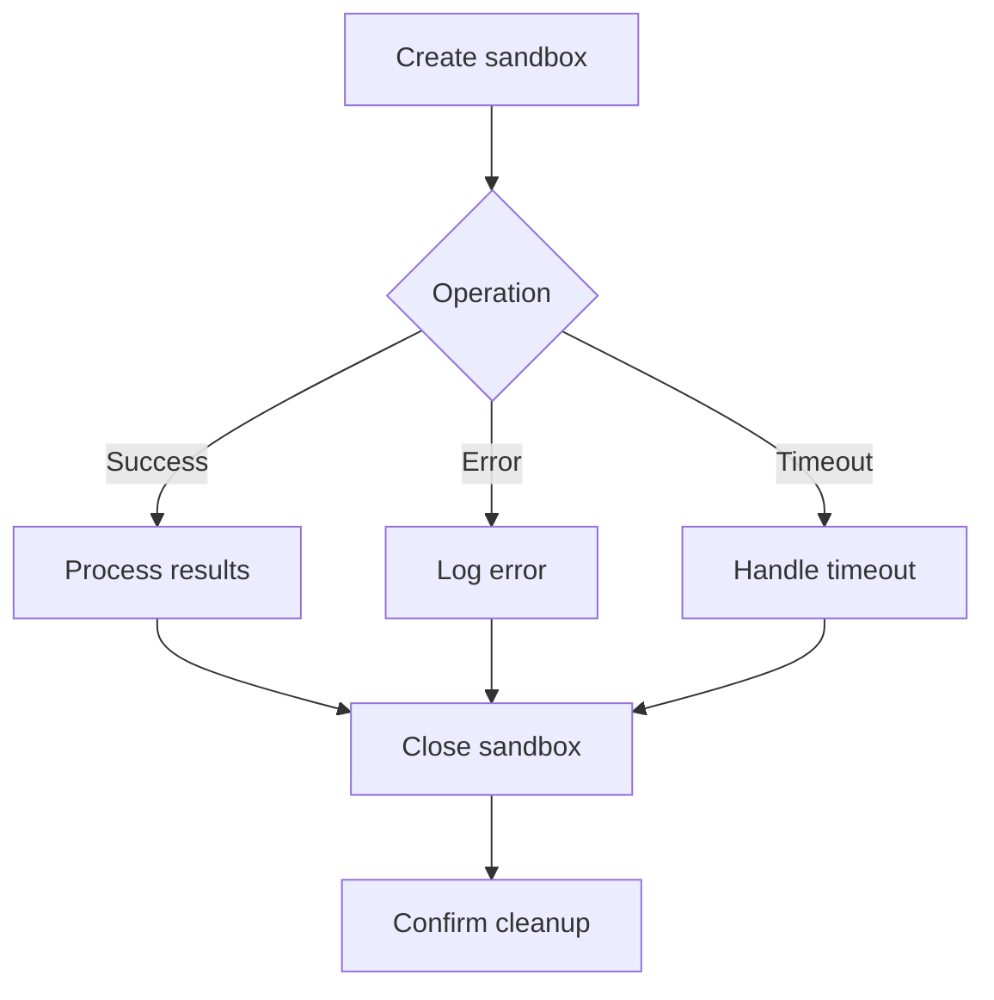
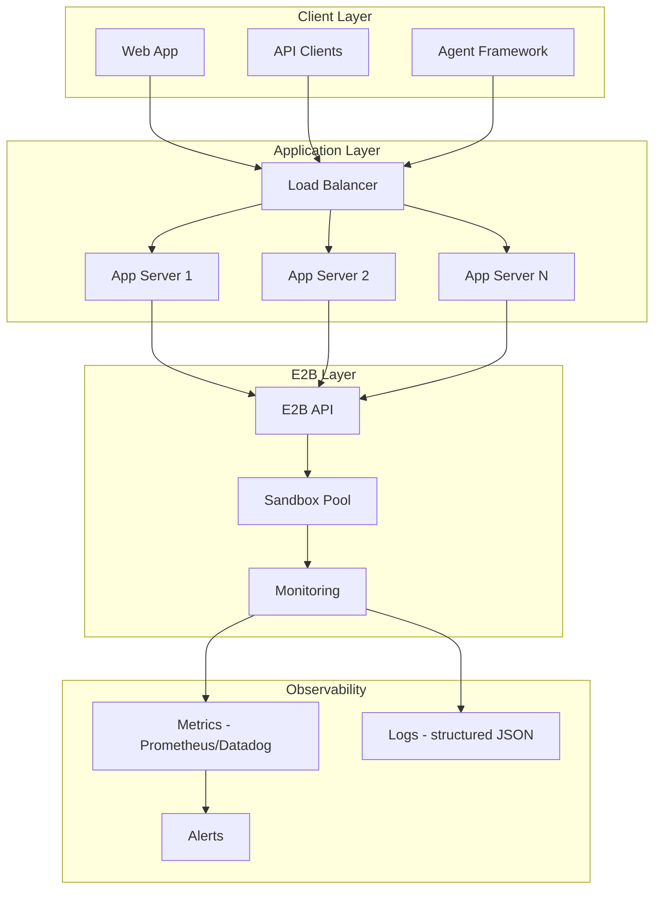
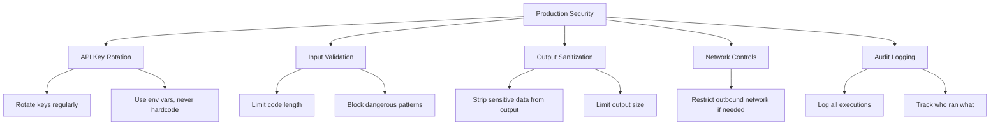

# Chapter 8: Production and Scaling

Welcome to **Chapter 8: Production and Scaling**. This final chapter covers how to run E2B reliably in production --- managing sandbox lifecycles, handling concurrency, monitoring costs, implementing retry logic, and designing for high availability.

## Learning Goals

- manage sandbox lifecycles to avoid resource leaks
- handle concurrent sandbox operations safely
- implement retry and fallback patterns
- monitor usage, costs, and performance
- design architectures for high-throughput production systems

## Sandbox Lifecycle Management

The most common production issue is sandbox leaks --- sandboxes that are created but never closed.



### Robust Sandbox Manager

```python
from e2b_code_interpreter import Sandbox
import logging
import time
from typing import Optional
from contextlib import contextmanager

logger = logging.getLogger(__name__)


class SandboxPool:
    """Manages a pool of E2B sandboxes with lifecycle guarantees."""

    def __init__(
        self,
        template: Optional[str] = None,
        max_sandboxes: int = 10,
        timeout: int = 300,
    ):
        self.template = template
        self.max_sandboxes = max_sandboxes
        self.timeout = timeout
        self._active: dict[str, Sandbox] = {}

    @contextmanager
    def acquire(self):
        """Acquire a sandbox with guaranteed cleanup."""
        if len(self._active) >= self.max_sandboxes:
            raise RuntimeError(
                f"Pool exhausted: {len(self._active)}/{self.max_sandboxes} "
                f"sandboxes in use"
            )

        sandbox = None
        try:
            kwargs = {"timeout": self.timeout}
            if self.template:
                kwargs["template"] = self.template

            sandbox = Sandbox(**kwargs)
            sandbox_id = sandbox.sandbox_id
            self._active[sandbox_id] = sandbox
            logger.info(f"Sandbox {sandbox_id} acquired ({len(self._active)} active)")

            yield sandbox

        except Exception as e:
            logger.error(f"Error in sandbox session: {e}")
            raise
        finally:
            if sandbox:
                try:
                    sandbox_id = sandbox.sandbox_id
                    sandbox.close()
                    self._active.pop(sandbox_id, None)
                    logger.info(f"Sandbox {sandbox_id} released ({len(self._active)} active)")
                except Exception as e:
                    logger.error(f"Error closing sandbox: {e}")

    def close_all(self):
        """Emergency cleanup of all sandboxes."""
        for sandbox_id, sandbox in list(self._active.items()):
            try:
                sandbox.close()
                logger.info(f"Force-closed sandbox {sandbox_id}")
            except Exception as e:
                logger.error(f"Error force-closing {sandbox_id}: {e}")
        self._active.clear()

    @property
    def active_count(self) -> int:
        return len(self._active)


# Usage
pool = SandboxPool(template="my-template", max_sandboxes=20)

with pool.acquire() as sandbox:
    result = sandbox.run_code("print('hello from pool')")
    print(result.text)

# Sandbox is guaranteed to be closed
```

## Retry and Error Handling

```python
import time
import logging
from e2b_code_interpreter import Sandbox
from typing import Optional

logger = logging.getLogger(__name__)


class ResilientExecutor:
    """Execute code with retries and fallback strategies."""

    def __init__(
        self,
        template: Optional[str] = None,
        max_retries: int = 3,
        retry_delay: float = 1.0,
        execution_timeout: int = 30,
    ):
        self.template = template
        self.max_retries = max_retries
        self.retry_delay = retry_delay
        self.execution_timeout = execution_timeout

    def execute(self, code: str) -> dict:
        """Execute code with retry logic."""
        last_error = None

        for attempt in range(1, self.max_retries + 1):
            try:
                return self._try_execute(code, attempt)
            except TimeoutError as e:
                last_error = e
                logger.warning(f"Attempt {attempt}: execution timed out")
            except ConnectionError as e:
                last_error = e
                logger.warning(f"Attempt {attempt}: connection error: {e}")
                if attempt < self.max_retries:
                    time.sleep(self.retry_delay * attempt)
            except Exception as e:
                last_error = e
                logger.error(f"Attempt {attempt}: unexpected error: {e}")
                if attempt < self.max_retries:
                    time.sleep(self.retry_delay)

        return {
            "success": False,
            "error": f"All {self.max_retries} attempts failed: {last_error}",
            "output": "",
        }

    def _try_execute(self, code: str, attempt: int) -> dict:
        """Single execution attempt with fresh sandbox."""
        kwargs = {"timeout": 120}
        if self.template:
            kwargs["template"] = self.template

        with Sandbox(**kwargs) as sandbox:
            logger.info(f"Attempt {attempt}: executing in sandbox {sandbox.sandbox_id}")

            execution = sandbox.run_code(
                code,
                timeout=self.execution_timeout,
            )

            if execution.error:
                return {
                    "success": False,
                    "error": f"{execution.error.name}: {execution.error.value}",
                    "output": execution.text or "",
                    "traceback": execution.error.traceback,
                }

            return {
                "success": True,
                "output": execution.text or "",
                "images": [r.png for r in execution.results if r.png],
            }


# Usage
executor = ResilientExecutor(max_retries=3, execution_timeout=30)
result = executor.execute("print(sum(range(1000000)))")
print(result)
```

## Concurrent Execution

### Thread-safe Pattern

```python
from e2b_code_interpreter import Sandbox
from concurrent.futures import ThreadPoolExecutor, as_completed
import logging

logger = logging.getLogger(__name__)


def execute_task(task_id: int, code: str, template: str = None) -> dict:
    """Execute a single task in its own sandbox."""
    kwargs = {}
    if template:
        kwargs["template"] = template

    try:
        with Sandbox(**kwargs) as sandbox:
            execution = sandbox.run_code(code, timeout=30)
            return {
                "task_id": task_id,
                "success": not execution.error,
                "output": execution.text or "",
                "error": str(execution.error.value) if execution.error else None,
            }
    except Exception as e:
        return {
            "task_id": task_id,
            "success": False,
            "output": "",
            "error": str(e),
        }


# Execute multiple tasks concurrently
tasks = [
    (1, "import math; print(math.factorial(100))"),
    (2, "print(sum(i**2 for i in range(1000)))"),
    (3, "import random; print(sorted(random.sample(range(100), 10)))"),
    (4, "print('\\n'.join(f'{i}: {i**3}' for i in range(10)))"),
    (5, "from collections import Counter; print(Counter('mississippi'))"),
]

with ThreadPoolExecutor(max_workers=5) as pool:
    futures = {
        pool.submit(execute_task, tid, code): tid
        for tid, code in tasks
    }

    for future in as_completed(futures):
        result = future.result()
        status = "OK" if result["success"] else "FAIL"
        print(f"Task {result['task_id']} [{status}]: {result['output'][:80]}")
```

### Async Pattern (TypeScript)

```typescript
import { Sandbox } from '@e2b/code-interpreter';

interface Task {
  id: number;
  code: string;
}

async function executeTask(task: Task): Promise<{
  id: number;
  success: boolean;
  output: string;
}> {
  const sandbox = await Sandbox.create();
  try {
    const execution = await sandbox.runCode(task.code);
    return {
      id: task.id,
      success: !execution.error,
      output: execution.text || '',
    };
  } finally {
    await sandbox.close();
  }
}

async function main() {
  const tasks: Task[] = [
    { id: 1, code: "print(2 ** 100)" },
    { id: 2, code: "print(sum(range(10000)))" },
    { id: 3, code: "import math; print(math.pi)" },
  ];

  // Execute all tasks concurrently
  const results = await Promise.all(tasks.map(executeTask));

  for (const result of results) {
    console.log(`Task ${result.id}: ${result.output}`);
  }
}

main();
```

## Production Architecture



## Monitoring and Observability

### Execution Metrics

```python
import time
import logging
from dataclasses import dataclass, field
from typing import Optional
from e2b_code_interpreter import Sandbox

logger = logging.getLogger(__name__)


@dataclass
class ExecutionMetrics:
    """Track sandbox execution metrics."""
    total_executions: int = 0
    successful: int = 0
    failed: int = 0
    timeouts: int = 0
    total_duration_ms: float = 0
    sandbox_create_ms: float = 0

    @property
    def success_rate(self) -> float:
        if self.total_executions == 0:
            return 0.0
        return self.successful / self.total_executions

    @property
    def avg_duration_ms(self) -> float:
        if self.total_executions == 0:
            return 0.0
        return self.total_duration_ms / self.total_executions

    def report(self) -> dict:
        return {
            "total": self.total_executions,
            "success_rate": f"{self.success_rate:.2%}",
            "avg_duration_ms": f"{self.avg_duration_ms:.1f}",
            "avg_create_ms": f"{self.sandbox_create_ms / max(self.total_executions, 1):.1f}",
            "failures": self.failed,
            "timeouts": self.timeouts,
        }


class MonitoredExecutor:
    """Executor with built-in metrics collection."""

    def __init__(self, template: Optional[str] = None):
        self.template = template
        self.metrics = ExecutionMetrics()

    def execute(self, code: str, timeout: int = 30) -> dict:
        self.metrics.total_executions += 1

        # Measure sandbox creation time
        create_start = time.monotonic()
        kwargs = {}
        if self.template:
            kwargs["template"] = self.template

        try:
            sandbox = Sandbox(**kwargs)
        except Exception as e:
            self.metrics.failed += 1
            logger.error(f"Sandbox creation failed: {e}")
            return {"success": False, "error": f"Sandbox creation failed: {e}"}

        create_ms = (time.monotonic() - create_start) * 1000
        self.metrics.sandbox_create_ms += create_ms

        # Measure execution time
        exec_start = time.monotonic()
        try:
            execution = sandbox.run_code(code, timeout=timeout)
            exec_ms = (time.monotonic() - exec_start) * 1000
            self.metrics.total_duration_ms += exec_ms

            if execution.error:
                self.metrics.failed += 1
                logger.warning(
                    f"Execution error: {execution.error.name}",
                    extra={"duration_ms": exec_ms},
                )
                return {
                    "success": False,
                    "error": f"{execution.error.name}: {execution.error.value}",
                    "duration_ms": exec_ms,
                }

            self.metrics.successful += 1
            logger.info(
                "Execution succeeded",
                extra={"duration_ms": exec_ms, "create_ms": create_ms},
            )
            return {
                "success": True,
                "output": execution.text or "",
                "duration_ms": exec_ms,
                "create_ms": create_ms,
            }

        except TimeoutError:
            self.metrics.timeouts += 1
            self.metrics.failed += 1
            return {"success": False, "error": "Timeout"}
        finally:
            sandbox.close()


# Usage
executor = MonitoredExecutor()

for i in range(10):
    executor.execute(f"print({i} ** 2)")

print(executor.metrics.report())
# {'total': 10, 'success_rate': '100.00%', 'avg_duration_ms': '45.2', ...}
```

## Cost Management

### Sandbox Timeout Strategy

```python
from e2b_code_interpreter import Sandbox


def cost_aware_execute(code: str, complexity: str = "simple") -> dict:
    """Choose sandbox timeout based on task complexity."""
    timeout_map = {
        "simple": 60,       # 1 minute for quick calculations
        "moderate": 180,     # 3 minutes for data processing
        "complex": 600,      # 10 minutes for ML training
        "long_running": 3600,  # 1 hour for batch jobs
    }

    timeout = timeout_map.get(complexity, 60)

    with Sandbox(timeout=timeout) as sandbox:
        execution = sandbox.run_code(code)
        return {
            "success": not execution.error,
            "output": execution.text or "",
            "timeout_used": timeout,
        }
```

### Usage Tracking

```python
import time
from dataclasses import dataclass


@dataclass
class UsageTracker:
    """Track sandbox usage for cost monitoring."""
    sandbox_seconds: float = 0
    sandbox_count: int = 0

    def record(self, duration_seconds: float):
        self.sandbox_seconds += duration_seconds
        self.sandbox_count += 1

    @property
    def estimated_cost(self) -> float:
        """Rough cost estimate. Check e2b.dev/pricing for actual rates."""
        cost_per_second = 0.0001  # example rate
        return self.sandbox_seconds * cost_per_second

    def summary(self) -> str:
        return (
            f"Sandboxes: {self.sandbox_count}, "
            f"Total time: {self.sandbox_seconds:.1f}s, "
            f"Est. cost: ${self.estimated_cost:.4f}"
        )
```

## Security Hardening



### Input Validation

```python
import re

MAX_CODE_LENGTH = 50_000  # 50KB limit
BLOCKED_PATTERNS = [
    r"os\.environ",        # accessing env vars
    r"subprocess\.call",   # shell escape
    r"__import__",         # dynamic imports of blocked modules
]


def validate_code(code: str) -> tuple[bool, str]:
    """Validate code before sending to sandbox."""
    if len(code) > MAX_CODE_LENGTH:
        return False, f"Code exceeds {MAX_CODE_LENGTH} character limit"

    for pattern in BLOCKED_PATTERNS:
        if re.search(pattern, code):
            return False, f"Code contains blocked pattern: {pattern}"

    return True, "OK"


# Usage
code = "print(os.environ['SECRET'])"
valid, message = validate_code(code)
if not valid:
    print(f"Rejected: {message}")
```

## Production Checklist

| Category | Item | Status |
|:---------|:-----|:-------|
| Lifecycle | All sandboxes closed in finally blocks | Required |
| Lifecycle | Timeout set on every sandbox | Required |
| Errors | Retry logic for transient failures | Required |
| Errors | Graceful degradation when E2B is unavailable | Recommended |
| Security | API keys in environment variables | Required |
| Security | Input validation on user-submitted code | Required |
| Security | Output size limits | Recommended |
| Monitoring | Execution duration tracking | Required |
| Monitoring | Error rate alerting | Required |
| Monitoring | Sandbox count monitoring | Recommended |
| Cost | Appropriate timeouts per task type | Required |
| Cost | Usage tracking and budgets | Recommended |
| Scale | Connection pooling for high throughput | Recommended |
| Scale | Async execution for non-blocking APIs | Recommended |

## Cross-references

- For sandbox architecture and isolation, see [Chapter 2: Sandbox Architecture](02-sandbox-architecture.md)
- For custom templates that reduce startup time, see [Chapter 5: Custom Sandbox Templates](05-custom-sandbox-templates.md)
- For streaming patterns in production UIs, see [Chapter 7: Streaming and Real-time Output](07-streaming-and-realtime-output.md)

## Source References

- [E2B Pricing](https://e2b.dev/pricing)
- [E2B SDK Reference](https://e2b.dev/docs/sdk-reference)
- [E2B Security Model](https://e2b.dev/docs/security)
- [E2B Status Page](https://status.e2b.dev)

## Summary

Production E2B usage requires disciplined lifecycle management, retry logic, monitoring, and cost awareness. Always close sandboxes in `finally` blocks, set appropriate timeouts, validate inputs, and track metrics. Use thread pools or async patterns for concurrent execution. The sandbox pool pattern prevents resource exhaustion while enabling high throughput.

---

[Previous: Chapter 7: Streaming and Real-time Output](07-streaming-and-realtime-output.md) | [Back to E2B Tutorial](README.md)

*Generated by [AI Codebase Knowledge Builder](https://github.com/The-Pocket/Tutorial-Codebase-Knowledge)*
