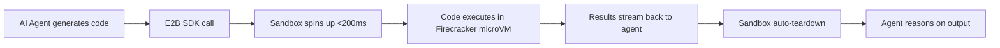

# E2B Tutorial: Secure Cloud Sandboxes for AI Agent Code Execution

> Learn how to use `e2b-dev/E2B` to give AI agents secure, sandboxed cloud environments for code execution with sub-200ms cold starts.

## Why This Track Matters

When AI agents generate code, they need a safe place to run it. Local execution is dangerous --- an agent can delete files, exfiltrate data, or crash the host. E2B solves this by providing on-demand cloud sandboxes that spin up in under 200ms, run arbitrary code in full isolation, and tear down automatically.

This track focuses on:

- spinning up sandboxes and executing code securely from Python and TypeScript
- understanding the Firecracker microVM architecture that powers E2B
- managing filesystems, processes, and network access inside sandboxes
- building custom sandbox templates with pre-installed dependencies
- integrating E2B with LangChain, CrewAI, and other agent frameworks
- handling streaming output and real-time execution feedback
- operating E2B at scale in production AI applications

## Current Snapshot (auto-updated)

- repository: [`e2b-dev/E2B`](https://github.com/e2b-dev/E2B)
- stars: about **11.9k**
- latest release: [`e2b@2.19.1`](https://github.com/e2b-dev/E2B/releases/tag/e2b@2.19.1) (published 2026-04-24)

## Mental Model

## Chapter Guide

| Chapter | Key Question | Outcome |
|:--------|:-------------|:--------|
| [01 - Getting Started](01-getting-started.md) | How do I spin up my first sandbox and run code? | Working baseline with Python and TypeScript SDKs |
| [02 - Sandbox Architecture](02-sandbox-architecture.md) | How does E2B achieve sub-200ms cold starts securely? | Strong mental model of Firecracker microVM isolation |
| [03 - Code Execution](03-code-execution.md) | How do I run code, handle errors, and capture output? | Reliable execution patterns for any language |
| [04 - Filesystem and Process Management](04-filesystem-and-process-management.md) | How do I read/write files and manage processes inside sandboxes? | Full control over sandbox state |
| [05 - Custom Sandbox Templates](05-custom-sandbox-templates.md) | How do I pre-install dependencies and tools? | Faster startup with custom environments |
| [06 - Framework Integrations](06-framework-integrations.md) | How do I connect E2B to LangChain, CrewAI, and other frameworks? | Agent framework code execution |
| [07 - Streaming and Real-time Output](07-streaming-and-realtime-output.md) | How do I get live output from long-running executions? | Real-time feedback loops |
| [08 - Production and Scaling](08-production-and-scaling.md) | How do I run E2B reliably at scale? | Production-grade deployment patterns |

## What You Will Learn

- how to give AI agents secure code execution without risking your infrastructure
- how Firecracker microVMs provide true isolation with near-instant startup
- how to build custom sandbox templates for specialized workloads
- how to integrate E2B with popular agent frameworks
- how to stream execution output for interactive experiences
- how to operate sandboxes at scale with proper lifecycle management

## Source References

- [E2B Repository](https://github.com/e2b-dev/E2B)
- [E2B Documentation](https://e2b.dev/docs)
- [E2B Python SDK](https://github.com/e2b-dev/E2B/tree/main/packages/python-sdk)
- [E2B TypeScript SDK](https://github.com/e2b-dev/E2B/tree/main/packages/js-sdk)
- [E2B CLI Reference](https://e2b.dev/docs/cli)
- [E2B Custom Sandboxes](https://e2b.dev/docs/sandbox-template)
- [E2B Cookbook](https://github.com/e2b-dev/e2b-cookbook)

## Related Tutorials

- [Codex CLI Tutorial](../codex-cli-tutorial/)
- [OpenHands Tutorial](../openhands-tutorial/)
- [MetaGPT Tutorial](../metagpt-tutorial/)

---

Start with [Chapter 1: Getting Started](01-getting-started.md).

## Navigation & Backlinks

- [Start Here: Chapter 1: Getting Started](01-getting-started.md)
- [Back to Main Catalog](../../README.md#-tutorial-catalog)
- [Browse A-Z Tutorial Directory](../../discoverability/tutorial-directory.md)
- [Search by Intent](../../discoverability/query-hub.md)
- [Explore Category Hubs](../../README.md#category-hubs)

## Full Chapter Map

1. [Chapter 1: Getting Started](01-getting-started.md)
2. [Chapter 2: Sandbox Architecture](02-sandbox-architecture.md)
3. [Chapter 3: Code Execution](03-code-execution.md)
4. [Chapter 4: Filesystem and Process Management](04-filesystem-and-process-management.md)
5. [Chapter 5: Custom Sandbox Templates](05-custom-sandbox-templates.md)
6. [Chapter 6: Framework Integrations](06-framework-integrations.md)
7. [Chapter 7: Streaming and Real-time Output](07-streaming-and-realtime-output.md)
8. [Chapter 8: Production and Scaling](08-production-and-scaling.md)

*Generated by [AI Codebase Knowledge Builder](https://github.com/The-Pocket/Tutorial-Codebase-Knowledge)*
