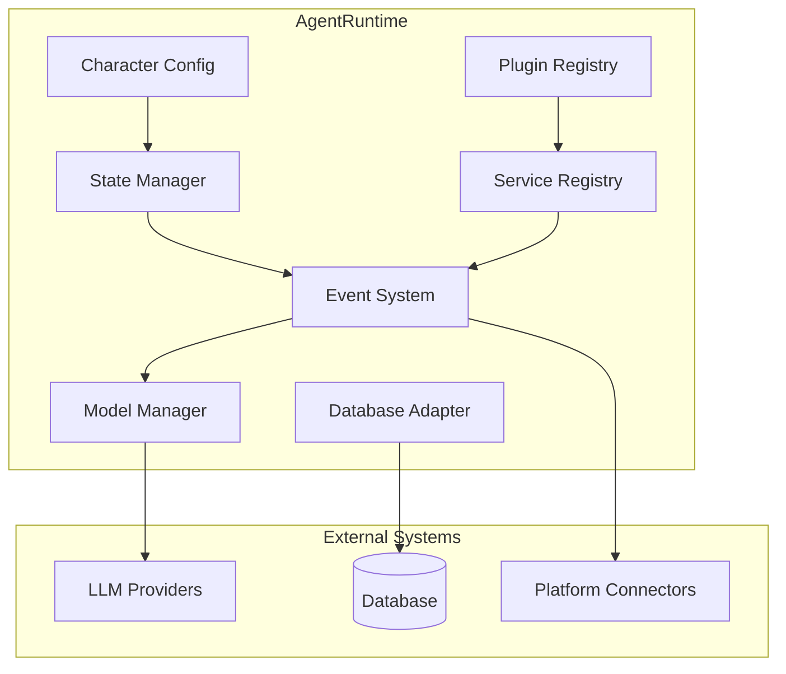

# Chapter 2: Agent Runtime

## Introduction

The `AgentRuntime` is the central engine of ElizaOS. It manages an agent's lifecycle, processes events, coordinates plugins, invokes models, and maintains state. Every agent in ElizaOS is an instance of `AgentRuntime`. This chapter examines its architecture and internals.

## AgentRuntime Architecture



## IAgentRuntime Interface

The runtime implements a comprehensive interface:

```typescript
interface IAgentRuntime {
  // Identity
  agentId: string;
  character: Character;

  // Plugin system
  plugins: Plugin[];
  actions: Action[];
  providers: Provider[];
  evaluators: Evaluator[];

  // Service management
  registerService(service: Service): void;
  getService<T extends Service>(type: ServiceTypeName): T | null;
  getAllServices(): Map<string, Service>;

  // Model invocation
  useModel<T extends keyof ModelParamsMap>(
    modelType: T,
    params: ModelParamsMap[T]
  ): Promise<ModelResult<T>>;

  // Memory
  getMemoryManager(): IMemoryManager;

  // Database
  getDatabase(): IDatabaseAdapter;

  // State
  composeState(message: Memory, additionalContext?: Record<string, unknown>): Promise<State>;

  // Event processing
  processEvent(event: Event): Promise<void>;
  emitEvent(eventType: string, payload: unknown): void;

  // Lifecycle
  initialize(): Promise<void>;
  shutdown(): Promise<void>;
}
```

## Runtime Initialization

The startup sequence loads plugins, registers services, and prepares the agent:

```typescript
class AgentRuntime implements IAgentRuntime {
  private character: Character;
  private plugins: Plugin[] = [];
  private actions: Action[] = [];
  private providers: Provider[] = [];
  private evaluators: Evaluator[] = [];
  private services: Map<string, Service> = new Map();
  private database: IDatabaseAdapter;
  private modelManager: ModelManager;

  constructor(options: RuntimeOptions) {
    this.character = options.character;
    this.agentId = options.character.id || crypto.randomUUID();
  }

  async initialize() {
    // 1. Initialize database
    this.database = await this.initializeDatabase();

    // 2. Load plugins in dependency order
    await this.loadPlugins();

    // 3. Register all actions from plugins
    this.registerActions();

    // 4. Register all providers from plugins
    this.registerProviders();

    // 5. Register all evaluators from plugins
    this.registerEvaluators();

    // 6. Initialize all services
    await this.initializeServices();

    // 7. Load character knowledge into memory
    await this.loadCharacterKnowledge();

    // 8. Start event processing
    this.startEventLoop();

    console.log(`Agent "${this.character.name}" initialized`);
  }

  private async loadPlugins() {
    // Sort plugins by priority (lower = loaded first)
    const sorted = [...this.plugins].sort(
      (a, b) => (a.priority || 100) - (b.priority || 100)
    );

    for (const plugin of sorted) {
      // Check dependencies
      if (plugin.dependencies) {
        for (const dep of plugin.dependencies) {
          if (!this.plugins.find(p => p.name === dep)) {
            throw new Error(
              `Plugin "${plugin.name}" requires "${dep}" which is not loaded`
            );
          }
        }
      }

      // Initialize plugin
      if (plugin.init) {
        await plugin.init(plugin.config || {}, this);
      }

      // Register plugin's services
      if (plugin.services) {
        for (const ServiceClass of plugin.services) {
          const service = new ServiceClass(this);
          await service.initialize();
          this.registerService(service);
        }
      }

      console.log(`Plugin loaded: ${plugin.name}`);
    }
  }
}
```

## State Composition

Before each model invocation, the runtime composes a rich state object:

```typescript
interface State {
  // Agent identity
  agentId: string;
  agentName: string;
  bio: string;

  // Conversation context
  recentMessages: Memory[];
  relevantMemories: Memory[];

  // Provider outputs (dynamic context)
  providers: Record<string, string>;

  // Available actions
  actions: ActionDescription[];

  // Current room/world context
  roomId: string;
  worldId?: string;
  participants: Entity[];

  // Additional context
  [key: string]: unknown;
}

async composeState(
  message: Memory,
  additionalContext?: Record<string, unknown>
): Promise<State> {
  // 1. Get recent conversation messages
  const recentMessages = await this.getMemoryManager().getMemories({
    roomId: message.roomId,
    count: 20,
    unique: false,
  });

  // 2. Search for relevant memories via embedding similarity
  const relevantMemories = await this.getMemoryManager().searchMemories({
    embedding: await this.embed(message.content.text || ""),
    roomId: message.roomId,
    count: 10,
    threshold: 0.7,
  });

  // 3. Run all registered providers to build dynamic context
  const providerOutputs: Record<string, string> = {};
  for (const provider of this.providers) {
    try {
      const output = await provider.get(this, message);
      if (output) {
        providerOutputs[provider.name] = output;
      }
    } catch (err) {
      console.warn(`Provider "${provider.name}" failed:`, err.message);
    }
  }

  // 4. Get available actions for current context
  const availableActions = this.actions
    .filter(action => action.validate
      ? action.validate(this, message)
      : true
    )
    .map(action => ({
      name: action.name,
      description: action.description,
      parameters: action.parameters,
    }));

  // 5. Compose the full state
  return {
    agentId: this.agentId,
    agentName: this.character.name,
    bio: this.character.bio?.join("\n") || "",
    recentMessages,
    relevantMemories,
    providers: providerOutputs,
    actions: availableActions,
    roomId: message.roomId,
    worldId: message.worldId,
    participants: await this.getRoomParticipants(message.roomId),
    ...additionalContext,
  };
}
```

## Model Invocation

The runtime provides a unified interface for calling any LLM:

```typescript
type ModelParamsMap = {
  text_generation: TextGenerationParams;
  text_embedding: EmbeddingParams;
  image_generation: ImageGenerationParams;
  speech_to_text: TranscriptionParams;
  text_to_speech: TTSParams;
  object_detection: ObjectDetectionParams;
};

class ModelManager {
  private handlers: Map<string, ModelHandler> = new Map();

  /**
   * Register a model handler (typically from a plugin).
   */
  register<T extends keyof ModelParamsMap>(
    modelType: T,
    handler: ModelHandler<T>
  ) {
    this.handlers.set(modelType, handler);
  }

  /**
   * Invoke a model. The actual implementation comes from
   * whichever plugin registered the handler.
   */
  async invoke<T extends keyof ModelParamsMap>(
    modelType: T,
    params: ModelParamsMap[T]
  ): Promise<ModelResult<T>> {
    const handler = this.handlers.get(modelType);
    if (!handler) {
      throw new Error(`No handler registered for model type: ${modelType}`);
    }

    return handler(params);
  }
}

// Usage in runtime
class AgentRuntime {
  async useModel<T extends keyof ModelParamsMap>(
    modelType: T,
    params: ModelParamsMap[T]
  ): Promise<ModelResult<T>> {
    return this.modelManager.invoke(modelType, params);
  }

  // Convenience method for text generation
  async generateResponse(
    state: State,
    systemPrompt: string
  ): Promise<string> {
    const result = await this.useModel("text_generation", {
      model: this.character.settings?.model || "gpt-4o",
      system: systemPrompt,
      messages: this.formatMessages(state),
      maxTokens: this.character.settings?.maxContextTokens || 4096,
      temperature: 0.7,
    });

    return result.text;
  }
}
```

## Event Processing

The runtime uses a unified event system:

```typescript
interface RuntimeEvent {
  type: string;
  payload: unknown;
  source: string;     // Which connector/plugin emitted
  roomId?: string;
  worldId?: string;
  timestamp: number;
}

class EventProcessor {
  private handlers: Map<string, EventHandler[]> = new Map();

  on(eventType: string, handler: EventHandler) {
    if (!this.handlers.has(eventType)) {
      this.handlers.set(eventType, []);
    }
    this.handlers.get(eventType)!.push(handler);
  }

  async emit(event: RuntimeEvent) {
    const handlers = this.handlers.get(event.type) || [];

    for (const handler of handlers) {
      try {
        await handler(event);
      } catch (err) {
        console.error(`Event handler error for ${event.type}:`, err);
      }
    }
  }
}

// Standard events
const StandardEvents = {
  MESSAGE_RECEIVED: "message_received",
  MESSAGE_SENT: "message_sent",
  ACTION_STARTED: "action_started",
  ACTION_COMPLETED: "action_completed",
  WORLD_JOINED: "world_joined",
  WORLD_LEFT: "world_left",
  ROOM_JOINED: "room_joined",
  ENTITY_UPDATED: "entity_updated",
  EVALUATION_COMPLETED: "evaluation_completed",
} as const;
```

## Action Execution

When the model decides to take an action, the runtime executes it:

```typescript
interface Action {
  name: string;
  description: string;
  similes: string[];        // Alternative phrasings the LLM might use
  examples: ActionExample[];
  parameters?: JSONSchema;

  validate?(runtime: IAgentRuntime, message: Memory): Promise<boolean>;
  handler(
    runtime: IAgentRuntime,
    message: Memory,
    state: State,
    options: ActionOptions,
    callback: ActionCallback
  ): Promise<void>;
}

class ActionExecutor {
  async execute(
    action: Action,
    runtime: IAgentRuntime,
    message: Memory,
    state: State
  ): Promise<ActionResult> {
    // Validate the action can run
    if (action.validate) {
      const valid = await action.validate(runtime, message);
      if (!valid) {
        return { success: false, error: "Action validation failed" };
      }
    }

    // Execute with callback for streaming responses
    const results: Memory[] = [];
    const callback: ActionCallback = async (response: Memory) => {
      results.push(response);
      // Stream the response back to the user
      runtime.emitEvent("action_response", {
        action: action.name,
        response,
        roomId: message.roomId,
      });
    };

    await action.handler(runtime, message, state, {}, callback);

    return { success: true, results };
  }
}
```

## Service Registry

Services are long-running capabilities that plugins provide:

```typescript
abstract class Service {
  abstract get serviceType(): string;

  protected runtime: IAgentRuntime;

  constructor(runtime: IAgentRuntime) {
    this.runtime = runtime;
  }

  abstract initialize(): Promise<void>;
  abstract shutdown(): Promise<void>;
}

// Example: a transcription service
class TranscriptionService extends Service {
  get serviceType() { return "TRANSCRIPTION"; }

  async initialize() {
    // Load Whisper model or configure API
  }

  async transcribe(audio: Buffer): Promise<string> {
    return this.runtime.useModel("speech_to_text", {
      audio,
      language: "en",
    });
  }

  async shutdown() {
    // Cleanup resources
  }
}
```

## Worlds and Rooms Model

ElizaOS models communication contexts hierarchically:

```typescript
interface World {
  id: string;
  name: string;          // e.g., "My Discord Server"
  platform: string;      // e.g., "discord", "telegram"
  metadata: Record<string, unknown>;
  rooms: Room[];
}

interface Room {
  id: string;
  worldId: string;
  name: string;          // e.g., "#general"
  type: "dm" | "group" | "channel";
  participants: Entity[];
}

interface Entity {
  id: string;
  name: string;
  platform: string;
  platformId: string;    // Platform-specific user ID
  metadata: Record<string, unknown>;
  components: Component[];  // ECS pattern
}
```

## Graceful Shutdown

```typescript
class AgentRuntime {
  async shutdown() {
    console.log(`Shutting down agent "${this.character.name}"...`);

    // 1. Stop accepting new events
    this.eventProcessor.pause();

    // 2. Drain pending events
    await this.eventProcessor.drain();

    // 3. Shutdown all services
    for (const [name, service] of this.services) {
      await service.shutdown();
    }

    // 4. Unload plugins
    for (const plugin of this.plugins.reverse()) {
      if (plugin.onUnload) {
        await plugin.onUnload();
      }
    }

    // 5. Close database connection
    await this.database.close();

    console.log(`Agent "${this.character.name}" shutdown complete`);
  }
}
```

## Summary

| Component | Purpose |
|-----------|---------|
| **AgentRuntime** | Central engine managing agent lifecycle and coordination |
| **State Composition** | Builds rich context from messages, memories, and providers |
| **Model Manager** | Unified interface for any LLM (text, embeddings, images, etc.) |
| **Event System** | Platform-agnostic event pipeline for all message flow |
| **Action Executor** | Executes agent actions with validation and streaming callbacks |
| **Service Registry** | Long-running capabilities (transcription, browser, email, etc.) |
| **Worlds/Rooms** | Hierarchical communication context model |

---

**Next Steps**: [Chapter 3: Character System](03-character-system.md) — Define agent personality, behavior, knowledge, and goals through character files.

---

*Built with insights from the [ElizaOS repository](https://github.com/elizaOS/eliza) and community documentation.*
