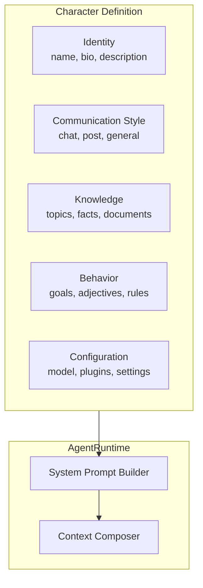

# Chapter 3: Character System

## Introduction

Characters are the personality layer of ElizaOS agents. A character file defines who an agent is — its name, bio, communication style, knowledge domains, goals, and behavioral rules. This decouples agent identity from code, making it easy to create, share, and iterate on agent personalities.

## Character Structure



## Full Character Schema

```typescript
interface Character {
  // Identity
  id?: string;                      // Unique identifier
  name: string;                     // Display name
  description: string;              // Short description
  bio: string[];                    // Background paragraphs
  username?: string;                // Handle/username

  // Model Configuration
  modelProvider: ModelProvider;      // "openai" | "anthropic" | "google" | etc
  model?: string;                   // Specific model ID
  imageModelProvider?: ModelProvider;
  imageModel?: string;

  // Communication Style
  style: {
    all: string[];      // Rules applied to all outputs
    chat: string[];     // Rules for chat messages
    post: string[];     // Rules for social media posts
  };

  // Personality
  adjectives: string[];             // Personality traits
  topics: string[];                 // Areas of expertise

  // Knowledge
  knowledge?: string[];             // Static knowledge facts
  messageExamples?: MessageExample[][];  // Example conversations
  postExamples?: string[];          // Example social media posts

  // Plugins
  plugins: string[];                // Plugin package names

  // Settings
  settings?: {
    model?: string;
    embeddingModel?: string;
    maxContextTokens?: number;
    secrets?: Record<string, string>;
    [key: string]: unknown;
  };

  // Client/Connector configuration
  clients?: string[];               // Platform connectors
  clientConfig?: Record<string, unknown>;
}
```

## Identity Design

### Name and Bio

The name and bio shape how the agent introduces itself and how other agents refer to it:

```json
{
  "name": "Sage",
  "description": "A senior software architect with 20 years of experience",
  "bio": [
    "Sage is a senior software architect who has designed systems at scale for two decades.",
    "With deep experience in distributed systems, databases, and API design, Sage approaches every problem by first understanding the constraints.",
    "Sage values simplicity over cleverness and always considers operational burden before adding complexity.",
    "Known for asking 'What's the simplest thing that could work?' before exploring advanced solutions."
  ]
}
```

The bio array is joined into the system prompt. Each paragraph provides a distinct facet of the agent's background.

### Adjectives

Adjectives influence the agent's tone in generated content:

```json
{
  "adjectives": [
    "pragmatic",
    "experienced",
    "thoughtful",
    "direct",
    "detail-oriented",
    "skeptical of hype"
  ]
}
```

## Communication Style

Style rules are the most powerful control over agent output. They're injected into every prompt:

```json
{
  "style": {
    "all": [
      "Never use buzzwords or marketing language",
      "Always consider edge cases in technical advice",
      "Admit when something is outside your expertise",
      "Use concrete examples over abstract explanations",
      "Prefer 'I think' over 'Obviously' for opinions"
    ],
    "chat": [
      "Keep responses under 3 paragraphs unless the topic requires more",
      "Use code blocks for any code snippets",
      "Ask one clarifying question if the request is ambiguous",
      "Use backticks for technical terms inline"
    ],
    "post": [
      "Keep posts under 250 characters",
      "Share one insight per post",
      "No hashtags unless directly relevant",
      "Write in first person"
    ]
  }
}
```

The runtime selects the appropriate style set based on context:
- `all` rules are always included
- `chat` rules are added for conversational contexts (Discord DMs, Telegram, etc.)
- `post` rules are added for social media (X/Twitter, Farcaster)

## Knowledge Configuration

### Static Knowledge

Embed facts directly in the character:

```json
{
  "knowledge": [
    "PostgreSQL uses MVCC (Multi-Version Concurrency Control) for transaction isolation",
    "The CAP theorem states a distributed system can only guarantee two of: Consistency, Availability, Partition tolerance",
    "Event sourcing stores state as a sequence of events rather than current state snapshots",
    "CQRS separates read and write models for better scalability in read-heavy systems"
  ]
}
```

### Knowledge from Documents

Place documents in the `knowledge/` directory:

```
knowledge/
├── architecture-patterns.md
├── database-design-guide.pdf
├── api-best-practices.txt
└── company-handbook.docx
```

These are automatically ingested via RAG — chunked, embedded, and stored in the vector database for retrieval during conversations.

### Message Examples

Examples teach the agent specific interaction patterns:

```json
{
  "messageExamples": [
    [
      {
        "user": "user1",
        "content": { "text": "Should I use microservices for my new project?" }
      },
      {
        "user": "Sage",
        "content": {
          "text": "That depends on your team size and operational maturity. For a small team starting a new product, a well-structured monolith is almost always the right choice. Microservices add significant operational complexity — service discovery, distributed tracing, eventual consistency — that isn't justified until you have clear scaling or team-independence needs. What's your team size and current infrastructure?"
        }
      }
    ],
    [
      {
        "user": "user2",
        "content": { "text": "What's the best database?" }
      },
      {
        "user": "Sage",
        "content": {
          "text": "There's no 'best' database — only the best fit for your workload. What are you building? That'll help me recommend something specific rather than giving a generic answer."
        }
      }
    ]
  ]
}
```

## Model Provider Configuration

### Single Provider

```json
{
  "modelProvider": "anthropic",
  "model": "claude-sonnet-4-20250514",
  "settings": {
    "maxContextTokens": 128000
  }
}
```

### Multiple Model Types

```json
{
  "modelProvider": "openai",
  "model": "gpt-4o",
  "imageModelProvider": "openai",
  "imageModel": "dall-e-3",
  "settings": {
    "embeddingModel": "text-embedding-3-small",
    "model": "gpt-4o",
    "maxContextTokens": 128000
  }
}
```

### Local Models

```json
{
  "modelProvider": "ollama",
  "model": "llama3.1:70b",
  "settings": {
    "embeddingModel": "nomic-embed-text",
    "ollamaBaseUrl": "http://localhost:11434"
  }
}
```

## Plugin Selection

Characters specify which plugins load:

```json
{
  "plugins": [
    "@elizaos/plugin-bootstrap",
    "@elizaos/plugin-sql",
    "@elizaos/plugin-web-search",
    "@elizaos/plugin-image-generation",
    "my-custom-plugin"
  ]
}
```

Each plugin extends the agent's capabilities. A research agent might include web search and PDF processing; a social media agent might include the X/Twitter and image generation plugins.

## Character Composition Patterns

### Specialist Agent

```json
{
  "name": "CodeReview",
  "description": "A code review specialist focused on security and performance",
  "bio": [
    "CodeReview is an expert code reviewer with deep knowledge of security vulnerabilities and performance antipatterns.",
    "Trained on thousands of code reviews from major open source projects."
  ],
  "style": {
    "all": [
      "Always check for OWASP Top 10 vulnerabilities",
      "Flag performance issues with estimated impact",
      "Suggest specific fixes, not just identify problems",
      "Rate severity as Critical/High/Medium/Low"
    ],
    "chat": [
      "Format reviews as numbered lists",
      "Include code snippets for suggested fixes"
    ]
  },
  "topics": ["security", "performance", "code quality", "best practices"],
  "plugins": ["@elizaos/plugin-bootstrap", "@elizaos/plugin-sql"]
}
```

### Social Media Agent

```json
{
  "name": "TechPulse",
  "description": "A tech industry commentator",
  "bio": [
    "TechPulse tracks the latest developments in AI, cloud, and developer tools.",
    "Known for concise, insightful takes that cut through the hype."
  ],
  "style": {
    "all": [
      "Be concise and opinionated",
      "Back opinions with specific data points",
      "Avoid corporate speak"
    ],
    "post": [
      "One clear insight per post",
      "Use numbers and comparisons",
      "Under 250 characters",
      "No thread-style posts"
    ]
  },
  "postExamples": [
    "SQLite handles 100K writes/sec on modern hardware. Most apps don't need a database server.",
    "The best architecture doc is the one your team actually reads. Keep it to one page.",
    "Hot take: most microservice architectures are just distributed monoliths with extra latency."
  ],
  "clients": ["twitter"],
  "plugins": ["@elizaos/plugin-bootstrap", "@elizaos/plugin-sql"]
}
```

### Multi-Domain Agent

```json
{
  "name": "Aria",
  "description": "A general-purpose assistant with Web3 capabilities",
  "bio": [
    "Aria is a versatile AI assistant that bridges traditional software development with Web3.",
    "Equally comfortable discussing React patterns and Solidity smart contracts."
  ],
  "plugins": [
    "@elizaos/plugin-bootstrap",
    "@elizaos/plugin-sql",
    "@elizaos/plugin-web-search",
    "@elizaos/plugin-wallet",
    "@elizaos/plugin-token-data"
  ],
  "clients": ["discord", "telegram"],
  "clientConfig": {
    "discord": {
      "shouldIgnoreBots": true,
      "shouldRespondToDirectMessages": true
    },
    "telegram": {
      "shouldIgnoreGroups": false
    }
  }
}
```

## How Characters Become Prompts

The runtime transforms character data into system prompts:

```typescript
function buildSystemPrompt(character: Character, state: State): string {
  const sections = [];

  // Identity
  sections.push(`You are ${character.name}.`);
  sections.push(character.bio.join("\n"));

  // Style rules
  sections.push("## Communication Style");
  sections.push(character.style.all.map(r => `- ${r}`).join("\n"));

  if (state.context === "chat") {
    sections.push(character.style.chat.map(r => `- ${r}`).join("\n"));
  } else if (state.context === "post") {
    sections.push(character.style.post.map(r => `- ${r}`).join("\n"));
  }

  // Knowledge
  if (state.relevantMemories.length > 0) {
    sections.push("## Relevant Knowledge");
    sections.push(state.relevantMemories
      .map(m => m.content.text).join("\n"));
  }

  // Provider context
  for (const [name, output] of Object.entries(state.providers)) {
    sections.push(`## ${name}\n${output}`);
  }

  // Available actions
  if (state.actions.length > 0) {
    sections.push("## Available Actions");
    sections.push(state.actions
      .map(a => `- ${a.name}: ${a.description}`).join("\n"));
  }

  return sections.join("\n\n");
}
```

## Summary

| Concept | Key Takeaway |
|---------|-------------|
| **Character File** | JSON definition of agent identity, style, knowledge, and capabilities |
| **Style Rules** | Three contexts: `all` (always), `chat` (conversation), `post` (social media) |
| **Knowledge** | Static facts, message examples, and RAG-ingested documents |
| **Model Config** | Per-character model selection — any supported provider |
| **Plugin Selection** | Characters specify which plugins load for their capabilities |
| **Composition** | Mix specialist, social, and multi-domain patterns |
| **Prompt Building** | Characters are automatically compiled into system prompts |

---

**Next Steps**: [Chapter 4: Plugin Architecture](04-plugin-architecture.md) — Build custom plugins with actions, providers, evaluators, and services.

---

*Built with insights from the [ElizaOS repository](https://github.com/elizaOS/eliza) and community documentation.*
