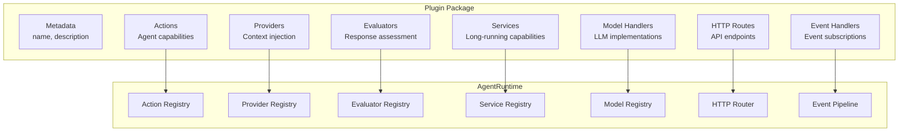

# Chapter 4: Plugin Architecture

## Introduction

ElizaOS is built on a plugin-first architecture. Every capability — model providers, database adapters, platform connectors, custom actions — is delivered as a plugin. The core runtime is intentionally minimal; plugins provide all the functionality. This chapter covers the plugin system in depth.

## Plugin Interface

```typescript
interface Plugin {
  // Metadata
  name: string;
  description: string;

  // Lifecycle
  init?: (
    config: Record<string, string>,
    runtime: IAgentRuntime
  ) => Promise<void>;

  // Configuration
  config?: Record<string, string | number | boolean | null | undefined>;

  // Capabilities
  services?: (typeof Service)[];
  actions?: Action[];
  providers?: Provider[];
  evaluators?: Evaluator[];
  adapter?: IDatabaseAdapter;
  models?: { [K in keyof ModelParamsMap]?: ModelHandler<K> };
  events?: PluginEvents;
  routes?: Route[];
  tests?: TestSuite[];

  // ECS Components
  componentTypes?: ComponentTypeDefinition[];

  // Dependencies
  dependencies?: string[];
  testDependencies?: string[];
  priority?: number;
}
```

## Plugin Components



## Actions

Actions are capabilities the agent can decide to use. They're exposed to the LLM as available tools:

```typescript
interface Action {
  name: string;
  description: string;
  similes: string[];              // Alternative names the LLM might use
  examples: ActionExample[];      // Few-shot examples for the LLM
  parameters?: JSONSchema;        // Input schema

  /**
   * Validate whether this action can run in current context.
   */
  validate?(
    runtime: IAgentRuntime,
    message: Memory
  ): Promise<boolean>;

  /**
   * Execute the action. Use callback to stream responses.
   */
  handler(
    runtime: IAgentRuntime,
    message: Memory,
    state: State,
    options: Record<string, unknown>,
    callback: ActionCallback
  ): Promise<void>;
}

type ActionCallback = (response: Memory) => Promise<void>;
```

### Example: Web Search Action

```typescript
const webSearchAction: Action = {
  name: "WEB_SEARCH",
  description: "Search the web for current information",
  similes: ["search", "google", "look up", "find online"],

  parameters: {
    type: "object",
    properties: {
      query: {
        type: "string",
        description: "The search query",
      },
      maxResults: {
        type: "number",
        description: "Maximum results to return",
        default: 5,
      },
    },
    required: ["query"],
  },

  examples: [
    [
      {
        user: "user",
        content: { text: "What's the latest news about TypeScript?" },
      },
      {
        user: "agent",
        content: {
          text: "Let me search for that.",
          action: "WEB_SEARCH",
        },
      },
    ],
  ],

  validate: async (runtime, message) => {
    // Only available if web search service is registered
    return runtime.getService("WEB_SEARCH") !== null;
  },

  handler: async (runtime, message, state, options, callback) => {
    const searchService = runtime.getService<WebSearchService>("WEB_SEARCH");
    const results = await searchService.search(
      options.query as string,
      options.maxResults as number
    );

    const formatted = results
      .map((r, i) => `${i + 1}. **${r.title}**\n   ${r.snippet}\n   ${r.url}`)
      .join("\n\n");

    await callback({
      content: { text: `Here are the search results:\n\n${formatted}` },
      roomId: message.roomId,
    });
  },
};
```

## Providers

Providers inject dynamic context into the agent's state before each LLM call:

```typescript
interface Provider {
  name: string;
  description: string;

  /**
   * Generate context string to inject into the prompt.
   * Return null to skip this provider for the current message.
   */
  get(
    runtime: IAgentRuntime,
    message: Memory,
    state?: State
  ): Promise<string | null>;
}
```

### Example: Time Provider

```typescript
const timeProvider: Provider = {
  name: "time",
  description: "Provides current date and time context",

  get: async (runtime, message) => {
    const timezone = runtime.character.settings?.timezone || "UTC";
    const now = new Date();

    return `Current date and time: ${now.toLocaleString("en-US", {
      timeZone: timezone,
      dateStyle: "full",
      timeStyle: "long",
    })} (${timezone})`;
  },
};
```

### Example: Recent Messages Provider

```typescript
const recentMessagesProvider: Provider = {
  name: "recentMessages",
  description: "Provides recent conversation context",

  get: async (runtime, message, state) => {
    const memories = await runtime.getMemoryManager().getMemories({
      roomId: message.roomId,
      count: 10,
    });

    if (memories.length === 0) return null;

    return memories
      .map((m) => `[${m.userId}]: ${m.content.text}`)
      .join("\n");
  },
};
```

## Evaluators

Evaluators assess the agent's responses and can trigger follow-up actions:

```typescript
interface Evaluator {
  name: string;
  description: string;
  similes: string[];

  /**
   * Check if this evaluator should run for the given message.
   */
  validate(runtime: IAgentRuntime, message: Memory): Promise<boolean>;

  /**
   * Evaluate the conversation and return assessment.
   */
  handler(
    runtime: IAgentRuntime,
    message: Memory,
    state: State,
    options: Record<string, unknown>
  ): Promise<EvaluationResult>;
}

interface EvaluationResult {
  score: number;          // 0-1 quality score
  feedback?: string;      // Assessment text
  shouldRetry?: boolean;  // Should the agent regenerate?
  metadata?: Record<string, unknown>;
}
```

### Example: Fact Checker Evaluator

```typescript
const factCheckerEvaluator: Evaluator = {
  name: "factChecker",
  description: "Validates factual claims in agent responses",
  similes: ["verify", "check facts"],

  validate: async (runtime, message) => {
    // Run on all agent responses
    return message.userId === runtime.agentId;
  },

  handler: async (runtime, message, state) => {
    const assessment = await runtime.useModel("text_generation", {
      system: `You are a fact checker. Analyze the following response
               for factual accuracy. Return a JSON object with:
               - score (0-1): confidence in factual accuracy
               - issues: array of potential inaccuracies
               - shouldRetry: true if response contains clear errors`,
      messages: [{
        role: "user",
        content: message.content.text || "",
      }],
    });

    return JSON.parse(assessment.text);
  },
};
```

## Services

Services are long-running capabilities that actions and providers depend on:

```typescript
abstract class Service {
  abstract get serviceType(): string;
  protected runtime: IAgentRuntime;

  constructor(runtime: IAgentRuntime) {
    this.runtime = runtime;
  }

  abstract initialize(): Promise<void>;
  abstract shutdown(): Promise<void>;
}
```

### Example: Browser Service

```typescript
class BrowserService extends Service {
  get serviceType() { return "BROWSER"; }

  private browser: Browser | null = null;

  async initialize() {
    const puppeteer = await import("puppeteer");
    this.browser = await puppeteer.launch({
      headless: true,
      args: ["--no-sandbox"],
    });
  }

  async browse(url: string): Promise<PageContent> {
    const page = await this.browser!.newPage();
    try {
      await page.goto(url, { waitUntil: "networkidle2" });
      const content = await page.evaluate(() => document.body.innerText);
      const title = await page.title();
      return { title, content, url };
    } finally {
      await page.close();
    }
  }

  async shutdown() {
    await this.browser?.close();
  }
}
```

## Building a Complete Plugin

### Plugin Structure

```
my-plugin/
├── src/
│   ├── index.ts          # Plugin definition
│   ├── actions/          # Action implementations
│   │   ├── search.ts
│   │   └── summarize.ts
│   ├── providers/        # Provider implementations
│   │   └── context.ts
│   ├── services/         # Service implementations
│   │   └── browser.ts
│   └── evaluators/       # Evaluator implementations
│       └── quality.ts
├── package.json
├── tsconfig.json
└── README.md
```

### Full Plugin Example

```typescript
// src/index.ts
import type { Plugin } from "@elizaos/core";
import { webSearchAction } from "./actions/search";
import { summarizeAction } from "./actions/summarize";
import { searchContextProvider } from "./providers/context";
import { BrowserService } from "./services/browser";
import { qualityEvaluator } from "./evaluators/quality";

const researchPlugin: Plugin = {
  name: "research-plugin",
  description: "Web research capabilities with search, browsing, and summarization",

  // Load order — lower = earlier
  priority: 50,

  // Dependencies — must be loaded before this plugin
  dependencies: ["@elizaos/plugin-bootstrap"],

  // Plugin configuration
  config: {
    maxSearchResults: 10,
    browserTimeout: 30000,
    enableFactChecking: true,
  },

  // Lifecycle
  init: async (config, runtime) => {
    console.log("Research plugin initialized with config:", config);
  },

  // Capabilities
  actions: [webSearchAction, summarizeAction],
  providers: [searchContextProvider],
  evaluators: [qualityEvaluator],
  services: [BrowserService],

  // Custom HTTP endpoints
  routes: [
    {
      method: "GET",
      path: "/research/history",
      handler: async (req, res, runtime) => {
        const history = await runtime.getMemoryManager().getMemories({
          tableName: "research_history",
          count: 50,
        });
        res.json(history);
      },
    },
  ],

  // Event handlers
  events: {
    MESSAGE_RECEIVED: async (event, runtime) => {
      // Track research-related messages for analytics
      if (event.payload.content?.text?.includes("research")) {
        await runtime.getDatabase().log({
          type: "research_request",
          timestamp: Date.now(),
          roomId: event.roomId,
        });
      }
    },
  },

  // Test suite
  tests: [
    {
      name: "search action",
      fn: async (runtime) => {
        const result = await webSearchAction.handler(
          runtime,
          { content: { text: "test query" }, roomId: "test" },
          {} as any,
          { query: "TypeScript", maxResults: 3 },
          async () => {}
        );
        // Assertions
      },
    },
  ],
};

export default researchPlugin;
```

### Package Configuration

```json
{
  "name": "elizaos-plugin-research",
  "version": "1.0.0",
  "main": "dist/index.js",
  "types": "dist/index.d.ts",
  "peerDependencies": {
    "@elizaos/core": "^1.4.0"
  },
  "scripts": {
    "build": "tsc",
    "test": "elizaos test"
  }
}
```

## Plugin Auto-Installation

ElizaOS can automatically install plugins referenced in character files:

```typescript
async function resolvePlugin(name: string): Promise<Plugin> {
  try {
    // Try to import the plugin
    const module = await import(name);
    return module.default || module;
  } catch {
    // Auto-install if not found
    if (process.env.ELIZAOS_AUTO_INSTALL_PLUGINS === "true") {
      console.log(`Auto-installing plugin: ${name}`);
      execSync(`bun add ${name}`, { stdio: "pipe" });
      const module = await import(name);
      return module.default || module;
    }
    throw new Error(`Plugin not found: ${name}`);
  }
}
```

## The Bootstrap Plugin

The `@elizaos/plugin-bootstrap` is the essential core plugin every agent needs:

| Component | Items |
|-----------|-------|
| **Actions** | reply, sendMessage, choice, followRoom, unfollowRoom, muteRoom, unmuteRoom, ignore, none, imageGeneration, roles, settings, updateEntity |
| **Providers** | actionState, actions, anxiety, attachments, capabilities, character, choice, entities, evaluators, facts, providers, recentMessages, relationships, roles, settings, time, world |
| **Services** | EmbeddingService, TaskService |

## Summary

| Component | Purpose | Example |
|-----------|---------|---------|
| **Actions** | Agent capabilities the LLM can choose to invoke | Web search, image generation |
| **Providers** | Dynamic context injected into prompts | Time, recent messages, user facts |
| **Evaluators** | Post-response quality assessment | Fact checking, relevance scoring |
| **Services** | Long-running capabilities for actions/providers | Browser, email, transcription |
| **Routes** | Custom HTTP endpoints | Analytics dashboards, webhooks |
| **Events** | Reactive handlers for system events | Message logging, metrics |
| **Models** | Custom LLM handler registration | Local model, custom API |

---

**Next Steps**: [Chapter 5: Memory & RAG](05-memory-rag.md) — Explore how ElizaOS manages conversation memory, embeddings, and retrieval-augmented generation.

---

*Built with insights from the [ElizaOS repository](https://github.com/elizaOS/eliza) and community documentation.*
