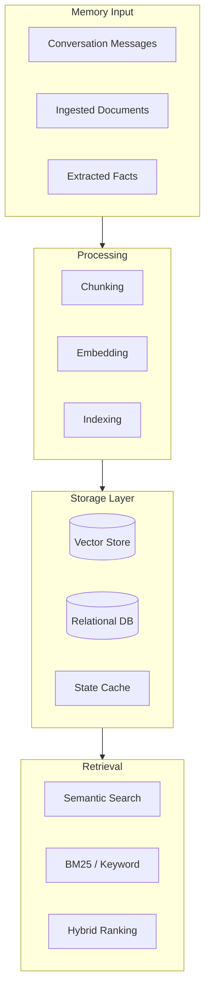
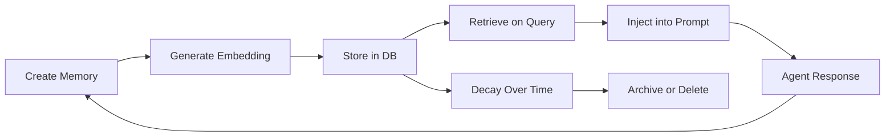

# Chapter 5: Memory & RAG

## Introduction

ElizaOS provides a sophisticated memory system that combines conversation history, semantic search, and retrieval-augmented generation (RAG). Agents remember past conversations, retrieve relevant knowledge from ingested documents, and maintain context across sessions. This chapter covers the memory architecture, embedding pipeline, and RAG integration.

## Memory Architecture



## Memory Types

ElizaOS manages several types of memory:

```typescript
interface Memory {
  id: string;
  content: MemoryContent;
  userId: string;
  agentId: string;
  roomId: string;
  worldId?: string;
  embedding?: number[];
  createdAt: number;
  unique?: boolean;      // Deduplicated memories
  tableName?: string;    // Memory partition
}

interface MemoryContent {
  text?: string;
  action?: string;
  source?: string;
  url?: string;
  attachments?: Attachment[];
  metadata?: Record<string, unknown>;
}
```

### Memory Tables

| Table | Purpose | Examples |
|-------|---------|---------|
| `messages` | Conversation history | User messages, agent responses |
| `facts` | Extracted knowledge | "User prefers Python", "Meeting at 2pm" |
| `knowledge` | Ingested documents | RAG chunks from PDFs, markdown, etc. |
| `relationships` | Entity relationships | "User works at Acme Corp" |
| `goals` | Agent goals and tasks | "Help user build an API" |

## IMemoryManager Interface

```typescript
interface IMemoryManager {
  // Store
  createMemory(memory: Memory, unique?: boolean): Promise<void>;

  // Retrieve by ID
  getMemoryById(id: string): Promise<Memory | null>;

  // Retrieve by room (conversation history)
  getMemories(params: {
    roomId: string;
    count?: number;
    unique?: boolean;
    tableName?: string;
    start?: number;
    end?: number;
  }): Promise<Memory[]>;

  // Semantic search
  searchMemories(params: {
    embedding: number[];
    roomId?: string;
    tableName?: string;
    count?: number;
    threshold?: number;
  }): Promise<Memory[]>;

  // Search by text (BM25)
  searchMemoriesByText(params: {
    text: string;
    roomId?: string;
    tableName?: string;
    count?: number;
  }): Promise<Memory[]>;

  // Delete
  removeMemory(id: string): Promise<void>;
  removeAllMemories(roomId: string, tableName?: string): Promise<void>;

  // Count
  countMemories(roomId: string, tableName?: string): Promise<number>;
}
```

## Embedding Pipeline

### Embedding Service

```typescript
class EmbeddingService extends Service {
  get serviceType() { return "EMBEDDING"; }

  private model: string;
  private dimension: number;
  private cache: Map<string, number[]> = new Map();

  async initialize() {
    this.model = this.runtime.character.settings?.embeddingModel
      || "text-embedding-3-small";
    this.dimension = this.getDimension(this.model);
  }

  /**
   * Generate an embedding vector for the given text.
   */
  async embed(text: string): Promise<number[]> {
    // Check cache
    const cacheKey = this.hashText(text);
    if (this.cache.has(cacheKey)) {
      return this.cache.get(cacheKey)!;
    }

    // Generate embedding via model
    const result = await this.runtime.useModel("text_embedding", {
      model: this.model,
      input: text,
    });

    this.cache.set(cacheKey, result.embedding);
    return result.embedding;
  }

  /**
   * Batch embed multiple texts efficiently.
   */
  async embedBatch(texts: string[]): Promise<number[][]> {
    const results: number[][] = [];
    const uncached: { index: number; text: string }[] = [];

    // Check cache first
    for (let i = 0; i < texts.length; i++) {
      const cacheKey = this.hashText(texts[i]);
      if (this.cache.has(cacheKey)) {
        results[i] = this.cache.get(cacheKey)!;
      } else {
        uncached.push({ index: i, text: texts[i] });
      }
    }

    // Batch embed uncached texts
    if (uncached.length > 0) {
      const batchResult = await this.runtime.useModel("text_embedding", {
        model: this.model,
        input: uncached.map(u => u.text),
      });

      for (let i = 0; i < uncached.length; i++) {
        results[uncached[i].index] = batchResult.embeddings[i];
        this.cache.set(
          this.hashText(uncached[i].text),
          batchResult.embeddings[i]
        );
      }
    }

    return results;
  }

  private getDimension(model: string): number {
    const dimensions: Record<string, number> = {
      "text-embedding-3-small": 1536,
      "text-embedding-3-large": 3072,
      "nomic-embed-text": 768,
    };
    return dimensions[model] || 1536;
  }
}
```

## Document Ingestion (RAG)

### Ingestion Pipeline


```typescript
class DocumentIngester {
  private loaders: Map<string, DocumentLoader> = new Map();
  private splitter: TextSplitter;
  private embedder: EmbeddingService;

  constructor(runtime: IAgentRuntime) {
    // Register loaders for different file types
    this.loaders.set(".md", new MarkdownLoader());
    this.loaders.set(".txt", new TextLoader());
    this.loaders.set(".pdf", new PDFLoader());
    this.loaders.set(".docx", new DocxLoader());
    this.loaders.set(".json", new JSONLoader());

    this.splitter = new TextSplitter({
      chunkSize: 1000,       // Characters per chunk
      chunkOverlap: 200,     // Overlap between chunks
      separators: ["\n\n", "\n", ". ", " "],
    });
  }

  async ingest(filePath: string, metadata?: Record<string, unknown>) {
    const ext = path.extname(filePath).toLowerCase();
    const loader = this.loaders.get(ext);
    if (!loader) throw new Error(`Unsupported file type: ${ext}`);

    // 1. Load document
    const document = await loader.load(filePath);

    // 2. Split into chunks
    const chunks = this.splitter.split(document.content);

    // 3. Generate embeddings
    const embeddings = await this.embedder.embedBatch(
      chunks.map(c => c.text)
    );

    // 4. Store in memory
    for (let i = 0; i < chunks.length; i++) {
      await this.runtime.getMemoryManager().createMemory({
        content: {
          text: chunks[i].text,
          source: filePath,
          metadata: {
            ...metadata,
            chunkIndex: i,
            totalChunks: chunks.length,
            startOffset: chunks[i].startOffset,
          },
        },
        embedding: embeddings[i],
        roomId: "knowledge",  // Global knowledge room
        userId: this.runtime.agentId,
        agentId: this.runtime.agentId,
        tableName: "knowledge",
      }, true);  // unique = true for deduplication
    }
  }
}
```

### Text Splitting Strategies

```typescript
class TextSplitter {
  private config: SplitterConfig;

  split(text: string): Chunk[] {
    const chunks: Chunk[] = [];
    let startOffset = 0;

    // Try each separator in order of preference
    for (const separator of this.config.separators) {
      if (text.length <= this.config.chunkSize) {
        chunks.push({ text, startOffset });
        return chunks;
      }

      const segments = text.split(separator);
      let current = "";

      for (const segment of segments) {
        if ((current + separator + segment).length > this.config.chunkSize) {
          if (current) {
            chunks.push({
              text: current.trim(),
              startOffset,
            });
            // Apply overlap
            const overlapStart = Math.max(
              0,
              current.length - this.config.chunkOverlap
            );
            startOffset += current.length - this.config.chunkOverlap;
            current = current.slice(overlapStart) + separator + segment;
          } else {
            current = segment;
          }
        } else {
          current += (current ? separator : "") + segment;
        }
      }

      if (current) {
        chunks.push({ text: current.trim(), startOffset });
      }

      if (chunks.length > 0) return chunks;
    }

    // Fallback: split by character count
    for (let i = 0; i < text.length; i += this.config.chunkSize - this.config.chunkOverlap) {
      chunks.push({
        text: text.slice(i, i + this.config.chunkSize),
        startOffset: i,
      });
    }

    return chunks;
  }
}
```

## Retrieval Pipeline

### Hybrid Search

ElizaOS combines semantic (vector) and keyword (BM25) search:

```typescript
class HybridRetriever {
  async retrieve(params: {
    query: string;
    roomId?: string;
    tableName?: string;
    count?: number;
    threshold?: number;
  }): Promise<RetrievalResult[]> {
    const { query, count = 10, threshold = 0.6 } = params;

    // Run both searches in parallel
    const [semanticResults, keywordResults] = await Promise.all([
      this.semanticSearch(query, params),
      this.keywordSearch(query, params),
    ]);

    // Reciprocal Rank Fusion (RRF) to combine results
    return this.reciprocalRankFusion(
      semanticResults,
      keywordResults,
      count,
      threshold
    );
  }

  private async semanticSearch(
    query: string,
    params: RetrievalParams
  ): Promise<ScoredMemory[]> {
    const embedding = await this.embedder.embed(query);

    return this.memoryManager.searchMemories({
      embedding,
      roomId: params.roomId,
      tableName: params.tableName,
      count: params.count! * 2,  // Over-fetch for fusion
      threshold: 0.5,
    });
  }

  private async keywordSearch(
    query: string,
    params: RetrievalParams
  ): Promise<ScoredMemory[]> {
    return this.memoryManager.searchMemoriesByText({
      text: query,
      roomId: params.roomId,
      tableName: params.tableName,
      count: params.count! * 2,
    });
  }

  /**
   * Reciprocal Rank Fusion combines ranked lists from
   * different retrieval methods into a single ranking.
   */
  private reciprocalRankFusion(
    semantic: ScoredMemory[],
    keyword: ScoredMemory[],
    count: number,
    threshold: number
  ): RetrievalResult[] {
    const k = 60; // RRF constant
    const scores = new Map<string, number>();

    // Score semantic results
    semantic.forEach((result, rank) => {
      const score = 1 / (k + rank + 1);
      scores.set(result.id, (scores.get(result.id) || 0) + score);
    });

    // Score keyword results
    keyword.forEach((result, rank) => {
      const score = 1 / (k + rank + 1);
      scores.set(result.id, (scores.get(result.id) || 0) + score);
    });

    // Sort by combined score and return top results
    const allResults = new Map([
      ...semantic.map(r => [r.id, r] as const),
      ...keyword.map(r => [r.id, r] as const),
    ]);

    return Array.from(scores.entries())
      .sort((a, b) => b[1] - a[1])
      .slice(0, count)
      .filter(([_, score]) => score > threshold)
      .map(([id, score]) => ({
        ...allResults.get(id)!,
        fusionScore: score,
      }));
  }
}
```

## Context Window Management

### Conversation Memory in Prompts

```typescript
class ContextWindowManager {
  /**
   * Build the context for an LLM call, balancing:
   * - Recent conversation history
   * - Retrieved knowledge (RAG)
   * - Provider outputs
   * - Available token budget
   */
  async buildContext(
    message: Memory,
    state: State,
    maxTokens: number
  ): Promise<ContextWindow> {
    let tokenBudget = maxTokens;

    // 1. Reserve tokens for system prompt (~2000)
    const systemPrompt = this.buildSystemPrompt(state);
    tokenBudget -= this.countTokens(systemPrompt);

    // 2. Reserve tokens for the current message (~500)
    tokenBudget -= this.countTokens(message.content.text || "");

    // 3. Allocate remaining budget
    const ragBudget = Math.floor(tokenBudget * 0.3);  // 30% for RAG
    const historyBudget = Math.floor(tokenBudget * 0.5); // 50% for history
    const providerBudget = Math.floor(tokenBudget * 0.2); // 20% for providers

    // 4. Fill each section within budget
    const ragContext = await this.fillRAGContext(message, ragBudget);
    const history = this.trimHistory(state.recentMessages, historyBudget);
    const providers = this.trimProviders(state.providers, providerBudget);

    return { systemPrompt, history, ragContext, providers, message };
  }

  private async fillRAGContext(
    message: Memory,
    tokenBudget: number
  ): Promise<string> {
    const retriever = new HybridRetriever(this.runtime);
    const results = await retriever.retrieve({
      query: message.content.text || "",
      tableName: "knowledge",
      count: 20,
    });

    let context = "";
    for (const result of results) {
      const chunk = result.content.text || "";
      if (this.countTokens(context + chunk) > tokenBudget) break;
      context += chunk + "\n\n";
    }

    return context;
  }
}
```

## Memory Lifecycle



### Memory Pruning

```typescript
class MemoryPruner {
  /**
   * Prune old, low-relevance memories to manage storage.
   */
  async prune(config: PruneConfig) {
    const cutoff = Date.now() - config.maxAgeDays * 24 * 60 * 60 * 1000;

    // Get memories older than cutoff
    const oldMemories = await this.db.query(`
      SELECT * FROM memories
      WHERE created_at < $1
        AND table_name = $2
      ORDER BY created_at ASC
    `, [cutoff, config.tableName]);

    let pruned = 0;
    for (const memory of oldMemories) {
      // Keep high-importance memories
      if (memory.content.metadata?.importance === "high") continue;

      // Keep memories that have been frequently accessed
      if (memory.access_count > config.minAccessCount) continue;

      await this.memoryManager.removeMemory(memory.id);
      pruned++;
    }

    return { pruned, total: oldMemories.length };
  }
}
```

## Summary

| Concept | Key Takeaway |
|---------|-------------|
| **Memory Types** | Messages, facts, knowledge (RAG), relationships, goals — stored in partitioned tables |
| **Embedding Pipeline** | Text → embedding vector via configurable model; cached for efficiency |
| **Document Ingestion** | Load → chunk → embed → store; supports MD, PDF, DOCX, TXT, JSON |
| **Text Splitting** | Smart chunking with overlap at paragraph/sentence/word boundaries |
| **Hybrid Search** | Semantic (vector) + keyword (BM25) combined via Reciprocal Rank Fusion |
| **Context Window** | Token budget allocated: 50% history, 30% RAG, 20% providers |
| **Memory Pruning** | Time-based decay, access count preservation, importance filtering |

---

**Next Steps**: [Chapter 6: Platform Connectors](06-platform-connectors.md) — Connect your agent to Discord, Telegram, Slack, X/Twitter via the unified event pipeline.

---

*Built with insights from the [ElizaOS repository](https://github.com/elizaOS/eliza) and community documentation.*
