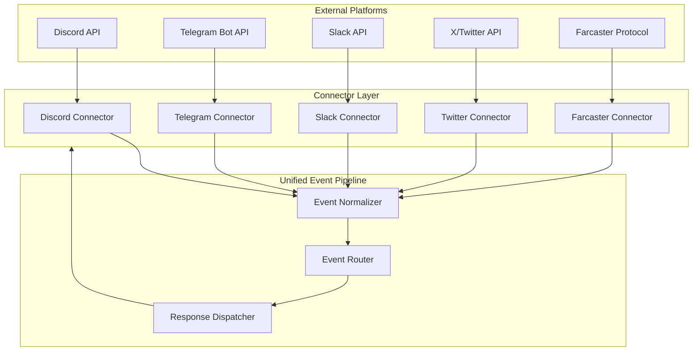

# Chapter 6: Platform Connectors

## Introduction

ElizaOS agents operate across multiple platforms simultaneously — Discord, Telegram, Slack, X/Twitter, and Farcaster. Each platform has its own API, message format, and interaction model. Connectors bridge the gap between platform-specific protocols and ElizaOS's unified event pipeline, allowing agents to be written once and deployed everywhere.

## Connector Architecture



## Connector Interface

All connectors implement a standard interface:

```typescript
interface PlatformConnector {
  platform: string;

  // Lifecycle
  connect(): Promise<void>;
  disconnect(): Promise<void>;

  // World/Room management
  getWorlds(): Promise<World[]>;
  getRooms(worldId: string): Promise<Room[]>;

  // Message handling
  sendMessage(roomId: string, content: MessageContent): Promise<void>;
  sendTypingIndicator(roomId: string): Promise<void>;

  // Event emission
  onEvent(handler: (event: PlatformEvent) => void): void;
}

interface PlatformEvent {
  type: string;
  platform: string;
  roomId: string;
  worldId?: string;
  userId: string;
  content: MessageContent;
  raw: unknown;            // Platform-specific raw event
  timestamp: number;
}
```

## Discord Connector

Discord provides the richest interaction model with servers, channels, threads, and slash commands:

```typescript
class DiscordConnector implements PlatformConnector {
  platform = "discord";
  private client: Client;
  private runtime: IAgentRuntime;

  async connect() {
    this.client = new Client({
      intents: [
        GatewayIntentBits.Guilds,
        GatewayIntentBits.GuildMessages,
        GatewayIntentBits.MessageContent,
        GatewayIntentBits.DirectMessages,
        GatewayIntentBits.GuildMembers,
      ],
    });

    // Map Discord events to ElizaOS events
    this.client.on("messageCreate", (msg) => this.handleMessage(msg));
    this.client.on("interactionCreate", (i) => this.handleInteraction(i));
    this.client.on("guildCreate", (guild) => this.handleGuildJoin(guild));

    await this.client.login(process.env.DISCORD_API_TOKEN);
  }

  private async handleMessage(msg: DiscordMessage) {
    if (msg.author.bot) return;

    // Check if agent should respond
    if (!this.shouldRespond(msg)) return;

    // Normalize to ElizaOS event
    const event: PlatformEvent = {
      type: "MESSAGE_RECEIVED",
      platform: "discord",
      roomId: msg.channelId,
      worldId: msg.guildId || undefined,
      userId: msg.author.id,
      content: {
        text: msg.content,
        attachments: msg.attachments.map(a => ({
          url: a.url,
          type: a.contentType || "unknown",
          name: a.name || "attachment",
        })),
      },
      raw: msg,
      timestamp: msg.createdTimestamp,
    };

    this.eventHandler(event);
  }

  private shouldRespond(msg: DiscordMessage): boolean {
    const config = this.runtime.character.clientConfig?.discord || {};

    // Always respond to DMs (unless configured otherwise)
    if (!msg.guild) {
      return config.shouldRespondToDirectMessages !== false;
    }

    // In servers: respond when mentioned
    if (msg.mentions.has(this.client.user!.id)) return true;

    // In servers: respond when replying to agent
    if (msg.reference?.messageId) {
      // Check if referenced message is from this agent
      return this.isOwnMessage(msg.reference.messageId, msg.channel);
    }

    return false;
  }

  async sendMessage(roomId: string, content: MessageContent) {
    const channel = await this.client.channels.fetch(roomId);
    if (!channel?.isTextBased()) return;

    // Handle Discord's 2000 char limit
    const chunks = this.chunkMessage(content.text || "", 2000);

    for (const chunk of chunks) {
      await (channel as TextChannel).send({
        content: chunk,
        embeds: content.embeds?.map(e => this.toDiscordEmbed(e)),
      });
    }
  }

  // Map Discord servers to ElizaOS Worlds
  async getWorlds(): Promise<World[]> {
    return this.client.guilds.cache.map(guild => ({
      id: guild.id,
      name: guild.name,
      platform: "discord",
      metadata: {
        memberCount: guild.memberCount,
        icon: guild.iconURL(),
      },
      rooms: [],
    }));
  }

  // Map Discord channels to ElizaOS Rooms
  async getRooms(worldId: string): Promise<Room[]> {
    const guild = await this.client.guilds.fetch(worldId);
    const channels = await guild.channels.fetch();

    return channels
      .filter(c => c?.isTextBased())
      .map(c => ({
        id: c!.id,
        worldId,
        name: c!.name,
        type: c!.type === ChannelType.DM ? "dm" : "channel",
        participants: [],
      }));
  }
}
```

## Telegram Connector

Telegram uses the Bot API with polling or webhooks:

```typescript
class TelegramConnector implements PlatformConnector {
  platform = "telegram";
  private bot: Bot;

  async connect() {
    this.bot = new Bot(process.env.TELEGRAM_BOT_TOKEN!);

    this.bot.on("message:text", (ctx) => this.handleText(ctx));
    this.bot.on("message:photo", (ctx) => this.handleMedia(ctx, "image"));
    this.bot.on("message:voice", (ctx) => this.handleMedia(ctx, "audio"));
    this.bot.on("callback_query:data", (ctx) => this.handleCallback(ctx));

    // Use webhooks in production, polling in development
    if (process.env.TELEGRAM_WEBHOOK_URL) {
      await this.bot.api.setWebhook(process.env.TELEGRAM_WEBHOOK_URL);
    } else {
      this.bot.start();
    }
  }

  private async handleText(ctx: Context) {
    const event: PlatformEvent = {
      type: "MESSAGE_RECEIVED",
      platform: "telegram",
      roomId: String(ctx.chat.id),
      userId: String(ctx.from!.id),
      content: {
        text: ctx.message!.text!,
      },
      raw: ctx,
      timestamp: ctx.message!.date * 1000,
    };

    // Group message activation check
    if (ctx.chat.type !== "private") {
      const botMentioned = ctx.message!.text!.includes(`@${this.bot.botInfo.username}`);
      const isReply = ctx.message!.reply_to_message?.from?.id === this.bot.botInfo.id;
      if (!botMentioned && !isReply) return;
    }

    this.eventHandler(event);
  }

  async sendMessage(roomId: string, content: MessageContent) {
    const chatId = Number(roomId);

    if (content.text) {
      await this.bot.api.sendMessage(chatId, content.text, {
        parse_mode: "MarkdownV2",
      });
    }

    if (content.attachments) {
      for (const attachment of content.attachments) {
        if (attachment.type === "image") {
          await this.bot.api.sendPhoto(chatId, attachment.url);
        }
      }
    }
  }
}
```

## X/Twitter Connector

The Twitter connector handles both reading and posting:

```typescript
class TwitterConnector implements PlatformConnector {
  platform = "twitter";
  private api: TwitterApi;
  private pollInterval: NodeJS.Timeout | null = null;

  async connect() {
    this.api = new TwitterApi({
      appKey: process.env.TWITTER_API_KEY!,
      appSecret: process.env.TWITTER_API_SECRET!,
      accessToken: process.env.TWITTER_ACCESS_TOKEN!,
      accessSecret: process.env.TWITTER_ACCESS_SECRET!,
    });

    // Start polling for mentions
    this.startPolling();
  }

  private startPolling() {
    this.pollInterval = setInterval(async () => {
      const mentions = await this.api.v2.userMentionTimeline(
        this.userId,
        { since_id: this.lastMentionId }
      );

      for (const tweet of mentions.data?.data || []) {
        this.eventHandler({
          type: "MESSAGE_RECEIVED",
          platform: "twitter",
          roomId: tweet.conversation_id || tweet.id,
          userId: tweet.author_id!,
          content: { text: tweet.text },
          raw: tweet,
          timestamp: new Date(tweet.created_at!).getTime(),
        });

        this.lastMentionId = tweet.id;
      }
    }, 60_000); // Poll every minute
  }

  async sendMessage(roomId: string, content: MessageContent) {
    const text = this.truncateForTwitter(content.text || "", 280);

    await this.api.v2.reply(text, roomId);
  }

  /**
   * Post original content (not a reply).
   * Used by agents with social media posting capabilities.
   */
  async post(content: MessageContent) {
    const text = content.text || "";

    // Apply character's post style rules
    const styled = await this.runtime.useModel("text_generation", {
      system: this.runtime.character.style.post.join("\n"),
      messages: [{ role: "user", content: `Rephrase for Twitter: ${text}` }],
    });

    await this.api.v2.tweet(styled.text.slice(0, 280));
  }
}
```

## Event Normalization

The event normalizer ensures all platform events have a consistent structure:

```typescript
class EventNormalizer {
  /**
   * Normalize platform-specific events into a standard format
   * that the AgentRuntime can process uniformly.
   */
  normalize(event: PlatformEvent): NormalizedEvent {
    return {
      // Standard fields
      id: crypto.randomUUID(),
      type: event.type,
      timestamp: event.timestamp || Date.now(),

      // Platform info
      platform: event.platform,
      roomId: event.roomId,
      worldId: event.worldId,

      // User info (resolved to ElizaOS entity)
      userId: this.resolveUserId(event.platform, event.userId),
      platformUserId: event.userId,

      // Content (normalized)
      content: this.normalizeContent(event.content, event.platform),

      // Raw event preserved for platform-specific handling
      raw: event.raw,
    };
  }

  private normalizeContent(
    content: MessageContent,
    platform: string
  ): NormalizedContent {
    let text = content.text || "";

    // Strip platform-specific formatting
    switch (platform) {
      case "discord":
        text = this.stripDiscordMentions(text);
        break;
      case "telegram":
        text = this.stripTelegramCommands(text);
        break;
      case "slack":
        text = this.convertSlackMarkdown(text);
        break;
    }

    return {
      text: text.trim(),
      attachments: content.attachments || [],
      metadata: content.metadata || {},
    };
  }
}
```

## Response Routing

Responses flow back through the connector that originated the message:

```typescript
class ResponseDispatcher {
  private connectors: Map<string, PlatformConnector> = new Map();

  async dispatch(response: AgentResponse, context: EventContext) {
    const connector = this.connectors.get(context.platform);
    if (!connector) {
      throw new Error(`No connector for platform: ${context.platform}`);
    }

    // Format response for the target platform
    const formatted = this.formatForPlatform(
      response,
      context.platform
    );

    // Show typing indicator
    await connector.sendTypingIndicator(context.roomId);

    // Send the response
    await connector.sendMessage(context.roomId, formatted);
  }

  private formatForPlatform(
    response: AgentResponse,
    platform: string
  ): MessageContent {
    const text = response.text;

    switch (platform) {
      case "discord":
        return {
          text: this.formatDiscord(text),
          embeds: response.embeds,
        };
      case "telegram":
        return {
          text: this.formatTelegramMarkdown(text),
        };
      case "twitter":
        return {
          text: text.slice(0, 280), // Twitter character limit
        };
      case "slack":
        return {
          text: this.formatSlackMrkdwn(text),
          blocks: this.buildSlackBlocks(response),
        };
      default:
        return { text };
    }
  }
}
```

## Multi-Platform Agent Configuration

Configure which platforms an agent connects to:

```json
{
  "name": "MultiBotAgent",
  "clients": ["discord", "telegram", "twitter"],
  "clientConfig": {
    "discord": {
      "shouldRespondToDirectMessages": true,
      "shouldIgnoreBots": true,
      "allowedGuilds": ["1234567890"]
    },
    "telegram": {
      "shouldIgnoreGroups": false,
      "allowedGroups": [-1001234567890]
    },
    "twitter": {
      "pollInterval": 120000,
      "autoPost": true,
      "postInterval": 3600000
    }
  }
}
```

## Summary

| Connector | Library | Key Features |
|-----------|---------|-------------|
| **Discord** | discord.js | Servers/channels/threads, slash commands, embeds |
| **Telegram** | grammY | Polling/webhooks, inline keyboards, media |
| **X/Twitter** | twitter-api-v2 | Mentions polling, replies, original posts |
| **Slack** | @slack/bolt | Socket Mode, Block Kit, app mentions |
| **Farcaster** | Farcaster SDK | Decentralized social, casts, channels |

| Concept | Key Takeaway |
|---------|-------------|
| **Unified Events** | All platforms normalized into platform-agnostic events |
| **Write Once** | Agent logic works identically across all platforms |
| **Response Formatting** | Automatic platform-specific formatting (markdown, mrkdwn, etc.) |
| **Activation Rules** | Per-platform: DMs, mentions, replies, group settings |

---

**Next Steps**: [Chapter 7: Multi-Agent Orchestration](07-multi-agent.md) — Coordinate groups of agents with delegation, collaboration, and shared context.

---

*Built with insights from the [ElizaOS repository](https://github.com/elizaOS/eliza) and community documentation.*
