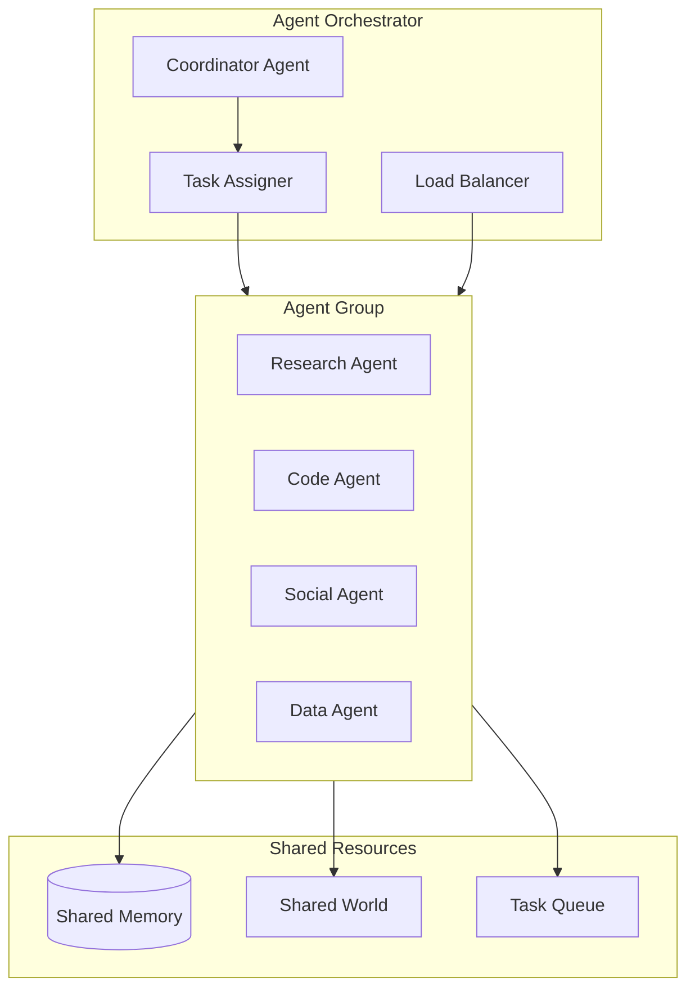

# Chapter 7: Multi-Agent Orchestration

## Introduction

ElizaOS natively supports multi-agent systems — groups of specialized agents that collaborate, delegate tasks, share context, and coordinate their actions. This goes beyond running multiple independent agents; ElizaOS provides primitives for inter-agent communication, role assignment, task delegation, and load balancing.

## Multi-Agent Architecture



## Agent Groups

An agent group is a collection of agents that work together:

```typescript
interface AgentGroup {
  id: string;
  name: string;
  agents: AgentRuntime[];
  coordinator?: AgentRuntime;     // Optional lead agent
  sharedMemory: IMemoryManager;
  taskQueue: TaskQueue;
  config: GroupConfig;
}

interface GroupConfig {
  delegationStrategy: "round_robin" | "capability" | "load";
  sharedContext: boolean;           // Agents can see each other's work
  crossAgentMemory: boolean;       // Memories shared across agents
  coordinatorRequired: boolean;     // Must have a coordinator
  maxConcurrentTasks: number;
}

class AgentGroupManager {
  private groups: Map<string, AgentGroup> = new Map();

  async createGroup(config: CreateGroupConfig): Promise<AgentGroup> {
    const group: AgentGroup = {
      id: crypto.randomUUID(),
      name: config.name,
      agents: [],
      sharedMemory: new SharedMemoryManager(),
      taskQueue: new TaskQueue(),
      config: config.groupConfig,
    };

    // Create agents from character definitions
    for (const characterDef of config.characters) {
      const runtime = new AgentRuntime({
        character: characterDef,
        plugins: characterDef.plugins.map(p => this.resolvePlugin(p)),
        groupId: group.id,
      });

      await runtime.initialize();
      group.agents.push(runtime);
    }

    // Designate coordinator if configured
    if (config.coordinatorIndex !== undefined) {
      group.coordinator = group.agents[config.coordinatorIndex];
    }

    this.groups.set(group.id, group);
    return group;
  }
}
```

## Task Delegation

The coordinator agent can delegate tasks to specialists:

```typescript
interface Task {
  id: string;
  description: string;
  assignedTo?: string;        // Agent ID
  status: TaskStatus;
  priority: number;
  dependencies: string[];     // Task IDs this depends on
  result?: unknown;
  createdAt: number;
  completedAt?: number;
}

enum TaskStatus {
  PENDING = "pending",
  ASSIGNED = "assigned",
  IN_PROGRESS = "in_progress",
  COMPLETED = "completed",
  FAILED = "failed",
}

class TaskDelegator {
  /**
   * Delegate a task to the most appropriate agent.
   */
  async delegate(
    task: Task,
    group: AgentGroup
  ): Promise<string> {
    let targetAgent: AgentRuntime;

    switch (group.config.delegationStrategy) {
      case "capability":
        targetAgent = this.findByCapability(task, group);
        break;

      case "load":
        targetAgent = this.findLeastLoaded(group);
        break;

      case "round_robin":
      default:
        targetAgent = this.nextInRotation(group);
        break;
    }

    // Assign the task
    task.assignedTo = targetAgent.agentId;
    task.status = TaskStatus.ASSIGNED;
    await group.taskQueue.update(task);

    // Notify the agent
    await targetAgent.processEvent({
      type: "TASK_ASSIGNED",
      payload: task,
      source: "coordinator",
      timestamp: Date.now(),
    });

    return targetAgent.agentId;
  }

  /**
   * Find the agent whose capabilities best match the task.
   */
  private findByCapability(
    task: Task,
    group: AgentGroup
  ): AgentRuntime {
    const scores = group.agents.map(agent => {
      const topics = agent.character.topics || [];
      const actions = agent.actions.map(a => a.name);

      // Score based on topic overlap
      const topicScore = this.calculateOverlap(
        task.description.toLowerCase().split(" "),
        topics.map(t => t.toLowerCase())
      );

      // Score based on available actions
      const actionScore = actions.length / 10;

      return { agent, score: topicScore + actionScore };
    });

    scores.sort((a, b) => b.score - a.score);
    return scores[0].agent;
  }

  private findLeastLoaded(group: AgentGroup): AgentRuntime {
    const loads = group.agents.map(agent => ({
      agent,
      load: group.taskQueue.getAssignedCount(agent.agentId),
    }));

    loads.sort((a, b) => a.load - b.load);
    return loads[0].agent;
  }
}
```

## Inter-Agent Communication

Agents within a group communicate via the shared event system:

```typescript
class InterAgentMessenger {
  /**
   * Send a message from one agent to another within the group.
   */
  async send(
    fromAgent: AgentRuntime,
    toAgentId: string,
    message: InterAgentMessage
  ) {
    const group = this.getGroup(fromAgent.groupId!);
    const targetAgent = group.agents.find(a => a.agentId === toAgentId);

    if (!targetAgent) {
      throw new Error(`Agent ${toAgentId} not found in group`);
    }

    await targetAgent.processEvent({
      type: "AGENT_MESSAGE",
      payload: {
        from: fromAgent.agentId,
        fromName: fromAgent.character.name,
        content: message.content,
        context: message.context,
        expectsReply: message.expectsReply,
      },
      source: fromAgent.agentId,
      timestamp: Date.now(),
    });
  }

  /**
   * Broadcast a message to all agents in the group.
   */
  async broadcast(
    fromAgent: AgentRuntime,
    message: InterAgentMessage
  ) {
    const group = this.getGroup(fromAgent.groupId!);

    await Promise.all(
      group.agents
        .filter(a => a.agentId !== fromAgent.agentId)
        .map(a => this.send(fromAgent, a.agentId, message))
    );
  }
}

interface InterAgentMessage {
  content: string;
  context?: Record<string, unknown>;
  expectsReply: boolean;
  priority?: number;
}
```

## Shared Memory

Agents in a group can share a memory space:

```typescript
class SharedMemoryManager implements IMemoryManager {
  private agentMemories: Map<string, IMemoryManager> = new Map();
  private sharedStore: IMemoryManager;

  /**
   * Store a memory in the shared space.
   * Other agents in the group can retrieve it.
   */
  async createSharedMemory(
    memory: Memory,
    sourceAgentId: string
  ) {
    // Tag with source agent
    const sharedMemory = {
      ...memory,
      content: {
        ...memory.content,
        metadata: {
          ...memory.content.metadata,
          sourceAgent: sourceAgentId,
          shared: true,
        },
      },
    };

    await this.sharedStore.createMemory(sharedMemory);
  }

  /**
   * Search across both personal and shared memories.
   */
  async searchAll(
    agentId: string,
    params: SearchParams
  ): Promise<Memory[]> {
    // Search personal memories
    const personal = await this.agentMemories
      .get(agentId)
      ?.searchMemories(params) || [];

    // Search shared memories
    const shared = await this.sharedStore.searchMemories(params);

    // Merge and deduplicate
    const merged = [...personal, ...shared];
    return this.deduplicateByContent(merged)
      .sort((a, b) => (b.score || 0) - (a.score || 0))
      .slice(0, params.count || 10);
  }
}
```

## Worlds and Rooms for Multi-Agent

The World/Room model supports multi-agent contexts:

```typescript
class MultiAgentWorld {
  /**
   * Create a world where multiple agents coexist.
   */
  async createWorld(config: WorldConfig): Promise<World> {
    const world: World = {
      id: crypto.randomUUID(),
      name: config.name,
      platform: config.platform,
      metadata: {
        agentIds: config.agentIds,
        roles: config.roles,
      },
      rooms: [],
    };

    // Create rooms for different interaction types
    const rooms = [
      // Agent-to-agent coordination room
      {
        id: `${world.id}:coordination`,
        name: "coordination",
        type: "channel" as const,
        worldId: world.id,
        participants: config.agentIds.map(id => ({
          id,
          name: this.getAgentName(id),
          platform: "internal",
          platformId: id,
          metadata: {},
          components: [],
        })),
      },
      // User-facing room
      {
        id: `${world.id}:main`,
        name: "main",
        type: "channel" as const,
        worldId: world.id,
        participants: [],
      },
    ];

    world.rooms = rooms;
    await this.store(world);
    return world;
  }
}
```

## Orchestration Patterns

### Pipeline Pattern

Agents process tasks sequentially, each adding their expertise:

```typescript
class PipelineOrchestrator {
  async execute(
    input: string,
    pipeline: AgentRuntime[]
  ): Promise<string> {
    let result = input;

    for (const agent of pipeline) {
      const response = await agent.processMessage({
        content: { text: result },
        roomId: "pipeline",
      });

      result = response.text;
    }

    return result;
  }
}

// Usage: Research → Analyze → Summarize
const pipeline = [researchAgent, analysisAgent, summaryAgent];
const result = await orchestrator.execute("Explain quantum computing trends", pipeline);
```

### Debate Pattern

Multiple agents discuss a topic and reach consensus:

```typescript
class DebateOrchestrator {
  async debate(
    topic: string,
    agents: AgentRuntime[],
    rounds: number = 3
  ): Promise<DebateResult> {
    const positions: Map<string, string[]> = new Map();

    for (let round = 0; round < rounds; round++) {
      for (const agent of agents) {
        // Each agent sees the full debate history
        const context = this.buildDebateContext(topic, positions);

        const response = await agent.processMessage({
          content: { text: context },
          roomId: "debate",
        });

        if (!positions.has(agent.agentId)) {
          positions.set(agent.agentId, []);
        }
        positions.get(agent.agentId)!.push(response.text);
      }
    }

    // Synthesize final consensus
    return this.synthesize(topic, positions);
  }
}
```

### Supervisor Pattern

A coordinator agent manages specialist agents:

```typescript
class SupervisorOrchestrator {
  private supervisor: AgentRuntime;
  private workers: AgentRuntime[];

  async handleRequest(userMessage: string): Promise<string> {
    // Supervisor decides how to break down the task
    const plan = await this.supervisor.processMessage({
      content: {
        text: `Break this request into subtasks for our team:
               Workers: ${this.workers.map(w => `${w.character.name} (${w.character.description})`).join(", ")}
               Request: ${userMessage}

               Respond with JSON: { "tasks": [{"worker": "name", "task": "description"}] }`,
      },
      roomId: "supervisor",
    });

    const tasks = JSON.parse(plan.text).tasks;

    // Delegate to workers in parallel
    const results = await Promise.all(
      tasks.map(async (task: any) => {
        const worker = this.workers.find(
          w => w.character.name === task.worker
        );
        if (!worker) return `[${task.worker} not found]`;

        const result = await worker.processMessage({
          content: { text: task.task },
          roomId: "worker",
        });

        return { worker: task.worker, result: result.text };
      })
    );

    // Supervisor synthesizes final response
    const synthesis = await this.supervisor.processMessage({
      content: {
        text: `Synthesize these results into a final response:
               ${results.map(r => `[${r.worker}]: ${r.result}`).join("\n")}`,
      },
      roomId: "supervisor",
    });

    return synthesis.text;
  }
}
```

## Agent Roles

Agents can be assigned roles that determine their behavior in groups:

```typescript
interface AgentRole {
  name: string;
  permissions: string[];
  responsibilities: string[];
  canDelegate: boolean;
  canOverride: boolean;
}

const predefinedRoles: Record<string, AgentRole> = {
  coordinator: {
    name: "coordinator",
    permissions: ["delegate", "override", "manage_tasks", "broadcast"],
    responsibilities: [
      "Break down complex requests",
      "Assign tasks to appropriate workers",
      "Synthesize results from workers",
      "Handle conflicts between workers",
    ],
    canDelegate: true,
    canOverride: true,
  },
  specialist: {
    name: "specialist",
    permissions: ["execute_tasks", "report_results", "request_help"],
    responsibilities: [
      "Execute assigned tasks within domain",
      "Report results back to coordinator",
      "Request help when task is outside expertise",
    ],
    canDelegate: false,
    canOverride: false,
  },
  reviewer: {
    name: "reviewer",
    permissions: ["review", "approve", "reject", "suggest"],
    responsibilities: [
      "Review outputs from specialists",
      "Provide quality assessment",
      "Suggest improvements",
    ],
    canDelegate: false,
    canOverride: false,
  },
};
```

## Summary

| Concept | Key Takeaway |
|---------|-------------|
| **Agent Groups** | Collections of agents with shared resources and coordination |
| **Task Delegation** | Capability-based, load-balanced, or round-robin assignment |
| **Inter-Agent Communication** | Direct messages and broadcasts via shared event system |
| **Shared Memory** | Agents can share and search each other's memories |
| **Pipeline Pattern** | Sequential processing with each agent adding expertise |
| **Debate Pattern** | Multi-round discussion for consensus building |
| **Supervisor Pattern** | Coordinator breaks tasks, workers execute, supervisor synthesizes |
| **Roles** | Coordinator, specialist, reviewer with different permissions |

---

**Next Steps**: [Chapter 8: Production Deployment](08-production-deployment.md) — Deploy ElizaOS with Docker, monitoring, Web3 integration, and scaling strategies.

---

*Built with insights from the [ElizaOS repository](https://github.com/elizaOS/eliza) and community documentation.*
