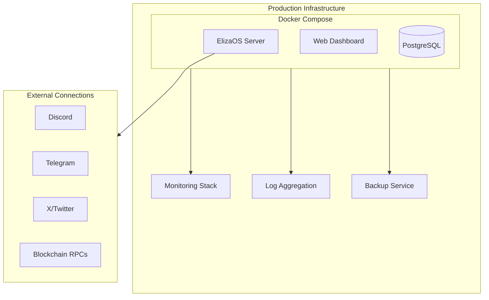

# Chapter 8: Production Deployment

Welcome to **Chapter 8: Production Deployment**. In this part of **ElizaOS: Deep Dive Tutorial**, you will build an intuitive mental model first, then move into concrete implementation details and practical production tradeoffs.


## Introduction

Deploying ElizaOS agents for reliable, always-on operation requires production-grade infrastructure — containerization, monitoring, database management, security hardening, and scaling strategies. This chapter covers Docker deployment, Web3 integration, monitoring, and operational best practices.

## Production Architecture



## Docker Compose Deployment

```yaml
# docker-compose.yml
version: "3.8"

services:
  server:
    build:
      context: .
      dockerfile: Dockerfile
    container_name: elizaos-server
    restart: unless-stopped
    ports:
      - "3000:3000"
    volumes:
      - ./characters:/app/characters:ro
      - ./knowledge:/app/knowledge:ro
      - elizaos-data:/app/data
    environment:
      - NODE_ENV=production
      - DATABASE_URL=postgresql://elizaos:${DB_PASSWORD}@db:5432/elizaos
      - OPENAI_API_KEY=${OPENAI_API_KEY}
      - ANTHROPIC_API_KEY=${ANTHROPIC_API_KEY}
      - DISCORD_API_TOKEN=${DISCORD_API_TOKEN}
      - TELEGRAM_BOT_TOKEN=${TELEGRAM_BOT_TOKEN}
      - SERVER_PORT=3000
    depends_on:
      db:
        condition: service_healthy
    healthcheck:
      test: ["CMD", "curl", "-f", "http://localhost:3000/health"]
      interval: 30s
      timeout: 10s
      retries: 3
    deploy:
      resources:
        limits:
          memory: 4G
          cpus: "2.0"
    logging:
      driver: json-file
      options:
        max-size: "50m"
        max-file: "5"

  db:
    image: postgres:16-alpine
    container_name: elizaos-db
    restart: unless-stopped
    volumes:
      - pgdata:/var/lib/postgresql/data
    environment:
      - POSTGRES_DB=elizaos
      - POSTGRES_USER=elizaos
      - POSTGRES_PASSWORD=${DB_PASSWORD}
    healthcheck:
      test: ["CMD-SHELL", "pg_isready -U elizaos"]
      interval: 10s
      timeout: 5s
      retries: 5

  dashboard:
    build:
      context: ./packages/client
    container_name: elizaos-dashboard
    restart: unless-stopped
    ports:
      - "3001:80"
    depends_on:
      - server

volumes:
  elizaos-data:
  pgdata:
```

### Environment File

```bash
# .env (never commit)
DB_PASSWORD=secure-password-here

# LLM Providers
OPENAI_API_KEY=sk-...
ANTHROPIC_API_KEY=sk-ant-...

# Platform Connectors
DISCORD_API_TOKEN=...
DISCORD_APPLICATION_ID=...
TELEGRAM_BOT_TOKEN=...
TWITTER_API_KEY=...
TWITTER_API_SECRET=...
TWITTER_ACCESS_TOKEN=...
TWITTER_ACCESS_SECRET=...

# Web3 (optional)
WALLET_PRIVATE_KEY=...
ETHEREUM_RPC_URL=https://mainnet.infura.io/v3/...
```

## Database Configuration

### PostgreSQL Setup

```sql
-- Initialize database schema
CREATE TABLE IF NOT EXISTS memories (
  id UUID PRIMARY KEY DEFAULT gen_random_uuid(),
  agent_id UUID NOT NULL,
  user_id UUID,
  room_id UUID NOT NULL,
  world_id UUID,
  content JSONB NOT NULL,
  embedding vector(1536),
  table_name VARCHAR(255) DEFAULT 'messages',
  unique_hash VARCHAR(255),
  created_at TIMESTAMP DEFAULT NOW(),

  CONSTRAINT unique_memory UNIQUE (unique_hash)
);

-- Vector similarity index
CREATE INDEX IF NOT EXISTS idx_memories_embedding
  ON memories USING ivfflat (embedding vector_cosine_ops)
  WITH (lists = 100);

-- Composite index for common queries
CREATE INDEX IF NOT EXISTS idx_memories_room_table
  ON memories (room_id, table_name, created_at DESC);

CREATE INDEX IF NOT EXISTS idx_memories_agent
  ON memories (agent_id, table_name, created_at DESC);
```

### PGLite (Embedded, Zero-Setup)

For single-instance deployments without external PostgreSQL:

```typescript
// PGLite runs PostgreSQL in-process
import { PGlite } from "@electric-sql/pglite";

const db = new PGlite("./data/elizaos.db");

// Same SQL interface as full PostgreSQL
// Includes pgvector extension for embeddings
```

## Web3 Integration

ElizaOS has first-class blockchain support:

### Wallet Management

```typescript
class WalletService extends Service {
  get serviceType() { return "WALLET"; }

  private wallets: Map<string, ethers.Wallet> = new Map();

  async initialize() {
    if (process.env.WALLET_PRIVATE_KEY) {
      const provider = new ethers.JsonRpcProvider(
        process.env.ETHEREUM_RPC_URL
      );
      const wallet = new ethers.Wallet(
        process.env.WALLET_PRIVATE_KEY,
        provider
      );
      this.wallets.set("default", wallet);
    }
  }

  async getBalance(chain: string = "ethereum"): Promise<string> {
    const wallet = this.wallets.get("default");
    if (!wallet) throw new Error("No wallet configured");

    const balance = await wallet.provider!.getBalance(wallet.address);
    return ethers.formatEther(balance);
  }

  async sendTransaction(params: {
    to: string;
    value: string;
    data?: string;
  }): Promise<string> {
    const wallet = this.wallets.get("default");
    if (!wallet) throw new Error("No wallet configured");

    const tx = await wallet.sendTransaction({
      to: params.to,
      value: ethers.parseEther(params.value),
      data: params.data,
    });

    return tx.hash;
  }
}
```

### Token Data Service

```typescript
class TokenDataService extends Service {
  get serviceType() { return "TOKEN_DATA"; }

  async getPrice(symbol: string): Promise<TokenPrice> {
    // Query price from DeFi APIs
    const response = await fetch(
      `https://api.coingecko.com/api/v3/simple/price?ids=${symbol}&vs_currencies=usd`
    );
    return response.json();
  }

  async getTokenInfo(address: string, chain: string): Promise<TokenInfo> {
    // Query on-chain token data
    const provider = this.getProvider(chain);
    const contract = new ethers.Contract(address, ERC20_ABI, provider);

    return {
      name: await contract.name(),
      symbol: await contract.symbol(),
      decimals: await contract.decimals(),
      totalSupply: await contract.totalSupply(),
    };
  }
}
```

## Monitoring

### Health Endpoint

```typescript
class HealthController {
  async check(): Promise<HealthReport> {
    const checks = await Promise.allSettled([
      this.checkDatabase(),
      this.checkModelProvider(),
      this.checkConnectors(),
      this.checkMemory(),
    ]);

    return {
      status: checks.every(c => c.status === "fulfilled") ? "healthy" : "degraded",
      uptime: process.uptime(),
      agents: this.runtime.getAllAgents().map(a => ({
        id: a.agentId,
        name: a.character.name,
        status: a.isRunning ? "running" : "stopped",
      })),
      database: this.extractResult(checks[0]),
      model: this.extractResult(checks[1]),
      connectors: this.extractResult(checks[2]),
      memory: this.extractResult(checks[3]),
    };
  }
}
```

### Metrics Collection

```typescript
class MetricsCollector {
  private counters = {
    messagesReceived: 0,
    messagesProcessed: 0,
    actionExecutions: 0,
    modelCalls: 0,
    errors: 0,
  };

  private histograms = {
    responseTime: new Histogram(),
    tokenUsage: new Histogram(),
  };

  recordMessage(platform: string) {
    this.counters.messagesReceived++;
  }

  recordResponse(durationMs: number, tokens: number) {
    this.counters.messagesProcessed++;
    this.histograms.responseTime.observe(durationMs);
    this.histograms.tokenUsage.observe(tokens);
  }

  recordError(type: string) {
    this.counters.errors++;
  }

  getMetrics(): Metrics {
    return {
      counters: { ...this.counters },
      responseTime: this.histograms.responseTime.getPercentiles(),
      tokenUsage: this.histograms.tokenUsage.getPercentiles(),
      memoryUsage: process.memoryUsage(),
    };
  }
}
```

### Structured Logging

```typescript
import pino from "pino";

const logger = pino({
  level: process.env.LOG_LEVEL || "info",
  transport: process.env.NODE_ENV === "production"
    ? undefined
    : { target: "pino-pretty" },
  serializers: {
    error: pino.stdSerializers.err,
  },
});

// Usage throughout the codebase
logger.info({ agentId, platform, roomId }, "Message received");
logger.warn({ agentId, action, error: err.message }, "Action failed");
logger.error({ err, context }, "Unhandled error");
```

## Security Hardening

### API Key Management

```typescript
class SecretManager {
  /**
   * Load secrets from environment or secret store.
   * Never expose secrets in logs or responses.
   */
  get(key: string): string {
    const value = process.env[key]
      || this.characterSecrets[key];

    if (!value) {
      throw new Error(`Secret not found: ${key}`);
    }

    return value;
  }

  /**
   * Redact secrets from log output.
   */
  redact(text: string): string {
    for (const [key, value] of Object.entries(process.env)) {
      if (key.includes("KEY") || key.includes("SECRET") || key.includes("TOKEN")) {
        if (value && text.includes(value)) {
          text = text.replace(value, `[REDACTED:${key}]`);
        }
      }
    }
    return text;
  }
}
```

### Input Validation

```typescript
class InputValidator {
  /**
   * Validate and sanitize user input before processing.
   */
  sanitize(input: string): string {
    // Remove potential prompt injection markers
    let sanitized = input;

    // Strip system-level prompt injection attempts
    sanitized = sanitized.replace(
      /\b(system|assistant|function)\s*:/gi,
      "[filtered]:"
    );

    // Limit length
    if (sanitized.length > 10_000) {
      sanitized = sanitized.slice(0, 10_000);
    }

    return sanitized;
  }

  /**
   * Validate action parameters against schema.
   */
  validateActionParams(
    params: unknown,
    schema: JSONSchema
  ): ValidationResult {
    const ajv = new Ajv();
    const validate = ajv.compile(schema);
    const valid = validate(params);

    return {
      valid: !!valid,
      errors: validate.errors || [],
    };
  }
}
```

## Scaling Strategies

### Vertical Scaling (Single Instance)

```yaml
# docker-compose.yml — increased resources
services:
  server:
    deploy:
      resources:
        limits:
          memory: 8G
          cpus: "4.0"
```

### Horizontal Scaling (Multiple Instances)

```yaml
# docker-compose.yml — multiple agent instances
services:
  agent-research:
    image: elizaos:latest
    environment:
      - CHARACTER_FILE=/characters/research.json
      - DATABASE_URL=postgresql://elizaos:pass@db:5432/elizaos

  agent-social:
    image: elizaos:latest
    environment:
      - CHARACTER_FILE=/characters/social.json
      - DATABASE_URL=postgresql://elizaos:pass@db:5432/elizaos

  agent-coding:
    image: elizaos:latest
    environment:
      - CHARACTER_FILE=/characters/coding.json
      - DATABASE_URL=postgresql://elizaos:pass@db:5432/elizaos

  # Shared database
  db:
    image: postgres:16-alpine
    volumes:
      - pgdata:/var/lib/postgresql/data
```

### Backup Strategy

```bash
#!/bin/bash
# backup.sh — run via cron
TIMESTAMP=$(date +%Y%m%d_%H%M%S)
BACKUP_DIR="/backups/elizaos"

# Backup PostgreSQL
docker exec elizaos-db pg_dump -U elizaos elizaos | \
  gzip > "${BACKUP_DIR}/db_${TIMESTAMP}.sql.gz"

# Backup data volume
docker run --rm \
  -v elizaos-data:/data:ro \
  -v ${BACKUP_DIR}:/backup \
  alpine tar czf "/backup/data_${TIMESTAMP}.tar.gz" /data

# Cleanup old backups (keep 30 days)
find ${BACKUP_DIR} -name "*.gz" -mtime +30 -delete
```

## Production Checklist

```markdown
## Pre-Deployment
- [ ] LLM API keys configured and tested
- [ ] Platform connector tokens verified
- [ ] Character files reviewed and tested
- [ ] Knowledge documents ingested
- [ ] Database schema initialized

## Infrastructure
- [ ] Docker Compose configured
- [ ] Health checks enabled (30s interval)
- [ ] Resource limits set (memory, CPU)
- [ ] Persistent volumes configured
- [ ] Log rotation enabled

## Security
- [ ] API keys in .env (not in code)
- [ ] Input validation enabled
- [ ] Rate limiting configured
- [ ] Secret redaction in logs
- [ ] Network isolation (internal services)

## Monitoring
- [ ] Health endpoint accessible
- [ ] Metrics collection running
- [ ] Structured logging configured
- [ ] Alert rules defined

## Operations
- [ ] Backup schedule configured (daily)
- [ ] Backup restore tested
- [ ] Update/rollback procedure documented
- [ ] Runbook for common issues
```

## Summary

| Concept | Key Takeaway |
|---------|-------------|
| **Docker Compose** | Server + PostgreSQL + Dashboard in containers |
| **Database** | PostgreSQL for production; PGLite for single-instance |
| **Web3** | Native wallet, token data, and blockchain RPC support |
| **Monitoring** | Health checks, metrics collection, structured logging |
| **Security** | Secret management, input validation, prompt injection prevention |
| **Scaling** | Vertical (more resources) or horizontal (agent per container) |
| **Backup** | PostgreSQL dumps + data volume archives, 30-day retention |

---

This concludes the ElizaOS Deep Dive tutorial. You now have a comprehensive understanding of the framework — from the AgentRuntime and character system through plugins, memory/RAG, platform connectors, multi-agent orchestration, and production deployment.

---

*Built with insights from the [ElizaOS repository](https://github.com/elizaOS/eliza) and community documentation.*

## What Problem Does This Solve?

Most teams struggle here because the hard part is not writing more code, but deciding clear boundaries for `elizaos`, `wallet`, `process` so behavior stays predictable as complexity grows.

In practical terms, this chapter helps you avoid three common failures:

- coupling core logic too tightly to one implementation path
- missing the handoff boundaries between setup, execution, and validation
- shipping changes without clear rollback or observability strategy

After working through this chapter, you should be able to reason about `Chapter 8: Production Deployment` as an operating subsystem inside **ElizaOS: Deep Dive Tutorial**, with explicit contracts for inputs, state transitions, and outputs.

Use the implementation notes around `configured`, `checks`, `sanitized` as your checklist when adapting these patterns to your own repository.

## How it Works Under the Hood

Under the hood, `Chapter 8: Production Deployment` usually follows a repeatable control path:

1. **Context bootstrap**: initialize runtime config and prerequisites for `elizaos`.
2. **Input normalization**: shape incoming data so `wallet` receives stable contracts.
3. **Core execution**: run the main logic branch and propagate intermediate state through `process`.
4. **Policy and safety checks**: enforce limits, auth scopes, and failure boundaries.
5. **Output composition**: return canonical result payloads for downstream consumers.
6. **Operational telemetry**: emit logs/metrics needed for debugging and performance tuning.

When debugging, walk this sequence in order and confirm each stage has explicit success/failure conditions.

## Source Walkthrough

Use the following upstream sources to verify implementation details while reading this chapter:

- [ElizaOS](https://github.com/elizaOS/eliza)
  Why it matters: authoritative reference on `ElizaOS` (github.com).

Suggested trace strategy:
- search upstream code for `elizaos` and `wallet` to map concrete implementation paths
- compare docs claims against actual runtime/config code before reusing patterns in production

## Chapter Connections

- [Tutorial Index](index.md)
- [Previous Chapter: Chapter 7: Multi-Agent Orchestration](07-multi-agent.md)
- [Main Catalog](../../README.md#-tutorial-catalog)
- [A-Z Tutorial Directory](../../discoverability/tutorial-directory.md)
