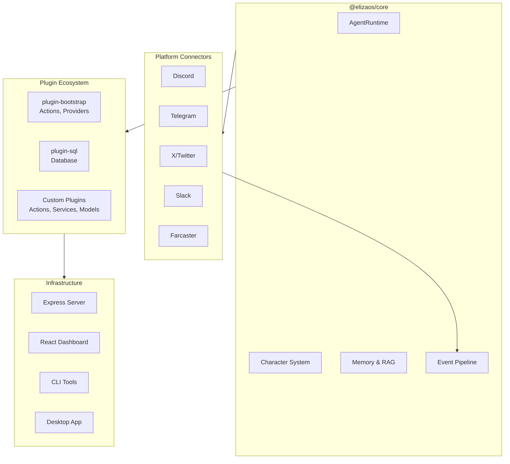

# ElizaOS: Deep Dive Tutorial

> **Project**: [ElizaOS](https://github.com/elizaOS/eliza) — Autonomous agents for everyone.

## What Is ElizaOS?

ElizaOS is an open-source framework for building, deploying, and managing autonomous multi-agent AI systems. It provides a complete platform for creating AI agents — chatbots, business automation, game NPCs, and Web3-native agents that interact with blockchains and smart contracts.

| Feature | Description |
|---------|-------------|
| **Multi-Agent** | Orchestrate groups of specialized agents with delegation and coordination |
| **Plugin System** | Modular architecture — model providers, connectors, actions, all via plugins |
| **Character Files** | Configure agent personality, goals, and behavior via JSON definitions |
| **Multi-Platform** | Discord, Telegram, Slack, X/Twitter, Farcaster connectors |
| **Web3 Native** | Wallet management, smart contracts, DeFi, token operations |
| **RAG Built-in** | Document ingestion, embeddings, retrieval-augmented generation |
| **Model Agnostic** | OpenAI, Anthropic, Gemini, Llama, Grok — any LLM backend |
| **Desktop & Web** | Tauri desktop app, React web dashboard, CLI tools |

## Architecture Overview

## Tutorial Structure

| Chapter | Topic | What You'll Learn |
|---------|-------|-------------------|
| [1. Getting Started](01-getting-started.md) | Installation & Setup | Install ElizaOS, create your first agent, run the server |
| [2. Agent Runtime](02-agent-runtime.md) | Core Engine | AgentRuntime, lifecycle, state management, model invocation |
| [3. Character System](03-character-system.md) | Agent Identity | Character files, personality, goals, knowledge, behavior |
| [4. Plugin Architecture](04-plugin-architecture.md) | Extensibility | Actions, providers, evaluators, services, custom plugins |
| [5. Memory & RAG](05-memory-rag.md) | Knowledge | Conversation memory, embeddings, document ingestion, retrieval |
| [6. Platform Connectors](06-platform-connectors.md) | Multi-Platform | Discord, Telegram, Slack, X/Twitter, unified event pipeline |
| [7. Multi-Agent Orchestration](07-multi-agent.md) | Coordination | Agent groups, delegation, worlds/rooms, coordination patterns |
| [8. Production Deployment](08-production-deployment.md) | Operations | Docker, monitoring, Web3 integration, scaling, security |

## Tech Stack

| Component | Technology |
|-----------|-----------|
| **Language** | TypeScript |
| **Runtime** | Bun / Node.js >= 23 |
| **Build** | Turbo (monorepo), Lerna (releases) |
| **Server** | Express.js, Socket.IO |
| **Web UI** | React |
| **Desktop** | Tauri |
| **Database** | PostgreSQL, PGLite (embedded) |
| **Embeddings** | Model-agnostic (OpenAI, local) |

## Prerequisites

- Node.js >= 23 or Bun
- An LLM API key (OpenAI, Anthropic, etc.)
- PostgreSQL (optional — PGLite works out of the box)

---

Ready to begin? Start with [Chapter 1: Getting Started](01-getting-started.md).

---

*Built with insights from the [ElizaOS repository](https://github.com/elizaOS/eliza) and community documentation.*

## Navigation & Backlinks

- [Start Here: Chapter 1: Getting Started with ElizaOS](01-getting-started.md)
- [Back to Main Catalog](../../README.md#-tutorial-catalog)
- [Browse A-Z Tutorial Directory](../../discoverability/tutorial-directory.md)
- [Search by Intent](../../discoverability/query-hub.md)
- [Explore Category Hubs](../../README.md#category-hubs)

## Full Chapter Map

1. [Chapter 1: Getting Started with ElizaOS](01-getting-started.md)
2. [Chapter 2: Agent Runtime](02-agent-runtime.md)
3. [Chapter 3: Character System](03-character-system.md)
4. [Chapter 4: Plugin Architecture](04-plugin-architecture.md)
5. [Chapter 5: Memory & RAG](05-memory-rag.md)
6. [Chapter 6: Platform Connectors](06-platform-connectors.md)
7. [Chapter 7: Multi-Agent Orchestration](07-multi-agent.md)
8. [Chapter 8: Production Deployment](08-production-deployment.md)

## Source References

- [ElizaOS](https://github.com/elizaOS/eliza)

*Generated by [AI Codebase Knowledge Builder](https://github.com/The-Pocket/Tutorial-Codebase-Knowledge)*
