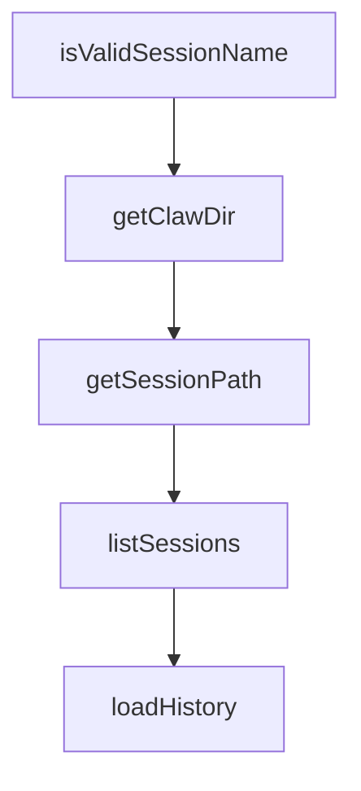

# Chapter 1: Getting Started

Welcome to **Chapter 1: Getting Started**. In this part of **Everything Claude Code Tutorial: Production Configuration Patterns for Claude Code**, you will build an intuitive mental model first, then move into concrete implementation details and practical production tradeoffs.


This chapter gets the package installed and verifies first workflow execution.

## Learning Goals

- install the marketplace plugin correctly
- install required rules for your language stack
- run initial commands and confirm capability surfaces
- avoid common first-run setup errors

## Quick Install

In Claude Code:

```bash
/plugin marketplace add affaan-m/everything-claude-code
/plugin install everything-claude-code@everything-claude-code
```

Then install rules from the repo clone:

```bash
./install.sh typescript
```

## First Validation

- run `/plan "small feature"`
- run `/code-review` on a branch with sample changes
- run `/verify` for basic quality pass

## Source References

- [README Quick Start](https://github.com/affaan-m/everything-claude-code/blob/main/README.md#-quick-start)
- [Rules Install Guide](https://github.com/affaan-m/everything-claude-code/blob/main/rules/README.md#installation)

## Summary

You now have a functioning baseline configuration.

Next: [Chapter 2: Architecture and Component Topology](02-architecture-and-component-topology.md)

## Depth Expansion Playbook

## Source Code Walkthrough

### `scripts/claw.js`

The `isValidSessionName` function in [`scripts/claw.js`](https://github.com/affaan-m/everything-claude-code/blob/HEAD/scripts/claw.js) handles a key part of this chapter's functionality:

```js
const DEFAULT_COMPACT_KEEP_TURNS = 20;

function isValidSessionName(name) {
  return typeof name === 'string' && name.length > 0 && SESSION_NAME_RE.test(name);
}

function getClawDir() {
  return path.join(os.homedir(), '.claude', 'claw');
}

function getSessionPath(name) {
  return path.join(getClawDir(), `${name}.md`);
}

function listSessions(dir) {
  const clawDir = dir || getClawDir();
  if (!fs.existsSync(clawDir)) return [];
  return fs.readdirSync(clawDir)
    .filter(f => f.endsWith('.md'))
    .map(f => f.replace(/\.md$/, ''));
}

function loadHistory(filePath) {
  try {
    return fs.readFileSync(filePath, 'utf8');
  } catch {
    return '';
  }
}

function appendTurn(filePath, role, content, timestamp) {
  const ts = timestamp || new Date().toISOString();
```

This function is important because it defines how Everything Claude Code Tutorial: Production Configuration Patterns for Claude Code implements the patterns covered in this chapter.

### `scripts/claw.js`

The `getClawDir` function in [`scripts/claw.js`](https://github.com/affaan-m/everything-claude-code/blob/HEAD/scripts/claw.js) handles a key part of this chapter's functionality:

```js
}

function getClawDir() {
  return path.join(os.homedir(), '.claude', 'claw');
}

function getSessionPath(name) {
  return path.join(getClawDir(), `${name}.md`);
}

function listSessions(dir) {
  const clawDir = dir || getClawDir();
  if (!fs.existsSync(clawDir)) return [];
  return fs.readdirSync(clawDir)
    .filter(f => f.endsWith('.md'))
    .map(f => f.replace(/\.md$/, ''));
}

function loadHistory(filePath) {
  try {
    return fs.readFileSync(filePath, 'utf8');
  } catch {
    return '';
  }
}

function appendTurn(filePath, role, content, timestamp) {
  const ts = timestamp || new Date().toISOString();
  const entry = `### [${ts}] ${role}\n${content}\n---\n`;
  fs.mkdirSync(path.dirname(filePath), { recursive: true });
  fs.appendFileSync(filePath, entry, 'utf8');
}
```

This function is important because it defines how Everything Claude Code Tutorial: Production Configuration Patterns for Claude Code implements the patterns covered in this chapter.

### `scripts/claw.js`

The `getSessionPath` function in [`scripts/claw.js`](https://github.com/affaan-m/everything-claude-code/blob/HEAD/scripts/claw.js) handles a key part of this chapter's functionality:

```js
}

function getSessionPath(name) {
  return path.join(getClawDir(), `${name}.md`);
}

function listSessions(dir) {
  const clawDir = dir || getClawDir();
  if (!fs.existsSync(clawDir)) return [];
  return fs.readdirSync(clawDir)
    .filter(f => f.endsWith('.md'))
    .map(f => f.replace(/\.md$/, ''));
}

function loadHistory(filePath) {
  try {
    return fs.readFileSync(filePath, 'utf8');
  } catch {
    return '';
  }
}

function appendTurn(filePath, role, content, timestamp) {
  const ts = timestamp || new Date().toISOString();
  const entry = `### [${ts}] ${role}\n${content}\n---\n`;
  fs.mkdirSync(path.dirname(filePath), { recursive: true });
  fs.appendFileSync(filePath, entry, 'utf8');
}

function normalizeSkillList(raw) {
  if (!raw) return [];
  if (Array.isArray(raw)) return raw.map(s => String(s).trim()).filter(Boolean);
```

This function is important because it defines how Everything Claude Code Tutorial: Production Configuration Patterns for Claude Code implements the patterns covered in this chapter.

### `scripts/claw.js`

The `listSessions` function in [`scripts/claw.js`](https://github.com/affaan-m/everything-claude-code/blob/HEAD/scripts/claw.js) handles a key part of this chapter's functionality:

```js
}

function listSessions(dir) {
  const clawDir = dir || getClawDir();
  if (!fs.existsSync(clawDir)) return [];
  return fs.readdirSync(clawDir)
    .filter(f => f.endsWith('.md'))
    .map(f => f.replace(/\.md$/, ''));
}

function loadHistory(filePath) {
  try {
    return fs.readFileSync(filePath, 'utf8');
  } catch {
    return '';
  }
}

function appendTurn(filePath, role, content, timestamp) {
  const ts = timestamp || new Date().toISOString();
  const entry = `### [${ts}] ${role}\n${content}\n---\n`;
  fs.mkdirSync(path.dirname(filePath), { recursive: true });
  fs.appendFileSync(filePath, entry, 'utf8');
}

function normalizeSkillList(raw) {
  if (!raw) return [];
  if (Array.isArray(raw)) return raw.map(s => String(s).trim()).filter(Boolean);
  return String(raw).split(',').map(s => s.trim()).filter(Boolean);
}

function loadECCContext(skillList) {
```

This function is important because it defines how Everything Claude Code Tutorial: Production Configuration Patterns for Claude Code implements the patterns covered in this chapter.


## How These Components Connect


