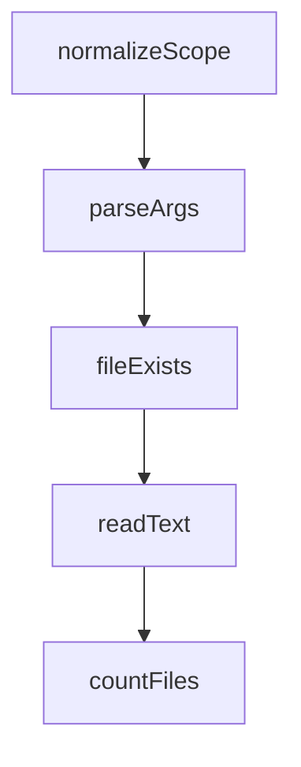

# Chapter 1: Getting Started

Welcome to **Chapter 1: Getting Started**. In this part of **Everything Claude Code Tutorial: Production Configuration Patterns for Claude Code**, you will build an intuitive mental model first, then move into concrete implementation details and practical production tradeoffs.


This chapter gets the package installed and verifies first workflow execution.

## Learning Goals

- install the marketplace plugin correctly
- install required rules for your language stack
- run initial commands and confirm capability surfaces
- avoid common first-run setup errors

## Quick Install

In Claude Code:

```bash
/plugin marketplace add affaan-m/everything-claude-code
/plugin install everything-claude-code@everything-claude-code
```

Then install rules from the repo clone:

```bash
./install.sh typescript
```

## First Validation

- run `/plan "small feature"`
- run `/code-review` on a branch with sample changes
- run `/verify` for basic quality pass

## Source References

- [README Quick Start](https://github.com/affaan-m/everything-claude-code/blob/main/README.md#-quick-start)
- [Rules Install Guide](https://github.com/affaan-m/everything-claude-code/blob/main/rules/README.md#installation)

## Summary

You now have a functioning baseline configuration.

Next: [Chapter 2: Architecture and Component Topology](02-architecture-and-component-topology.md)

## Source Code Walkthrough

### `scripts/harness-audit.js`

The `normalizeScope` function in [`scripts/harness-audit.js`](https://github.com/affaan-m/everything-claude-code/blob/HEAD/scripts/harness-audit.js) handles a key part of this chapter's functionality:

```js
];

function normalizeScope(scope) {
  const value = (scope || 'repo').toLowerCase();
  if (!['repo', 'hooks', 'skills', 'commands', 'agents'].includes(value)) {
    throw new Error(`Invalid scope: ${scope}`);
  }
  return value;
}

function parseArgs(argv) {
  const args = argv.slice(2);
  const parsed = {
    scope: 'repo',
    format: 'text',
    help: false,
    root: path.resolve(process.env.AUDIT_ROOT || process.cwd()),
  };

  for (let index = 0; index < args.length; index += 1) {
    const arg = args[index];

    if (arg === '--help' || arg === '-h') {
      parsed.help = true;
      continue;
    }

    if (arg === '--format') {
      parsed.format = (args[index + 1] || '').toLowerCase();
      index += 1;
      continue;
    }
```

This function is important because it defines how Everything Claude Code Tutorial: Production Configuration Patterns for Claude Code implements the patterns covered in this chapter.

### `scripts/harness-audit.js`

The `parseArgs` function in [`scripts/harness-audit.js`](https://github.com/affaan-m/everything-claude-code/blob/HEAD/scripts/harness-audit.js) handles a key part of this chapter's functionality:

```js
}

function parseArgs(argv) {
  const args = argv.slice(2);
  const parsed = {
    scope: 'repo',
    format: 'text',
    help: false,
    root: path.resolve(process.env.AUDIT_ROOT || process.cwd()),
  };

  for (let index = 0; index < args.length; index += 1) {
    const arg = args[index];

    if (arg === '--help' || arg === '-h') {
      parsed.help = true;
      continue;
    }

    if (arg === '--format') {
      parsed.format = (args[index + 1] || '').toLowerCase();
      index += 1;
      continue;
    }

    if (arg === '--scope') {
      parsed.scope = normalizeScope(args[index + 1]);
      index += 1;
      continue;
    }

    if (arg === '--root') {
```

This function is important because it defines how Everything Claude Code Tutorial: Production Configuration Patterns for Claude Code implements the patterns covered in this chapter.

### `scripts/harness-audit.js`

The `fileExists` function in [`scripts/harness-audit.js`](https://github.com/affaan-m/everything-claude-code/blob/HEAD/scripts/harness-audit.js) handles a key part of this chapter's functionality:

```js
}

function fileExists(rootDir, relativePath) {
  return fs.existsSync(path.join(rootDir, relativePath));
}

function readText(rootDir, relativePath) {
  return fs.readFileSync(path.join(rootDir, relativePath), 'utf8');
}

function countFiles(rootDir, relativeDir, extension) {
  const dirPath = path.join(rootDir, relativeDir);
  if (!fs.existsSync(dirPath)) {
    return 0;
  }

  const stack = [dirPath];
  let count = 0;

  while (stack.length > 0) {
    const current = stack.pop();
    const entries = fs.readdirSync(current, { withFileTypes: true });

    for (const entry of entries) {
      const nextPath = path.join(current, entry.name);
      if (entry.isDirectory()) {
        stack.push(nextPath);
      } else if (!extension || entry.name.endsWith(extension)) {
        count += 1;
      }
    }
  }
```

This function is important because it defines how Everything Claude Code Tutorial: Production Configuration Patterns for Claude Code implements the patterns covered in this chapter.

### `scripts/harness-audit.js`

The `readText` function in [`scripts/harness-audit.js`](https://github.com/affaan-m/everything-claude-code/blob/HEAD/scripts/harness-audit.js) handles a key part of this chapter's functionality:

```js
}

function readText(rootDir, relativePath) {
  return fs.readFileSync(path.join(rootDir, relativePath), 'utf8');
}

function countFiles(rootDir, relativeDir, extension) {
  const dirPath = path.join(rootDir, relativeDir);
  if (!fs.existsSync(dirPath)) {
    return 0;
  }

  const stack = [dirPath];
  let count = 0;

  while (stack.length > 0) {
    const current = stack.pop();
    const entries = fs.readdirSync(current, { withFileTypes: true });

    for (const entry of entries) {
      const nextPath = path.join(current, entry.name);
      if (entry.isDirectory()) {
        stack.push(nextPath);
      } else if (!extension || entry.name.endsWith(extension)) {
        count += 1;
      }
    }
  }

  return count;
}

```

This function is important because it defines how Everything Claude Code Tutorial: Production Configuration Patterns for Claude Code implements the patterns covered in this chapter.


## How These Components Connect


