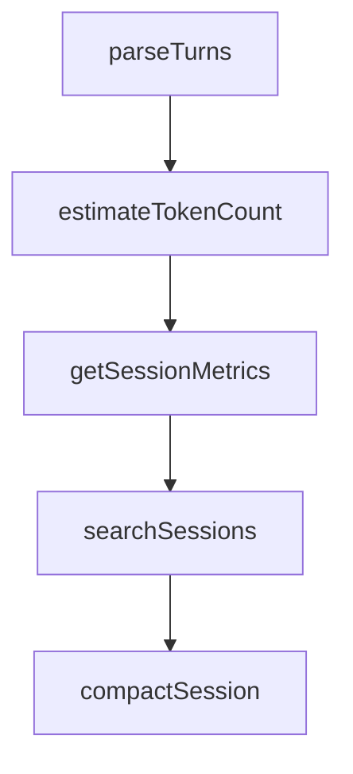

# Chapter 2: Architecture and Component Topology

Welcome to **Chapter 2: Architecture and Component Topology**. In this part of **Everything Claude Code Tutorial: Production Configuration Patterns for Claude Code**, you will build an intuitive mental model first, then move into concrete implementation details and practical production tradeoffs.


This chapter maps the system into manageable component groups.

## Learning Goals

- understand role boundaries between agents, skills, hooks, commands, and rules
- map critical files and folders to runtime behavior
- identify where to customize without breaking portability
- reason about orchestration paths from command to output

## Core Topology

- `agents/`: specialist delegations (planning, review, security, docs, etc.)
- `skills/`: reusable workflow and domain modules
- `commands/`: high-level task entrypoints
- `hooks/`: automated lifecycle enforcement and reminders
- `rules/`: persistent project and language guidance
- MCP configs: external capability integrations

## Architectural Principle

Keep each layer focused and composable; avoid collapsing all behavior into one layer.

## Source References

- [README What's Inside](https://github.com/affaan-m/everything-claude-code/blob/main/README.md#-whats-inside)
- [Agents Directory](https://github.com/affaan-m/everything-claude-code/tree/main/agents)
- [Skills Directory](https://github.com/affaan-m/everything-claude-code/tree/main/skills)

## Summary

You now understand the component architecture and boundaries.

Next: [Chapter 3: Installation Modes and Rules Strategy](03-installation-modes-and-rules-strategy.md)

## Depth Expansion Playbook

## Source Code Walkthrough

### `scripts/claw.js`

The `parseTurns` function in [`scripts/claw.js`](https://github.com/affaan-m/everything-claude-code/blob/HEAD/scripts/claw.js) handles a key part of this chapter's functionality:

```js
}

function parseTurns(history) {
  const turns = [];
  const regex = /### \[([^\]]+)\] ([^\n]+)\n([\s\S]*?)\n---\n/g;
  let match;
  while ((match = regex.exec(history)) !== null) {
    turns.push({ timestamp: match[1], role: match[2], content: match[3] });
  }
  return turns;
}

function estimateTokenCount(text) {
  return Math.ceil((text || '').length / 4);
}

function getSessionMetrics(filePath) {
  const history = loadHistory(filePath);
  const turns = parseTurns(history);
  const charCount = history.length;
  const tokenEstimate = estimateTokenCount(history);
  const userTurns = turns.filter(t => t.role === 'User').length;
  const assistantTurns = turns.filter(t => t.role === 'Assistant').length;

  return {
    turns: turns.length,
    userTurns,
    assistantTurns,
    charCount,
    tokenEstimate,
  };
}
```

This function is important because it defines how Everything Claude Code Tutorial: Production Configuration Patterns for Claude Code implements the patterns covered in this chapter.

### `scripts/claw.js`

The `estimateTokenCount` function in [`scripts/claw.js`](https://github.com/affaan-m/everything-claude-code/blob/HEAD/scripts/claw.js) handles a key part of this chapter's functionality:

```js
}

function estimateTokenCount(text) {
  return Math.ceil((text || '').length / 4);
}

function getSessionMetrics(filePath) {
  const history = loadHistory(filePath);
  const turns = parseTurns(history);
  const charCount = history.length;
  const tokenEstimate = estimateTokenCount(history);
  const userTurns = turns.filter(t => t.role === 'User').length;
  const assistantTurns = turns.filter(t => t.role === 'Assistant').length;

  return {
    turns: turns.length,
    userTurns,
    assistantTurns,
    charCount,
    tokenEstimate,
  };
}

function searchSessions(query, dir) {
  const q = String(query || '').toLowerCase().trim();
  if (!q) return [];

  const sessionDir = dir || getClawDir();
  const sessions = listSessions(sessionDir);
  const results = [];
  for (const name of sessions) {
    const p = path.join(sessionDir, `${name}.md`);
```

This function is important because it defines how Everything Claude Code Tutorial: Production Configuration Patterns for Claude Code implements the patterns covered in this chapter.

### `scripts/claw.js`

The `getSessionMetrics` function in [`scripts/claw.js`](https://github.com/affaan-m/everything-claude-code/blob/HEAD/scripts/claw.js) handles a key part of this chapter's functionality:

```js
}

function getSessionMetrics(filePath) {
  const history = loadHistory(filePath);
  const turns = parseTurns(history);
  const charCount = history.length;
  const tokenEstimate = estimateTokenCount(history);
  const userTurns = turns.filter(t => t.role === 'User').length;
  const assistantTurns = turns.filter(t => t.role === 'Assistant').length;

  return {
    turns: turns.length,
    userTurns,
    assistantTurns,
    charCount,
    tokenEstimate,
  };
}

function searchSessions(query, dir) {
  const q = String(query || '').toLowerCase().trim();
  if (!q) return [];

  const sessionDir = dir || getClawDir();
  const sessions = listSessions(sessionDir);
  const results = [];
  for (const name of sessions) {
    const p = path.join(sessionDir, `${name}.md`);
    const content = loadHistory(p);
    if (!content) continue;

    const idx = content.toLowerCase().indexOf(q);
```

This function is important because it defines how Everything Claude Code Tutorial: Production Configuration Patterns for Claude Code implements the patterns covered in this chapter.

### `scripts/claw.js`

The `searchSessions` function in [`scripts/claw.js`](https://github.com/affaan-m/everything-claude-code/blob/HEAD/scripts/claw.js) handles a key part of this chapter's functionality:

```js
}

function searchSessions(query, dir) {
  const q = String(query || '').toLowerCase().trim();
  if (!q) return [];

  const sessionDir = dir || getClawDir();
  const sessions = listSessions(sessionDir);
  const results = [];
  for (const name of sessions) {
    const p = path.join(sessionDir, `${name}.md`);
    const content = loadHistory(p);
    if (!content) continue;

    const idx = content.toLowerCase().indexOf(q);
    if (idx >= 0) {
      const start = Math.max(0, idx - 40);
      const end = Math.min(content.length, idx + q.length + 40);
      const snippet = content.slice(start, end).replace(/\n/g, ' ');
      results.push({ session: name, snippet });
    }
  }
  return results;
}

function compactSession(filePath, keepTurns = DEFAULT_COMPACT_KEEP_TURNS) {
  const history = loadHistory(filePath);
  if (!history) return false;

  const turns = parseTurns(history);
  if (turns.length <= keepTurns) return false;

```

This function is important because it defines how Everything Claude Code Tutorial: Production Configuration Patterns for Claude Code implements the patterns covered in this chapter.


## How These Components Connect


