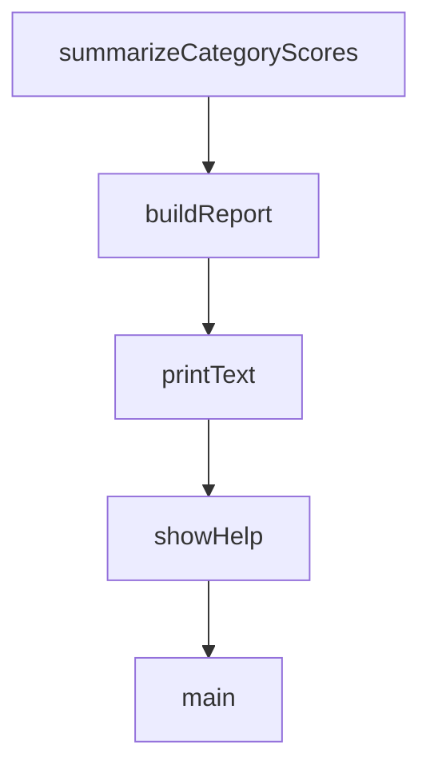

# Chapter 2: Architecture and Component Topology

Welcome to **Chapter 2: Architecture and Component Topology**. In this part of **Everything Claude Code Tutorial: Production Configuration Patterns for Claude Code**, you will build an intuitive mental model first, then move into concrete implementation details and practical production tradeoffs.


This chapter maps the system into manageable component groups.

## Learning Goals

- understand role boundaries between agents, skills, hooks, commands, and rules
- map critical files and folders to runtime behavior
- identify where to customize without breaking portability
- reason about orchestration paths from command to output

## Core Topology

- `agents/`: specialist delegations (planning, review, security, docs, etc.)
- `skills/`: reusable workflow and domain modules
- `commands/`: high-level task entrypoints
- `hooks/`: automated lifecycle enforcement and reminders
- `rules/`: persistent project and language guidance
- MCP configs: external capability integrations

## Architectural Principle

Keep each layer focused and composable; avoid collapsing all behavior into one layer.

## Source References

- [README What's Inside](https://github.com/affaan-m/everything-claude-code/blob/main/README.md#-whats-inside)
- [Agents Directory](https://github.com/affaan-m/everything-claude-code/tree/main/agents)
- [Skills Directory](https://github.com/affaan-m/everything-claude-code/tree/main/skills)

## Summary

You now understand the component architecture and boundaries.

Next: [Chapter 3: Installation Modes and Rules Strategy](03-installation-modes-and-rules-strategy.md)

## Source Code Walkthrough

### `scripts/harness-audit.js`

The `summarizeCategoryScores` function in [`scripts/harness-audit.js`](https://github.com/affaan-m/everything-claude-code/blob/HEAD/scripts/harness-audit.js) handles a key part of this chapter's functionality:

```js
}

function summarizeCategoryScores(checks) {
  const scores = {};
  for (const category of CATEGORIES) {
    const inCategory = checks.filter(check => check.category === category);
    const max = inCategory.reduce((sum, check) => sum + check.points, 0);
    const earned = inCategory
      .filter(check => check.pass)
      .reduce((sum, check) => sum + check.points, 0);

    const normalized = max === 0 ? 0 : Math.round((earned / max) * 10);
    scores[category] = {
      score: normalized,
      earned,
      max,
    };
  }

  return scores;
}

function buildReport(scope, options = {}) {
  const rootDir = path.resolve(options.rootDir || process.cwd());
  const targetMode = options.targetMode || detectTargetMode(rootDir);
  const checks = (targetMode === 'repo' ? getRepoChecks(rootDir) : getConsumerChecks(rootDir))
    .filter(check => check.scopes.includes(scope));
  const categoryScores = summarizeCategoryScores(checks);
  const maxScore = checks.reduce((sum, check) => sum + check.points, 0);
  const overallScore = checks
    .filter(check => check.pass)
    .reduce((sum, check) => sum + check.points, 0);
```

This function is important because it defines how Everything Claude Code Tutorial: Production Configuration Patterns for Claude Code implements the patterns covered in this chapter.

### `scripts/harness-audit.js`

The `buildReport` function in [`scripts/harness-audit.js`](https://github.com/affaan-m/everything-claude-code/blob/HEAD/scripts/harness-audit.js) handles a key part of this chapter's functionality:

```js
}

function buildReport(scope, options = {}) {
  const rootDir = path.resolve(options.rootDir || process.cwd());
  const targetMode = options.targetMode || detectTargetMode(rootDir);
  const checks = (targetMode === 'repo' ? getRepoChecks(rootDir) : getConsumerChecks(rootDir))
    .filter(check => check.scopes.includes(scope));
  const categoryScores = summarizeCategoryScores(checks);
  const maxScore = checks.reduce((sum, check) => sum + check.points, 0);
  const overallScore = checks
    .filter(check => check.pass)
    .reduce((sum, check) => sum + check.points, 0);

  const failedChecks = checks.filter(check => !check.pass);
  const topActions = failedChecks
    .sort((left, right) => right.points - left.points)
    .slice(0, 3)
    .map(check => ({
      action: check.fix,
      path: check.path,
      category: check.category,
      points: check.points,
    }));

  return {
    scope,
    root_dir: rootDir,
    target_mode: targetMode,
    deterministic: true,
    rubric_version: '2026-03-30',
    overall_score: overallScore,
    max_score: maxScore,
```

This function is important because it defines how Everything Claude Code Tutorial: Production Configuration Patterns for Claude Code implements the patterns covered in this chapter.

### `scripts/harness-audit.js`

The `printText` function in [`scripts/harness-audit.js`](https://github.com/affaan-m/everything-claude-code/blob/HEAD/scripts/harness-audit.js) handles a key part of this chapter's functionality:

```js
}

function printText(report) {
  console.log(`Harness Audit (${report.scope}, ${report.target_mode}): ${report.overall_score}/${report.max_score}`);
  console.log(`Root: ${report.root_dir}`);
  console.log('');

  for (const category of CATEGORIES) {
    const data = report.categories[category];
    if (!data || data.max === 0) {
      continue;
    }

    console.log(`- ${category}: ${data.score}/10 (${data.earned}/${data.max} pts)`);
  }

  const failed = report.checks.filter(check => !check.pass);
  console.log('');
  console.log(`Checks: ${report.checks.length} total, ${failed.length} failing`);

  if (failed.length > 0) {
    console.log('');
    console.log('Top 3 Actions:');
    report.top_actions.forEach((action, index) => {
      console.log(`${index + 1}) [${action.category}] ${action.action} (${action.path})`);
    });
  }
}

function showHelp(exitCode = 0) {
  console.log(`
Usage: node scripts/harness-audit.js [scope] [--scope <repo|hooks|skills|commands|agents>] [--format <text|json>]
```

This function is important because it defines how Everything Claude Code Tutorial: Production Configuration Patterns for Claude Code implements the patterns covered in this chapter.

### `scripts/harness-audit.js`

The `showHelp` function in [`scripts/harness-audit.js`](https://github.com/affaan-m/everything-claude-code/blob/HEAD/scripts/harness-audit.js) handles a key part of this chapter's functionality:

```js
}

function showHelp(exitCode = 0) {
  console.log(`
Usage: node scripts/harness-audit.js [scope] [--scope <repo|hooks|skills|commands|agents>] [--format <text|json>]
       [--root <path>]

Deterministic harness audit based on explicit file/rule checks.
Audits the current working directory by default and auto-detects ECC repo mode vs consumer-project mode.
`);
  process.exit(exitCode);
}

function main() {
  try {
    const args = parseArgs(process.argv);

    if (args.help) {
      showHelp(0);
      return;
    }

    const report = buildReport(args.scope, { rootDir: args.root });

    if (args.format === 'json') {
      console.log(JSON.stringify(report, null, 2));
    } else {
      printText(report);
    }
  } catch (error) {
    console.error(`Error: ${error.message}`);
    process.exit(1);
```

This function is important because it defines how Everything Claude Code Tutorial: Production Configuration Patterns for Claude Code implements the patterns covered in this chapter.


## How These Components Connect


