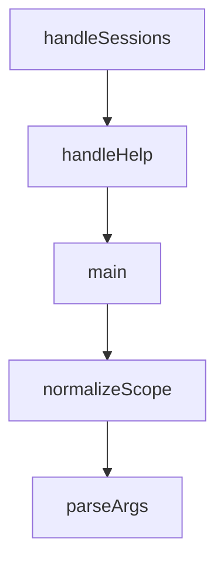

# Chapter 3: Installation Modes and Rules Strategy

Welcome to **Chapter 3: Installation Modes and Rules Strategy**. In this part of **Everything Claude Code Tutorial: Production Configuration Patterns for Claude Code**, you will build an intuitive mental model first, then move into concrete implementation details and practical production tradeoffs.


This chapter covers installation choices and language-rule management.

## Learning Goals

- choose plugin install vs manual install intentionally
- configure common plus language-specific rules safely
- avoid rule bloat across mixed-language projects
- maintain consistent setup across contributors

## Installation Paths

- plugin install (recommended for most users)
- manual copy/sync of components (advanced customization)

## Rules Strategy

- always install common rules
- add only language sets you actively use
- version rule sets with project onboarding docs

## Source References

- [README Installation](https://github.com/affaan-m/everything-claude-code/blob/main/README.md#-installation)
- [Rules README](https://github.com/affaan-m/everything-claude-code/blob/main/rules/README.md)
- [Plugin Manifest Notes](https://github.com/affaan-m/everything-claude-code/blob/main/.claude-plugin/README.md)

## Summary

You now have a reproducible installation strategy.

Next: [Chapter 4: Agents, Skills, and Command Orchestration](04-agents-skills-and-command-orchestration.md)

## Depth Expansion Playbook

## Source Code Walkthrough

### `scripts/claw.js`

The `handleSessions` function in [`scripts/claw.js`](https://github.com/affaan-m/everything-claude-code/blob/HEAD/scripts/claw.js) handles a key part of this chapter's functionality:

```js
}

function handleSessions(dir) {
  const sessions = listSessions(dir);
  if (sessions.length === 0) {
    console.log('(no sessions)');
    return;
  }

  console.log('Sessions:');
  for (const s of sessions) {
    console.log(`  - ${s}`);
  }
}

function handleHelp() {
  console.log('NanoClaw REPL Commands:');
  console.log('  /help                          Show this help');
  console.log('  /clear                         Clear current session history');
  console.log('  /history                       Print full conversation history');
  console.log('  /sessions                      List saved sessions');
  console.log('  /model [name]                  Show/set model');
  console.log('  /load <skill-name>             Load a skill into active context');
  console.log('  /branch <session-name>         Branch current session into a new session');
  console.log('  /search <query>                Search query across sessions');
  console.log('  /compact                       Keep recent turns, compact older context');
  console.log('  /export <md|json|txt> [path]   Export current session');
  console.log('  /metrics                       Show session metrics');
  console.log('  exit                           Quit the REPL');
}

function main() {
```

This function is important because it defines how Everything Claude Code Tutorial: Production Configuration Patterns for Claude Code implements the patterns covered in this chapter.

### `scripts/claw.js`

The `handleHelp` function in [`scripts/claw.js`](https://github.com/affaan-m/everything-claude-code/blob/HEAD/scripts/claw.js) handles a key part of this chapter's functionality:

```js
}

function handleHelp() {
  console.log('NanoClaw REPL Commands:');
  console.log('  /help                          Show this help');
  console.log('  /clear                         Clear current session history');
  console.log('  /history                       Print full conversation history');
  console.log('  /sessions                      List saved sessions');
  console.log('  /model [name]                  Show/set model');
  console.log('  /load <skill-name>             Load a skill into active context');
  console.log('  /branch <session-name>         Branch current session into a new session');
  console.log('  /search <query>                Search query across sessions');
  console.log('  /compact                       Keep recent turns, compact older context');
  console.log('  /export <md|json|txt> [path]   Export current session');
  console.log('  /metrics                       Show session metrics');
  console.log('  exit                           Quit the REPL');
}

function main() {
  const initialSessionName = process.env.CLAW_SESSION || 'default';
  if (!isValidSessionName(initialSessionName)) {
    console.error(`Error: Invalid session name "${initialSessionName}". Use alphanumeric characters and hyphens only.`);
    process.exit(1);
  }

  fs.mkdirSync(getClawDir(), { recursive: true });

  const state = {
    sessionName: initialSessionName,
    sessionPath: getSessionPath(initialSessionName),
    model: DEFAULT_MODEL,
    skills: normalizeSkillList(process.env.CLAW_SKILLS || ''),
```

This function is important because it defines how Everything Claude Code Tutorial: Production Configuration Patterns for Claude Code implements the patterns covered in this chapter.

### `scripts/claw.js`

The `main` function in [`scripts/claw.js`](https://github.com/affaan-m/everything-claude-code/blob/HEAD/scripts/claw.js) handles a key part of this chapter's functionality:

```js
}

function main() {
  const initialSessionName = process.env.CLAW_SESSION || 'default';
  if (!isValidSessionName(initialSessionName)) {
    console.error(`Error: Invalid session name "${initialSessionName}". Use alphanumeric characters and hyphens only.`);
    process.exit(1);
  }

  fs.mkdirSync(getClawDir(), { recursive: true });

  const state = {
    sessionName: initialSessionName,
    sessionPath: getSessionPath(initialSessionName),
    model: DEFAULT_MODEL,
    skills: normalizeSkillList(process.env.CLAW_SKILLS || ''),
  };

  let eccContext = loadECCContext(state.skills);

  const loadedCount = state.skills.filter(skillExists).length;

  console.log(`NanoClaw v2 — Session: ${state.sessionName}`);
  console.log(`Model: ${state.model}`);
  if (loadedCount > 0) {
    console.log(`Loaded ${loadedCount} skill(s) as context.`);
  }
  console.log('Type /help for commands, exit to quit.\n');

  const rl = readline.createInterface({ input: process.stdin, output: process.stdout });

  const prompt = () => {
```

This function is important because it defines how Everything Claude Code Tutorial: Production Configuration Patterns for Claude Code implements the patterns covered in this chapter.

### `scripts/harness-audit.js`

The `normalizeScope` function in [`scripts/harness-audit.js`](https://github.com/affaan-m/everything-claude-code/blob/HEAD/scripts/harness-audit.js) handles a key part of this chapter's functionality:

```js
];

function normalizeScope(scope) {
  const value = (scope || 'repo').toLowerCase();
  if (!['repo', 'hooks', 'skills', 'commands', 'agents'].includes(value)) {
    throw new Error(`Invalid scope: ${scope}`);
  }
  return value;
}

function parseArgs(argv) {
  const args = argv.slice(2);
  const parsed = {
    scope: 'repo',
    format: 'text',
    help: false,
  };

  for (let index = 0; index < args.length; index += 1) {
    const arg = args[index];

    if (arg === '--help' || arg === '-h') {
      parsed.help = true;
      continue;
    }

    if (arg === '--format') {
      parsed.format = (args[index + 1] || '').toLowerCase();
      index += 1;
      continue;
    }

```

This function is important because it defines how Everything Claude Code Tutorial: Production Configuration Patterns for Claude Code implements the patterns covered in this chapter.


## How These Components Connect


