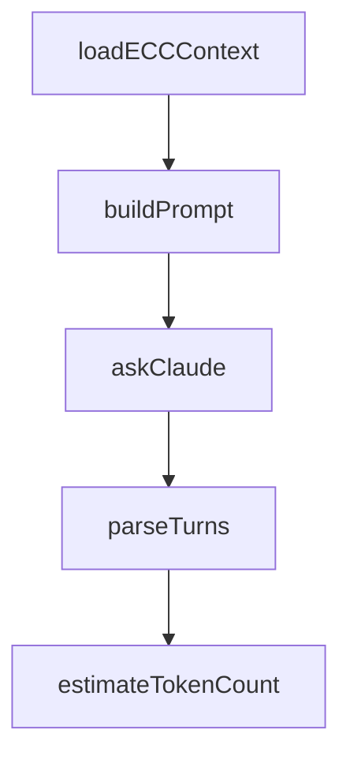

# Chapter 3: Installation Modes and Rules Strategy

Welcome to **Chapter 3: Installation Modes and Rules Strategy**. In this part of **Everything Claude Code Tutorial: Production Configuration Patterns for Claude Code**, you will build an intuitive mental model first, then move into concrete implementation details and practical production tradeoffs.


This chapter covers installation choices and language-rule management.

## Learning Goals

- choose plugin install vs manual install intentionally
- configure common plus language-specific rules safely
- avoid rule bloat across mixed-language projects
- maintain consistent setup across contributors

## Installation Paths

- plugin install (recommended for most users)
- manual copy/sync of components (advanced customization)

## Rules Strategy

- always install common rules
- add only language sets you actively use
- version rule sets with project onboarding docs

## Source References

- [README Installation](https://github.com/affaan-m/everything-claude-code/blob/main/README.md#-installation)
- [Rules README](https://github.com/affaan-m/everything-claude-code/blob/main/rules/README.md)
- [Plugin Manifest Notes](https://github.com/affaan-m/everything-claude-code/blob/main/.claude-plugin/README.md)

## Summary

You now have a reproducible installation strategy.

Next: [Chapter 4: Agents, Skills, and Command Orchestration](04-agents-skills-and-command-orchestration.md)

## Source Code Walkthrough

### `scripts/claw.js`

The `loadECCContext` function in [`scripts/claw.js`](https://github.com/affaan-m/everything-claude-code/blob/HEAD/scripts/claw.js) handles a key part of this chapter's functionality:

```js
}

function loadECCContext(skillList) {
  const requested = normalizeSkillList(skillList !== undefined ? skillList : process.env.CLAW_SKILLS || '');
  if (requested.length === 0) return '';

  const chunks = [];
  for (const name of requested) {
    const skillPath = path.join(process.cwd(), 'skills', name, 'SKILL.md');
    try {
      chunks.push(fs.readFileSync(skillPath, 'utf8'));
    } catch {
      // Skip missing skills silently to keep REPL usable.
    }
  }

  return chunks.join('\n\n');
}

function buildPrompt(systemPrompt, history, userMessage) {
  const parts = [];
  if (systemPrompt) parts.push(`=== SYSTEM CONTEXT ===\n${systemPrompt}\n`);
  if (history) parts.push(`=== CONVERSATION HISTORY ===\n${history}\n`);
  parts.push(`=== USER MESSAGE ===\n${userMessage}`);
  return parts.join('\n');
}

function askClaude(systemPrompt, history, userMessage, model) {
  const fullPrompt = buildPrompt(systemPrompt, history, userMessage);
  const args = [];
  if (model) {
    args.push('--model', model);
```

This function is important because it defines how Everything Claude Code Tutorial: Production Configuration Patterns for Claude Code implements the patterns covered in this chapter.

### `scripts/claw.js`

The `buildPrompt` function in [`scripts/claw.js`](https://github.com/affaan-m/everything-claude-code/blob/HEAD/scripts/claw.js) handles a key part of this chapter's functionality:

```js
}

function buildPrompt(systemPrompt, history, userMessage) {
  const parts = [];
  if (systemPrompt) parts.push(`=== SYSTEM CONTEXT ===\n${systemPrompt}\n`);
  if (history) parts.push(`=== CONVERSATION HISTORY ===\n${history}\n`);
  parts.push(`=== USER MESSAGE ===\n${userMessage}`);
  return parts.join('\n');
}

function askClaude(systemPrompt, history, userMessage, model) {
  const fullPrompt = buildPrompt(systemPrompt, history, userMessage);
  const args = [];
  if (model) {
    args.push('--model', model);
  }
  args.push('-p', fullPrompt);

  const result = spawnSync('claude', args, {
    encoding: 'utf8',
    stdio: ['pipe', 'pipe', 'pipe'],
    env: { ...process.env, CLAUDECODE: '' },
    timeout: 300000,
  });

  if (result.error) {
    return `[Error: ${result.error.message}]`;
  }

  if (result.status !== 0 && result.stderr) {
    return `[Error: claude exited with code ${result.status}: ${result.stderr.trim()}]`;
  }
```

This function is important because it defines how Everything Claude Code Tutorial: Production Configuration Patterns for Claude Code implements the patterns covered in this chapter.

### `scripts/claw.js`

The `askClaude` function in [`scripts/claw.js`](https://github.com/affaan-m/everything-claude-code/blob/HEAD/scripts/claw.js) handles a key part of this chapter's functionality:

```js
}

function askClaude(systemPrompt, history, userMessage, model) {
  const fullPrompt = buildPrompt(systemPrompt, history, userMessage);
  const args = [];
  if (model) {
    args.push('--model', model);
  }
  args.push('-p', fullPrompt);

  const result = spawnSync('claude', args, {
    encoding: 'utf8',
    stdio: ['pipe', 'pipe', 'pipe'],
    env: { ...process.env, CLAUDECODE: '' },
    timeout: 300000,
  });

  if (result.error) {
    return `[Error: ${result.error.message}]`;
  }

  if (result.status !== 0 && result.stderr) {
    return `[Error: claude exited with code ${result.status}: ${result.stderr.trim()}]`;
  }

  return (result.stdout || '').trim();
}

function parseTurns(history) {
  const turns = [];
  const regex = /### \[([^\]]+)\] ([^\n]+)\n([\s\S]*?)\n---\n/g;
  let match;
```

This function is important because it defines how Everything Claude Code Tutorial: Production Configuration Patterns for Claude Code implements the patterns covered in this chapter.

### `scripts/claw.js`

The `parseTurns` function in [`scripts/claw.js`](https://github.com/affaan-m/everything-claude-code/blob/HEAD/scripts/claw.js) handles a key part of this chapter's functionality:

```js
}

function parseTurns(history) {
  const turns = [];
  const regex = /### \[([^\]]+)\] ([^\n]+)\n([\s\S]*?)\n---\n/g;
  let match;
  while ((match = regex.exec(history)) !== null) {
    turns.push({ timestamp: match[1], role: match[2], content: match[3] });
  }
  return turns;
}

function estimateTokenCount(text) {
  return Math.ceil((text || '').length / 4);
}

function getSessionMetrics(filePath) {
  const history = loadHistory(filePath);
  const turns = parseTurns(history);
  const charCount = history.length;
  const tokenEstimate = estimateTokenCount(history);
  const userTurns = turns.filter(t => t.role === 'User').length;
  const assistantTurns = turns.filter(t => t.role === 'Assistant').length;

  return {
    turns: turns.length,
    userTurns,
    assistantTurns,
    charCount,
    tokenEstimate,
  };
}
```

This function is important because it defines how Everything Claude Code Tutorial: Production Configuration Patterns for Claude Code implements the patterns covered in this chapter.


## How These Components Connect


