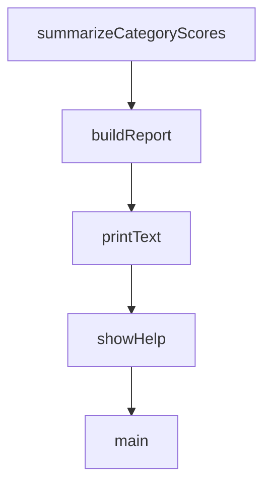

# Chapter 4: Agents, Skills, and Command Orchestration

Welcome to **Chapter 4: Agents, Skills, and Command Orchestration**. In this part of **Everything Claude Code Tutorial: Production Configuration Patterns for Claude Code**, you will build an intuitive mental model first, then move into concrete implementation details and practical production tradeoffs.


This chapter focuses on day-to-day orchestration patterns.

## Learning Goals

- route tasks through commands with minimal ambiguity
- choose the right specialist agent for each task class
- activate supporting skills for quality and speed
- structure complex workflows into deterministic phases

## Orchestration Pattern

- `plan` before execution
- delegate to specialized agents during implementation
- run review/security passes before merge
- close with verification and learnings capture

## Suggested Command Chain

`/plan` -> `/tdd` -> `/code-review` -> `/verify` -> `/learn`

## Source References

- [Commands Directory](https://github.com/affaan-m/everything-claude-code/tree/main/commands)
- [Agents Directory](https://github.com/affaan-m/everything-claude-code/tree/main/agents)
- [Skills Directory](https://github.com/affaan-m/everything-claude-code/tree/main/skills)

## Summary

You now have a practical command/agent orchestration baseline.

Next: [Chapter 5: Hooks, MCP, and Continuous Learning Loops](05-hooks-mcp-and-continuous-learning-loops.md)

## Depth Expansion Playbook

## Source Code Walkthrough

### `scripts/harness-audit.js`

The `summarizeCategoryScores` function in [`scripts/harness-audit.js`](https://github.com/affaan-m/everything-claude-code/blob/HEAD/scripts/harness-audit.js) handles a key part of this chapter's functionality:

```js
}

function summarizeCategoryScores(checks) {
  const scores = {};
  for (const category of CATEGORIES) {
    const inCategory = checks.filter(check => check.category === category);
    const max = inCategory.reduce((sum, check) => sum + check.points, 0);
    const earned = inCategory
      .filter(check => check.pass)
      .reduce((sum, check) => sum + check.points, 0);

    const normalized = max === 0 ? 0 : Math.round((earned / max) * 10);
    scores[category] = {
      score: normalized,
      earned,
      max,
    };
  }

  return scores;
}

function buildReport(scope) {
  const checks = getChecks().filter(check => check.scopes.includes(scope));
  const categoryScores = summarizeCategoryScores(checks);
  const maxScore = checks.reduce((sum, check) => sum + check.points, 0);
  const overallScore = checks
    .filter(check => check.pass)
    .reduce((sum, check) => sum + check.points, 0);

  const failedChecks = checks.filter(check => !check.pass);
  const topActions = failedChecks
```

This function is important because it defines how Everything Claude Code Tutorial: Production Configuration Patterns for Claude Code implements the patterns covered in this chapter.

### `scripts/harness-audit.js`

The `buildReport` function in [`scripts/harness-audit.js`](https://github.com/affaan-m/everything-claude-code/blob/HEAD/scripts/harness-audit.js) handles a key part of this chapter's functionality:

```js
}

function buildReport(scope) {
  const checks = getChecks().filter(check => check.scopes.includes(scope));
  const categoryScores = summarizeCategoryScores(checks);
  const maxScore = checks.reduce((sum, check) => sum + check.points, 0);
  const overallScore = checks
    .filter(check => check.pass)
    .reduce((sum, check) => sum + check.points, 0);

  const failedChecks = checks.filter(check => !check.pass);
  const topActions = failedChecks
    .sort((left, right) => right.points - left.points)
    .slice(0, 3)
    .map(check => ({
      action: check.fix,
      path: check.path,
      category: check.category,
      points: check.points,
    }));

  return {
    scope,
    deterministic: true,
    rubric_version: '2026-03-16',
    overall_score: overallScore,
    max_score: maxScore,
    categories: categoryScores,
    checks: checks.map(check => ({
      id: check.id,
      category: check.category,
      points: check.points,
```

This function is important because it defines how Everything Claude Code Tutorial: Production Configuration Patterns for Claude Code implements the patterns covered in this chapter.

### `scripts/harness-audit.js`

The `printText` function in [`scripts/harness-audit.js`](https://github.com/affaan-m/everything-claude-code/blob/HEAD/scripts/harness-audit.js) handles a key part of this chapter's functionality:

```js
}

function printText(report) {
  console.log(`Harness Audit (${report.scope}): ${report.overall_score}/${report.max_score}`);
  console.log('');

  for (const category of CATEGORIES) {
    const data = report.categories[category];
    if (!data || data.max === 0) {
      continue;
    }

    console.log(`- ${category}: ${data.score}/10 (${data.earned}/${data.max} pts)`);
  }

  const failed = report.checks.filter(check => !check.pass);
  console.log('');
  console.log(`Checks: ${report.checks.length} total, ${failed.length} failing`);

  if (failed.length > 0) {
    console.log('');
    console.log('Top 3 Actions:');
    report.top_actions.forEach((action, index) => {
      console.log(`${index + 1}) [${action.category}] ${action.action} (${action.path})`);
    });
  }
}

function showHelp(exitCode = 0) {
  console.log(`
Usage: node scripts/harness-audit.js [scope] [--scope <repo|hooks|skills|commands|agents>] [--format <text|json>]

```

This function is important because it defines how Everything Claude Code Tutorial: Production Configuration Patterns for Claude Code implements the patterns covered in this chapter.

### `scripts/harness-audit.js`

The `showHelp` function in [`scripts/harness-audit.js`](https://github.com/affaan-m/everything-claude-code/blob/HEAD/scripts/harness-audit.js) handles a key part of this chapter's functionality:

```js
}

function showHelp(exitCode = 0) {
  console.log(`
Usage: node scripts/harness-audit.js [scope] [--scope <repo|hooks|skills|commands|agents>] [--format <text|json>]

Deterministic harness audit based on explicit file/rule checks.
`);
  process.exit(exitCode);
}

function main() {
  try {
    const args = parseArgs(process.argv);

    if (args.help) {
      showHelp(0);
      return;
    }

    const report = buildReport(args.scope);

    if (args.format === 'json') {
      console.log(JSON.stringify(report, null, 2));
    } else {
      printText(report);
    }
  } catch (error) {
    console.error(`Error: ${error.message}`);
    process.exit(1);
  }
}
```

This function is important because it defines how Everything Claude Code Tutorial: Production Configuration Patterns for Claude Code implements the patterns covered in this chapter.


## How These Components Connect


