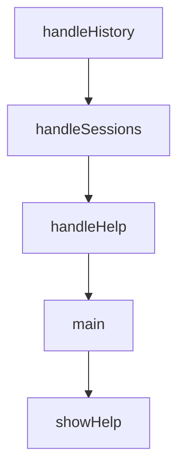

# Chapter 4: Agents, Skills, and Command Orchestration

Welcome to **Chapter 4: Agents, Skills, and Command Orchestration**. In this part of **Everything Claude Code Tutorial: Production Configuration Patterns for Claude Code**, you will build an intuitive mental model first, then move into concrete implementation details and practical production tradeoffs.


This chapter focuses on day-to-day orchestration patterns.

## Learning Goals

- route tasks through commands with minimal ambiguity
- choose the right specialist agent for each task class
- activate supporting skills for quality and speed
- structure complex workflows into deterministic phases

## Orchestration Pattern

- `plan` before execution
- delegate to specialized agents during implementation
- run review/security passes before merge
- close with verification and learnings capture

## Suggested Command Chain

`/plan` -> `/tdd` -> `/code-review` -> `/verify` -> `/learn`

## Source References

- [Commands Directory](https://github.com/affaan-m/everything-claude-code/tree/main/commands)
- [Agents Directory](https://github.com/affaan-m/everything-claude-code/tree/main/agents)
- [Skills Directory](https://github.com/affaan-m/everything-claude-code/tree/main/skills)

## Summary

You now have a practical command/agent orchestration baseline.

Next: [Chapter 5: Hooks, MCP, and Continuous Learning Loops](05-hooks-mcp-and-continuous-learning-loops.md)

## Source Code Walkthrough

### `scripts/claw.js`

The `handleHistory` function in [`scripts/claw.js`](https://github.com/affaan-m/everything-claude-code/blob/HEAD/scripts/claw.js) handles a key part of this chapter's functionality:

```js
}

function handleHistory(sessionPath) {
  const history = loadHistory(sessionPath);
  if (!history) {
    console.log('(no history)');
    return;
  }
  console.log(history);
}

function handleSessions(dir) {
  const sessions = listSessions(dir);
  if (sessions.length === 0) {
    console.log('(no sessions)');
    return;
  }

  console.log('Sessions:');
  for (const s of sessions) {
    console.log(`  - ${s}`);
  }
}

function handleHelp() {
  console.log('NanoClaw REPL Commands:');
  console.log('  /help                          Show this help');
  console.log('  /clear                         Clear current session history');
  console.log('  /history                       Print full conversation history');
  console.log('  /sessions                      List saved sessions');
  console.log('  /model [name]                  Show/set model');
  console.log('  /load <skill-name>             Load a skill into active context');
```

This function is important because it defines how Everything Claude Code Tutorial: Production Configuration Patterns for Claude Code implements the patterns covered in this chapter.

### `scripts/claw.js`

The `handleSessions` function in [`scripts/claw.js`](https://github.com/affaan-m/everything-claude-code/blob/HEAD/scripts/claw.js) handles a key part of this chapter's functionality:

```js
}

function handleSessions(dir) {
  const sessions = listSessions(dir);
  if (sessions.length === 0) {
    console.log('(no sessions)');
    return;
  }

  console.log('Sessions:');
  for (const s of sessions) {
    console.log(`  - ${s}`);
  }
}

function handleHelp() {
  console.log('NanoClaw REPL Commands:');
  console.log('  /help                          Show this help');
  console.log('  /clear                         Clear current session history');
  console.log('  /history                       Print full conversation history');
  console.log('  /sessions                      List saved sessions');
  console.log('  /model [name]                  Show/set model');
  console.log('  /load <skill-name>             Load a skill into active context');
  console.log('  /branch <session-name>         Branch current session into a new session');
  console.log('  /search <query>                Search query across sessions');
  console.log('  /compact                       Keep recent turns, compact older context');
  console.log('  /export <md|json|txt> [path]   Export current session');
  console.log('  /metrics                       Show session metrics');
  console.log('  exit                           Quit the REPL');
}

function main() {
```

This function is important because it defines how Everything Claude Code Tutorial: Production Configuration Patterns for Claude Code implements the patterns covered in this chapter.

### `scripts/claw.js`

The `handleHelp` function in [`scripts/claw.js`](https://github.com/affaan-m/everything-claude-code/blob/HEAD/scripts/claw.js) handles a key part of this chapter's functionality:

```js
}

function handleHelp() {
  console.log('NanoClaw REPL Commands:');
  console.log('  /help                          Show this help');
  console.log('  /clear                         Clear current session history');
  console.log('  /history                       Print full conversation history');
  console.log('  /sessions                      List saved sessions');
  console.log('  /model [name]                  Show/set model');
  console.log('  /load <skill-name>             Load a skill into active context');
  console.log('  /branch <session-name>         Branch current session into a new session');
  console.log('  /search <query>                Search query across sessions');
  console.log('  /compact                       Keep recent turns, compact older context');
  console.log('  /export <md|json|txt> [path]   Export current session');
  console.log('  /metrics                       Show session metrics');
  console.log('  exit                           Quit the REPL');
}

function main() {
  const initialSessionName = process.env.CLAW_SESSION || 'default';
  if (!isValidSessionName(initialSessionName)) {
    console.error(`Error: Invalid session name "${initialSessionName}". Use alphanumeric characters and hyphens only.`);
    process.exit(1);
  }

  fs.mkdirSync(getClawDir(), { recursive: true });

  const state = {
    sessionName: initialSessionName,
    sessionPath: getSessionPath(initialSessionName),
    model: DEFAULT_MODEL,
    skills: normalizeSkillList(process.env.CLAW_SKILLS || ''),
```

This function is important because it defines how Everything Claude Code Tutorial: Production Configuration Patterns for Claude Code implements the patterns covered in this chapter.

### `scripts/claw.js`

The `main` function in [`scripts/claw.js`](https://github.com/affaan-m/everything-claude-code/blob/HEAD/scripts/claw.js) handles a key part of this chapter's functionality:

```js
}

function main() {
  const initialSessionName = process.env.CLAW_SESSION || 'default';
  if (!isValidSessionName(initialSessionName)) {
    console.error(`Error: Invalid session name "${initialSessionName}". Use alphanumeric characters and hyphens only.`);
    process.exit(1);
  }

  fs.mkdirSync(getClawDir(), { recursive: true });

  const state = {
    sessionName: initialSessionName,
    sessionPath: getSessionPath(initialSessionName),
    model: DEFAULT_MODEL,
    skills: normalizeSkillList(process.env.CLAW_SKILLS || ''),
  };

  let eccContext = loadECCContext(state.skills);

  const loadedCount = state.skills.filter(skillExists).length;

  console.log(`NanoClaw v2 — Session: ${state.sessionName}`);
  console.log(`Model: ${state.model}`);
  if (loadedCount > 0) {
    console.log(`Loaded ${loadedCount} skill(s) as context.`);
  }
  console.log('Type /help for commands, exit to quit.\n');

  const rl = readline.createInterface({ input: process.stdin, output: process.stdout });

  const prompt = () => {
```

This function is important because it defines how Everything Claude Code Tutorial: Production Configuration Patterns for Claude Code implements the patterns covered in this chapter.


## How These Components Connect


