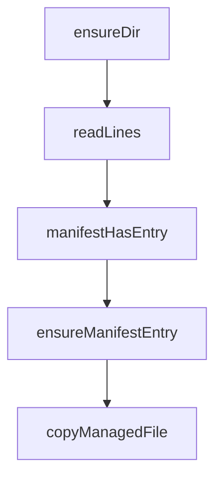

# Chapter 5: Hooks, MCP, and Continuous Learning Loops

Welcome to **Chapter 5: Hooks, MCP, and Continuous Learning Loops**. In this part of **Everything Claude Code Tutorial: Production Configuration Patterns for Claude Code**, you will build an intuitive mental model first, then move into concrete implementation details and practical production tradeoffs.


This chapter explains automation and feedback loops that improve over time.

## Learning Goals

- understand hook lifecycle behavior and guardrails
- configure MCP integrations for external capabilities
- use continuous learning skills without polluting context
- establish safe automation boundaries

## Hook and MCP Role Split

- hooks: event-based local automation
- MCP: external tool/data integrations
- skills: durable workflow intelligence

## Continuous Learning Baseline

- capture reusable patterns from sessions
- score confidence before promoting patterns
- evolve into skills only after repeated evidence

## Source References

- [README Continuous Learning](https://github.com/affaan-m/everything-claude-code/blob/main/README.md#-continuous-learning-v2)
- [Hooks Guidance](https://github.com/affaan-m/everything-claude-code/tree/main/hooks)
- [MCP Config](https://github.com/affaan-m/everything-claude-code/blob/main/.cursor/mcp.json)

## Summary

You now understand how to run automated feedback loops with controlled risk.

Next: [Chapter 6: Cross-Platform Workflows (Cursor and OpenCode)](06-cross-platform-workflows-cursor-and-opencode.md)

## Source Code Walkthrough

### `.codebuddy/install.js`

The `ensureDir` function in [`.codebuddy/install.js`](https://github.com/affaan-m/everything-claude-code/blob/HEAD/.codebuddy/install.js) handles a key part of this chapter's functionality:

```js
 * Ensure directory exists
 */
function ensureDir(dirPath) {
  try {
    if (!fs.existsSync(dirPath)) {
      fs.mkdirSync(dirPath, { recursive: true });
    }
  } catch (err) {
    if (err.code !== 'EEXIST') {
      throw err;
    }
  }
}

/**
 * Read lines from a file
 */
function readLines(filePath) {
  try {
    if (!fs.existsSync(filePath)) {
      return [];
    }
    const content = fs.readFileSync(filePath, 'utf8');
    return content.split('\n').filter(line => line.length > 0);
  } catch {
    return [];
  }
}

/**
 * Check if manifest contains an entry
 */
```

This function is important because it defines how Everything Claude Code Tutorial: Production Configuration Patterns for Claude Code implements the patterns covered in this chapter.

### `.codebuddy/install.js`

The `readLines` function in [`.codebuddy/install.js`](https://github.com/affaan-m/everything-claude-code/blob/HEAD/.codebuddy/install.js) handles a key part of this chapter's functionality:

```js
 * Read lines from a file
 */
function readLines(filePath) {
  try {
    if (!fs.existsSync(filePath)) {
      return [];
    }
    const content = fs.readFileSync(filePath, 'utf8');
    return content.split('\n').filter(line => line.length > 0);
  } catch {
    return [];
  }
}

/**
 * Check if manifest contains an entry
 */
function manifestHasEntry(manifestPath, entry) {
  const lines = readLines(manifestPath);
  return lines.includes(entry);
}

/**
 * Add entry to manifest
 */
function ensureManifestEntry(manifestPath, entry) {
  try {
    const lines = readLines(manifestPath);
    if (!lines.includes(entry)) {
      const content = lines.join('\n') + (lines.length > 0 ? '\n' : '') + entry + '\n';
      fs.writeFileSync(manifestPath, content, 'utf8');
    }
```

This function is important because it defines how Everything Claude Code Tutorial: Production Configuration Patterns for Claude Code implements the patterns covered in this chapter.

### `.codebuddy/install.js`

The `manifestHasEntry` function in [`.codebuddy/install.js`](https://github.com/affaan-m/everything-claude-code/blob/HEAD/.codebuddy/install.js) handles a key part of this chapter's functionality:

```js
 * Check if manifest contains an entry
 */
function manifestHasEntry(manifestPath, entry) {
  const lines = readLines(manifestPath);
  return lines.includes(entry);
}

/**
 * Add entry to manifest
 */
function ensureManifestEntry(manifestPath, entry) {
  try {
    const lines = readLines(manifestPath);
    if (!lines.includes(entry)) {
      const content = lines.join('\n') + (lines.length > 0 ? '\n' : '') + entry + '\n';
      fs.writeFileSync(manifestPath, content, 'utf8');
    }
  } catch (err) {
    console.error(`Error updating manifest: ${err.message}`);
  }
}

/**
 * Copy a file and manage in manifest
 */
function copyManagedFile(sourcePath, targetPath, manifestPath, manifestEntry, makeExecutable = false) {
  const alreadyManaged = manifestHasEntry(manifestPath, manifestEntry);

  // If target file already exists
  if (fs.existsSync(targetPath)) {
    if (alreadyManaged) {
      ensureManifestEntry(manifestPath, manifestEntry);
```

This function is important because it defines how Everything Claude Code Tutorial: Production Configuration Patterns for Claude Code implements the patterns covered in this chapter.

### `.codebuddy/install.js`

The `ensureManifestEntry` function in [`.codebuddy/install.js`](https://github.com/affaan-m/everything-claude-code/blob/HEAD/.codebuddy/install.js) handles a key part of this chapter's functionality:

```js
 * Add entry to manifest
 */
function ensureManifestEntry(manifestPath, entry) {
  try {
    const lines = readLines(manifestPath);
    if (!lines.includes(entry)) {
      const content = lines.join('\n') + (lines.length > 0 ? '\n' : '') + entry + '\n';
      fs.writeFileSync(manifestPath, content, 'utf8');
    }
  } catch (err) {
    console.error(`Error updating manifest: ${err.message}`);
  }
}

/**
 * Copy a file and manage in manifest
 */
function copyManagedFile(sourcePath, targetPath, manifestPath, manifestEntry, makeExecutable = false) {
  const alreadyManaged = manifestHasEntry(manifestPath, manifestEntry);

  // If target file already exists
  if (fs.existsSync(targetPath)) {
    if (alreadyManaged) {
      ensureManifestEntry(manifestPath, manifestEntry);
    }
    return false;
  }

  // Copy the file
  try {
    ensureDir(path.dirname(targetPath));
    fs.copyFileSync(sourcePath, targetPath);
```

This function is important because it defines how Everything Claude Code Tutorial: Production Configuration Patterns for Claude Code implements the patterns covered in this chapter.


## How These Components Connect


