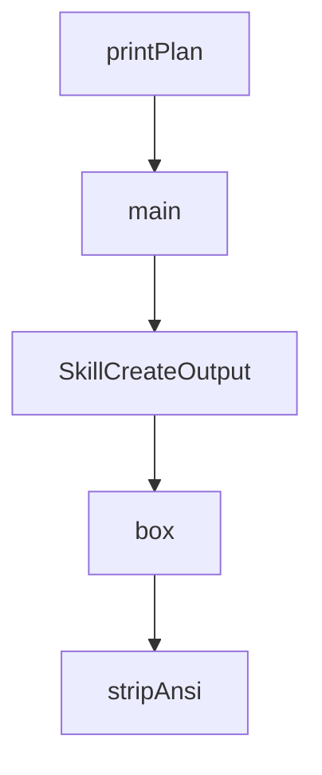

# Chapter 5: Hooks, MCP, and Continuous Learning Loops

Welcome to **Chapter 5: Hooks, MCP, and Continuous Learning Loops**. In this part of **Everything Claude Code Tutorial: Production Configuration Patterns for Claude Code**, you will build an intuitive mental model first, then move into concrete implementation details and practical production tradeoffs.


This chapter explains automation and feedback loops that improve over time.

## Learning Goals

- understand hook lifecycle behavior and guardrails
- configure MCP integrations for external capabilities
- use continuous learning skills without polluting context
- establish safe automation boundaries

## Hook and MCP Role Split

- hooks: event-based local automation
- MCP: external tool/data integrations
- skills: durable workflow intelligence

## Continuous Learning Baseline

- capture reusable patterns from sessions
- score confidence before promoting patterns
- evolve into skills only after repeated evidence

## Source References

- [README Continuous Learning](https://github.com/affaan-m/everything-claude-code/blob/main/README.md#-continuous-learning-v2)
- [Hooks Guidance](https://github.com/affaan-m/everything-claude-code/tree/main/hooks)
- [MCP Config](https://github.com/affaan-m/everything-claude-code/blob/main/.cursor/mcp.json)

## Summary

You now understand how to run automated feedback loops with controlled risk.

Next: [Chapter 6: Cross-Platform Workflows (Cursor and OpenCode)](06-cross-platform-workflows-cursor-and-opencode.md)

## Depth Expansion Playbook

## Source Code Walkthrough

### `scripts/install-plan.js`

The `printPlan` function in [`scripts/install-plan.js`](https://github.com/affaan-m/everything-claude-code/blob/HEAD/scripts/install-plan.js) handles a key part of this chapter's functionality:

```js
}

function printPlan(plan) {
  console.log('Install plan:\n');
  console.log(
    'Note: target filtering and operation output currently reflect scaffold-level adapter planning, not a byte-for-byte mirror of legacy install.sh copy paths.\n'
  );
  console.log(`Profile: ${plan.profileId || '(custom modules)'}`);
  console.log(`Target: ${plan.target || '(all targets)'}`);
  console.log(`Included components: ${plan.includedComponentIds.join(', ') || '(none)'}`);
  console.log(`Excluded components: ${plan.excludedComponentIds.join(', ') || '(none)'}`);
  console.log(`Requested: ${plan.requestedModuleIds.join(', ')}`);
  if (plan.targetAdapterId) {
    console.log(`Adapter: ${plan.targetAdapterId}`);
    console.log(`Target root: ${plan.targetRoot}`);
    console.log(`Install-state: ${plan.installStatePath}`);
  }
  console.log('');
  console.log(`Selected modules (${plan.selectedModuleIds.length}):`);
  for (const module of plan.selectedModules) {
    console.log(`- ${module.id} [${module.kind}]`);
  }

  if (plan.skippedModuleIds.length > 0) {
    console.log('');
    console.log(`Skipped for target ${plan.target} (${plan.skippedModuleIds.length}):`);
    for (const module of plan.skippedModules) {
      console.log(`- ${module.id} [${module.kind}]`);
    }
  }

  if (plan.excludedModuleIds.length > 0) {
```

This function is important because it defines how Everything Claude Code Tutorial: Production Configuration Patterns for Claude Code implements the patterns covered in this chapter.

### `scripts/install-plan.js`

The `main` function in [`scripts/install-plan.js`](https://github.com/affaan-m/everything-claude-code/blob/HEAD/scripts/install-plan.js) handles a key part of this chapter's functionality:

```js
}

function main() {
  try {
    const options = parseArgs(process.argv);

    if (options.help || process.argv.length <= 2) {
      showHelp();
      process.exit(0);
    }

    if (options.listProfiles) {
      const profiles = listInstallProfiles();
      if (options.json) {
        console.log(JSON.stringify({ profiles }, null, 2));
      } else {
        printProfiles(profiles);
      }
      return;
    }

    if (options.listModules) {
      const modules = listInstallModules();
      if (options.json) {
        console.log(JSON.stringify({ modules }, null, 2));
      } else {
        printModules(modules);
      }
      return;
    }

    if (options.listComponents) {
```

This function is important because it defines how Everything Claude Code Tutorial: Production Configuration Patterns for Claude Code implements the patterns covered in this chapter.

### `scripts/skill-create-output.js`

The `SkillCreateOutput` class in [`scripts/skill-create-output.js`](https://github.com/affaan-m/everything-claude-code/blob/HEAD/scripts/skill-create-output.js) handles a key part of this chapter's functionality:

```js

// Main output formatter
class SkillCreateOutput {
  constructor(repoName, options = {}) {
    this.repoName = repoName;
    this.options = options;
    this.width = options.width || 70;
  }

  header() {
    const subtitle = `Extracting patterns from ${chalk.cyan(this.repoName)}`;

    console.log('\n');
    console.log(chalk.bold(chalk.magenta('╔════════════════════════════════════════════════════════════════╗')));
    console.log(chalk.bold(chalk.magenta('║')) + chalk.bold('  🔮 ECC Skill Creator                                          ') + chalk.bold(chalk.magenta('║')));
    console.log(chalk.bold(chalk.magenta('║')) + `     ${subtitle}${' '.repeat(Math.max(0, 59 - stripAnsi(subtitle).length))}` + chalk.bold(chalk.magenta('║')));
    console.log(chalk.bold(chalk.magenta('╚════════════════════════════════════════════════════════════════╝')));
    console.log('');
  }

  async analyzePhase(data) {
    const steps = [
      { name: 'Parsing git history...', duration: 300 },
      { name: `Found ${chalk.yellow(data.commits)} commits`, duration: 200 },
      { name: 'Analyzing commit patterns...', duration: 400 },
      { name: 'Detecting file co-changes...', duration: 300 },
      { name: 'Identifying workflows...', duration: 400 },
      { name: 'Extracting architecture patterns...', duration: 300 },
    ];

    await animateProgress('Analyzing Repository', steps);
  }
```

This class is important because it defines how Everything Claude Code Tutorial: Production Configuration Patterns for Claude Code implements the patterns covered in this chapter.

### `scripts/skill-create-output.js`

The `box` function in [`scripts/skill-create-output.js`](https://github.com/affaan-m/everything-claude-code/blob/HEAD/scripts/skill-create-output.js) handles a key part of this chapter's functionality:

```js

// Helper functions
function box(title, content, width = 60) {
  const lines = content.split('\n');
  const top = `${BOX.topLeft}${BOX.horizontal} ${chalk.bold(chalk.cyan(title))} ${BOX.horizontal.repeat(Math.max(0, width - title.length - 5))}${BOX.topRight}`;
  const bottom = `${BOX.bottomLeft}${BOX.horizontal.repeat(width - 2)}${BOX.bottomRight}`;
  const middle = lines.map(line => {
    const padding = width - 4 - stripAnsi(line).length;
    return `${BOX.vertical} ${line}${' '.repeat(Math.max(0, padding))} ${BOX.vertical}`;
  }).join('\n');
  return `${top}\n${middle}\n${bottom}`;
}

function stripAnsi(str) {
  // eslint-disable-next-line no-control-regex
  return str.replace(/\x1b\[[0-9;]*m/g, '');
}

function progressBar(percent, width = 30) {
  const filled = Math.min(width, Math.max(0, Math.round(width * percent / 100)));
  const empty = width - filled;
  const bar = chalk.green('█'.repeat(filled)) + chalk.gray('░'.repeat(empty));
  return `${bar} ${chalk.bold(percent)}%`;
}

function sleep(ms) {
  return new Promise(resolve => setTimeout(resolve, ms));
}

async function animateProgress(label, steps, callback) {
  process.stdout.write(`\n${chalk.cyan('⏳')} ${label}...\n`);

```

This function is important because it defines how Everything Claude Code Tutorial: Production Configuration Patterns for Claude Code implements the patterns covered in this chapter.


## How These Components Connect


