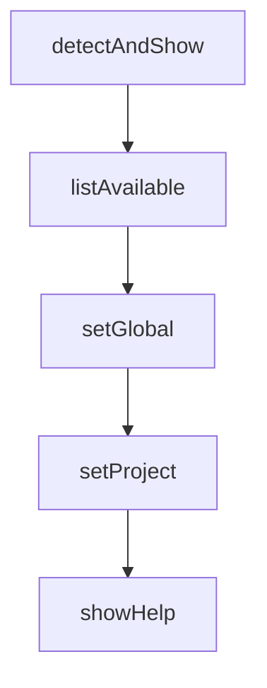

# Chapter 6: Cross-Platform Workflows (Cursor and OpenCode)

Welcome to **Chapter 6: Cross-Platform Workflows (Cursor and OpenCode)**. In this part of **Everything Claude Code Tutorial: Production Configuration Patterns for Claude Code**, you will build an intuitive mental model first, then move into concrete implementation details and practical production tradeoffs.


This chapter covers portability patterns across editor and agent runtimes.

## Learning Goals

- apply Cursor and OpenCode integration paths correctly
- understand feature parity and known differences
- avoid portability regressions in shared teams
- keep one conceptual workflow across multiple tools

## Portability Guidelines

- keep core commands and skills semantically aligned
- document runtime-specific differences explicitly
- test a small reference workflow in each target environment

## Source References

- [Cursor Support](https://github.com/affaan-m/everything-claude-code/blob/main/.cursor/README.md)
- [OpenCode Support](https://github.com/affaan-m/everything-claude-code/blob/main/.opencode/README.md)
- [README OpenCode Section](https://github.com/affaan-m/everything-claude-code/blob/main/README.md#-opencode-support)

## Summary

You now have a practical cross-platform portability model.

Next: [Chapter 7: Testing, Verification, and Troubleshooting](07-testing-verification-and-troubleshooting.md)

## Depth Expansion Playbook

## Source Code Walkthrough

### `scripts/setup-package-manager.js`

The `detectAndShow` function in [`scripts/setup-package-manager.js`](https://github.com/affaan-m/everything-claude-code/blob/HEAD/scripts/setup-package-manager.js) handles a key part of this chapter's functionality:

```js
}

function detectAndShow() {
  const pm = getPackageManager();
  const available = getAvailablePackageManagers();
  const fromLock = detectFromLockFile();
  const fromPkg = detectFromPackageJson();

  console.log('\n=== Package Manager Detection ===\n');

  console.log('Current selection:');
  console.log(`  Package Manager: ${pm.name}`);
  console.log(`  Source: ${pm.source}`);
  console.log('');

  console.log('Detection results:');
  console.log(`  From package.json: ${fromPkg || 'not specified'}`);
  console.log(`  From lock file: ${fromLock || 'not found'}`);
  console.log(`  Environment var: ${process.env.CLAUDE_PACKAGE_MANAGER || 'not set'}`);
  console.log('');

  console.log('Available package managers:');
  for (const pmName of Object.keys(PACKAGE_MANAGERS)) {
    const installed = available.includes(pmName);
    const indicator = installed ? '✓' : '✗';
    const current = pmName === pm.name ? ' (current)' : '';
    console.log(`  ${indicator} ${pmName}${current}`);
  }

  console.log('');
  console.log('Commands:');
  console.log(`  Install: ${pm.config.installCmd}`);
```

This function is important because it defines how Everything Claude Code Tutorial: Production Configuration Patterns for Claude Code implements the patterns covered in this chapter.

### `scripts/setup-package-manager.js`

The `listAvailable` function in [`scripts/setup-package-manager.js`](https://github.com/affaan-m/everything-claude-code/blob/HEAD/scripts/setup-package-manager.js) handles a key part of this chapter's functionality:

```js
}

function listAvailable() {
  const available = getAvailablePackageManagers();
  const pm = getPackageManager();

  console.log('\nAvailable Package Managers:\n');

  for (const pmName of Object.keys(PACKAGE_MANAGERS)) {
    const config = PACKAGE_MANAGERS[pmName];
    const installed = available.includes(pmName);
    const current = pmName === pm.name ? ' (current)' : '';

    console.log(`${pmName}${current}`);
    console.log(`  Installed: ${installed ? 'Yes' : 'No'}`);
    console.log(`  Lock file: ${config.lockFile}`);
    console.log(`  Install: ${config.installCmd}`);
    console.log(`  Run: ${config.runCmd}`);
    console.log('');
  }
}

function setGlobal(pmName) {
  if (!PACKAGE_MANAGERS[pmName]) {
    console.error(`Error: Unknown package manager "${pmName}"`);
    console.error(`Available: ${Object.keys(PACKAGE_MANAGERS).join(', ')}`);
    process.exit(1);
  }

  const available = getAvailablePackageManagers();
  if (!available.includes(pmName)) {
    console.warn(`Warning: ${pmName} is not installed on your system`);
```

This function is important because it defines how Everything Claude Code Tutorial: Production Configuration Patterns for Claude Code implements the patterns covered in this chapter.

### `scripts/setup-package-manager.js`

The `setGlobal` function in [`scripts/setup-package-manager.js`](https://github.com/affaan-m/everything-claude-code/blob/HEAD/scripts/setup-package-manager.js) handles a key part of this chapter's functionality:

```js
}

function setGlobal(pmName) {
  if (!PACKAGE_MANAGERS[pmName]) {
    console.error(`Error: Unknown package manager "${pmName}"`);
    console.error(`Available: ${Object.keys(PACKAGE_MANAGERS).join(', ')}`);
    process.exit(1);
  }

  const available = getAvailablePackageManagers();
  if (!available.includes(pmName)) {
    console.warn(`Warning: ${pmName} is not installed on your system`);
  }

  try {
    setPreferredPackageManager(pmName);
    console.log(`\n✓ Global preference set to: ${pmName}`);
    console.log('  Saved to: ~/.claude/package-manager.json');
    console.log('');
  } catch (err) {
    console.error(`Error: ${err.message}`);
    process.exit(1);
  }
}

function setProject(pmName) {
  if (!PACKAGE_MANAGERS[pmName]) {
    console.error(`Error: Unknown package manager "${pmName}"`);
    console.error(`Available: ${Object.keys(PACKAGE_MANAGERS).join(', ')}`);
    process.exit(1);
  }

```

This function is important because it defines how Everything Claude Code Tutorial: Production Configuration Patterns for Claude Code implements the patterns covered in this chapter.

### `scripts/setup-package-manager.js`

The `setProject` function in [`scripts/setup-package-manager.js`](https://github.com/affaan-m/everything-claude-code/blob/HEAD/scripts/setup-package-manager.js) handles a key part of this chapter's functionality:

```js
  getPackageManager,
  setPreferredPackageManager,
  setProjectPackageManager,
  getAvailablePackageManagers,
  detectFromLockFile,
  detectFromPackageJson
} = require('./lib/package-manager');

function showHelp() {
  console.log(`
Package Manager Setup for Claude Code

Usage:
  node scripts/setup-package-manager.js [options] [package-manager]

Options:
  --detect        Detect and show current package manager
  --global <pm>   Set global preference (saves to ~/.claude/package-manager.json)
  --project <pm>  Set project preference (saves to .claude/package-manager.json)
  --list          List available package managers
  --help          Show this help message

Package Managers:
  npm             Node Package Manager (default with Node.js)
  pnpm            Fast, disk space efficient package manager
  yarn            Classic Yarn package manager
  bun             All-in-one JavaScript runtime & toolkit

Examples:
  # Detect current package manager
  node scripts/setup-package-manager.js --detect

```

This function is important because it defines how Everything Claude Code Tutorial: Production Configuration Patterns for Claude Code implements the patterns covered in this chapter.


## How These Components Connect


