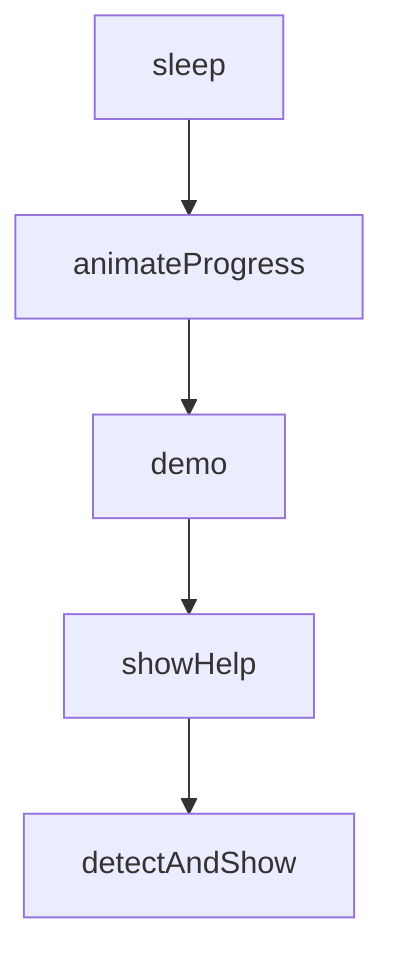

# Chapter 6: Cross-Platform Workflows (Cursor and OpenCode)

Welcome to **Chapter 6: Cross-Platform Workflows (Cursor and OpenCode)**. In this part of **Everything Claude Code Tutorial: Production Configuration Patterns for Claude Code**, you will build an intuitive mental model first, then move into concrete implementation details and practical production tradeoffs.


This chapter covers portability patterns across editor and agent runtimes.

## Learning Goals

- apply Cursor and OpenCode integration paths correctly
- understand feature parity and known differences
- avoid portability regressions in shared teams
- keep one conceptual workflow across multiple tools

## Portability Guidelines

- keep core commands and skills semantically aligned
- document runtime-specific differences explicitly
- test a small reference workflow in each target environment

## Source References

- [Cursor Support](https://github.com/affaan-m/everything-claude-code/blob/main/.cursor/README.md)
- [OpenCode Support](https://github.com/affaan-m/everything-claude-code/blob/main/.opencode/README.md)
- [README OpenCode Section](https://github.com/affaan-m/everything-claude-code/blob/main/README.md#-opencode-support)

## Summary

You now have a practical cross-platform portability model.

Next: [Chapter 7: Testing, Verification, and Troubleshooting](07-testing-verification-and-troubleshooting.md)

## Source Code Walkthrough

### `scripts/skill-create-output.js`

The `sleep` function in [`scripts/skill-create-output.js`](https://github.com/affaan-m/everything-claude-code/blob/HEAD/scripts/skill-create-output.js) handles a key part of this chapter's functionality:

```js
}

function sleep(ms) {
  return new Promise(resolve => setTimeout(resolve, ms));
}

async function animateProgress(label, steps, callback) {
  process.stdout.write(`\n${chalk.cyan('[RUN]')} ${label}...\n`);

  for (let i = 0; i < steps.length; i++) {
    const step = steps[i];
    process.stdout.write(`   ${chalk.gray(SPINNER[i % SPINNER.length])} ${step.name}`);
    await sleep(step.duration || 500);
    process.stdout.clearLine?.(0) || process.stdout.write('\r');
    process.stdout.cursorTo?.(0) || process.stdout.write('\r');
    process.stdout.write(`   ${chalk.green('[DONE]')} ${step.name}\n`);
    if (callback) callback(step, i);
  }
}

// Main output formatter
class SkillCreateOutput {
  constructor(repoName, options = {}) {
    this.repoName = repoName;
    this.options = options;
    this.width = options.width || 70;
  }

  header() {
    const subtitle = `Extracting patterns from ${chalk.cyan(this.repoName)}`;

    console.log('\n');
```

This function is important because it defines how Everything Claude Code Tutorial: Production Configuration Patterns for Claude Code implements the patterns covered in this chapter.

### `scripts/skill-create-output.js`

The `animateProgress` function in [`scripts/skill-create-output.js`](https://github.com/affaan-m/everything-claude-code/blob/HEAD/scripts/skill-create-output.js) handles a key part of this chapter's functionality:

```js
}

async function animateProgress(label, steps, callback) {
  process.stdout.write(`\n${chalk.cyan('[RUN]')} ${label}...\n`);

  for (let i = 0; i < steps.length; i++) {
    const step = steps[i];
    process.stdout.write(`   ${chalk.gray(SPINNER[i % SPINNER.length])} ${step.name}`);
    await sleep(step.duration || 500);
    process.stdout.clearLine?.(0) || process.stdout.write('\r');
    process.stdout.cursorTo?.(0) || process.stdout.write('\r');
    process.stdout.write(`   ${chalk.green('[DONE]')} ${step.name}\n`);
    if (callback) callback(step, i);
  }
}

// Main output formatter
class SkillCreateOutput {
  constructor(repoName, options = {}) {
    this.repoName = repoName;
    this.options = options;
    this.width = options.width || 70;
  }

  header() {
    const subtitle = `Extracting patterns from ${chalk.cyan(this.repoName)}`;

    console.log('\n');
    console.log(chalk.bold(chalk.magenta('╔════════════════════════════════════════════════════════════════╗')));
    console.log(chalk.bold(chalk.magenta('║')) + chalk.bold('  ECC Skill Creator                                             ') + chalk.bold(chalk.magenta('║')));
    console.log(chalk.bold(chalk.magenta('║')) + `     ${subtitle}${' '.repeat(Math.max(0, 59 - stripAnsi(subtitle).length))}` + chalk.bold(chalk.magenta('║')));
    console.log(chalk.bold(chalk.magenta('╚════════════════════════════════════════════════════════════════╝')));
```

This function is important because it defines how Everything Claude Code Tutorial: Production Configuration Patterns for Claude Code implements the patterns covered in this chapter.

### `scripts/skill-create-output.js`

The `demo` function in [`scripts/skill-create-output.js`](https://github.com/affaan-m/everything-claude-code/blob/HEAD/scripts/skill-create-output.js) handles a key part of this chapter's functionality:

```js

// Demo function to show the output
async function demo() {
  const output = new SkillCreateOutput('PMX');

  output.header();

  await output.analyzePhase({
    commits: 200,
  });

  output.analysisResults({
    commits: 200,
    timeRange: 'Nov 2024 - Jan 2025',
    contributors: 4,
    files: 847,
  });

  output.patterns([
    {
      name: 'Conventional Commits',
      trigger: 'when writing commit messages',
      confidence: 0.85,
      evidence: 'Found in 150/200 commits (feat:, fix:, refactor:)',
    },
    {
      name: 'Client/Server Component Split',
      trigger: 'when creating Next.js pages',
      confidence: 0.90,
      evidence: 'Observed in markets/, premarkets/, portfolio/',
    },
    {
```

This function is important because it defines how Everything Claude Code Tutorial: Production Configuration Patterns for Claude Code implements the patterns covered in this chapter.

### `scripts/setup-package-manager.js`

The `showHelp` function in [`scripts/setup-package-manager.js`](https://github.com/affaan-m/everything-claude-code/blob/HEAD/scripts/setup-package-manager.js) handles a key part of this chapter's functionality:

```js
} = require('./lib/package-manager');

function showHelp() {
  console.log(`
Package Manager Setup for Claude Code

Usage:
  node scripts/setup-package-manager.js [options] [package-manager]

Options:
  --detect        Detect and show current package manager
  --global <pm>   Set global preference (saves to ~/.claude/package-manager.json)
  --project <pm>  Set project preference (saves to .claude/package-manager.json)
  --list          List available package managers
  --help          Show this help message

Package Managers:
  npm             Node Package Manager (default with Node.js)
  pnpm            Fast, disk space efficient package manager
  yarn            Classic Yarn package manager
  bun             All-in-one JavaScript runtime & toolkit

Examples:
  # Detect current package manager
  node scripts/setup-package-manager.js --detect

  # Set pnpm as global preference
  node scripts/setup-package-manager.js --global pnpm

  # Set bun for current project
  node scripts/setup-package-manager.js --project bun

```

This function is important because it defines how Everything Claude Code Tutorial: Production Configuration Patterns for Claude Code implements the patterns covered in this chapter.


## How These Components Connect


