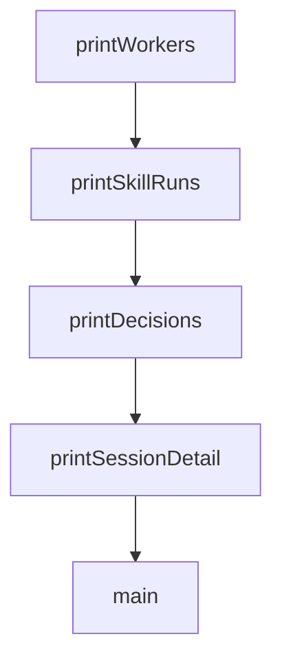

# Chapter 7: Testing, Verification, and Troubleshooting

Welcome to **Chapter 7: Testing, Verification, and Troubleshooting**. In this part of **Everything Claude Code Tutorial: Production Configuration Patterns for Claude Code**, you will build an intuitive mental model first, then move into concrete implementation details and practical production tradeoffs.


This chapter provides quality and incident-response routines.

## Learning Goals

- run test and verification loops consistently
- diagnose hook, rules, and command failures quickly
- maintain stable runtime behavior during rapid changes
- prevent repeated regressions in workflow assets

## Reliability Routine

- run tests and verification after major updates
- check hook firing sequence on representative tasks
- inspect command output drift after component changes
- capture recurring failures as explicit playbook notes

## Source References

- [README Running Tests](https://github.com/affaan-m/everything-claude-code/blob/main/README.md#-running-tests)
- [README Important Notes](https://github.com/affaan-m/everything-claude-code/blob/main/README.md#-important-notes)
- [Troubleshooting Issues](https://github.com/affaan-m/everything-claude-code/issues)

## Summary

You now have a reliability playbook for daily operations.

Next: [Chapter 8: Contribution Workflow and Governance](08-contribution-workflow-and-governance.md)

## Depth Expansion Playbook

## Source Code Walkthrough

### `scripts/sessions-cli.js`

The `printWorkers` function in [`scripts/sessions-cli.js`](https://github.com/affaan-m/everything-claude-code/blob/HEAD/scripts/sessions-cli.js) handles a key part of this chapter's functionality:

```js
}

function printWorkers(workers) {
  console.log(`Workers: ${workers.length}`);
  if (workers.length === 0) {
    console.log('  - none');
    return;
  }

  for (const worker of workers) {
    console.log(`  - ${worker.id || worker.label || '(unknown)'} ${worker.state || 'unknown'}`);
    console.log(`    Branch: ${worker.branch || '(unknown)'}`);
    console.log(`    Worktree: ${worker.worktree || '(unknown)'}`);
  }
}

function printSkillRuns(skillRuns) {
  console.log(`Skill runs: ${skillRuns.length}`);
  if (skillRuns.length === 0) {
    console.log('  - none');
    return;
  }

  for (const skillRun of skillRuns) {
    console.log(`  - ${skillRun.id} ${skillRun.outcome} ${skillRun.skillId}@${skillRun.skillVersion}`);
    console.log(`    Task: ${skillRun.taskDescription}`);
    console.log(`    Duration: ${skillRun.durationMs ?? '(unknown)'} ms`);
  }
}

function printDecisions(decisions) {
  console.log(`Decisions: ${decisions.length}`);
```

This function is important because it defines how Everything Claude Code Tutorial: Production Configuration Patterns for Claude Code implements the patterns covered in this chapter.

### `scripts/sessions-cli.js`

The `printSkillRuns` function in [`scripts/sessions-cli.js`](https://github.com/affaan-m/everything-claude-code/blob/HEAD/scripts/sessions-cli.js) handles a key part of this chapter's functionality:

```js
}

function printSkillRuns(skillRuns) {
  console.log(`Skill runs: ${skillRuns.length}`);
  if (skillRuns.length === 0) {
    console.log('  - none');
    return;
  }

  for (const skillRun of skillRuns) {
    console.log(`  - ${skillRun.id} ${skillRun.outcome} ${skillRun.skillId}@${skillRun.skillVersion}`);
    console.log(`    Task: ${skillRun.taskDescription}`);
    console.log(`    Duration: ${skillRun.durationMs ?? '(unknown)'} ms`);
  }
}

function printDecisions(decisions) {
  console.log(`Decisions: ${decisions.length}`);
  if (decisions.length === 0) {
    console.log('  - none');
    return;
  }

  for (const decision of decisions) {
    console.log(`  - ${decision.id} ${decision.status}`);
    console.log(`    Title: ${decision.title}`);
    console.log(`    Alternatives: ${decision.alternatives.join(', ') || '(none)'}`);
  }
}

function printSessionDetail(payload) {
  console.log(`Session: ${payload.session.id}`);
```

This function is important because it defines how Everything Claude Code Tutorial: Production Configuration Patterns for Claude Code implements the patterns covered in this chapter.

### `scripts/sessions-cli.js`

The `printDecisions` function in [`scripts/sessions-cli.js`](https://github.com/affaan-m/everything-claude-code/blob/HEAD/scripts/sessions-cli.js) handles a key part of this chapter's functionality:

```js
}

function printDecisions(decisions) {
  console.log(`Decisions: ${decisions.length}`);
  if (decisions.length === 0) {
    console.log('  - none');
    return;
  }

  for (const decision of decisions) {
    console.log(`  - ${decision.id} ${decision.status}`);
    console.log(`    Title: ${decision.title}`);
    console.log(`    Alternatives: ${decision.alternatives.join(', ') || '(none)'}`);
  }
}

function printSessionDetail(payload) {
  console.log(`Session: ${payload.session.id}`);
  console.log(`Harness: ${payload.session.harness}`);
  console.log(`Adapter: ${payload.session.adapterId}`);
  console.log(`State: ${payload.session.state}`);
  console.log(`Repo: ${payload.session.repoRoot || '(unknown)'}`);
  console.log(`Started: ${payload.session.startedAt || '(unknown)'}`);
  console.log(`Ended: ${payload.session.endedAt || '(active)'}`);
  console.log();
  printWorkers(payload.workers);
  console.log();
  printSkillRuns(payload.skillRuns);
  console.log();
  printDecisions(payload.decisions);
}

```

This function is important because it defines how Everything Claude Code Tutorial: Production Configuration Patterns for Claude Code implements the patterns covered in this chapter.

### `scripts/sessions-cli.js`

The `printSessionDetail` function in [`scripts/sessions-cli.js`](https://github.com/affaan-m/everything-claude-code/blob/HEAD/scripts/sessions-cli.js) handles a key part of this chapter's functionality:

```js
}

function printSessionDetail(payload) {
  console.log(`Session: ${payload.session.id}`);
  console.log(`Harness: ${payload.session.harness}`);
  console.log(`Adapter: ${payload.session.adapterId}`);
  console.log(`State: ${payload.session.state}`);
  console.log(`Repo: ${payload.session.repoRoot || '(unknown)'}`);
  console.log(`Started: ${payload.session.startedAt || '(unknown)'}`);
  console.log(`Ended: ${payload.session.endedAt || '(active)'}`);
  console.log();
  printWorkers(payload.workers);
  console.log();
  printSkillRuns(payload.skillRuns);
  console.log();
  printDecisions(payload.decisions);
}

async function main() {
  let store = null;

  try {
    const options = parseArgs(process.argv);
    if (options.help) {
      showHelp(0);
    }

    store = await createStateStore({
      dbPath: options.dbPath,
      homeDir: process.env.HOME,
    });

```

This function is important because it defines how Everything Claude Code Tutorial: Production Configuration Patterns for Claude Code implements the patterns covered in this chapter.


## How These Components Connect


