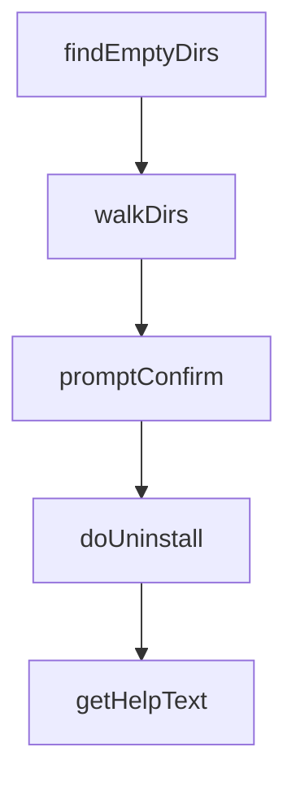

# Chapter 7: Testing, Verification, and Troubleshooting

Welcome to **Chapter 7: Testing, Verification, and Troubleshooting**. In this part of **Everything Claude Code Tutorial: Production Configuration Patterns for Claude Code**, you will build an intuitive mental model first, then move into concrete implementation details and practical production tradeoffs.


This chapter provides quality and incident-response routines.

## Learning Goals

- run test and verification loops consistently
- diagnose hook, rules, and command failures quickly
- maintain stable runtime behavior during rapid changes
- prevent repeated regressions in workflow assets

## Reliability Routine

- run tests and verification after major updates
- check hook firing sequence on representative tasks
- inspect command output drift after component changes
- capture recurring failures as explicit playbook notes

## Source References

- [README Running Tests](https://github.com/affaan-m/everything-claude-code/blob/main/README.md#-running-tests)
- [README Important Notes](https://github.com/affaan-m/everything-claude-code/blob/main/README.md#-important-notes)
- [Troubleshooting Issues](https://github.com/affaan-m/everything-claude-code/issues)

## Summary

You now have a reliability playbook for daily operations.

Next: [Chapter 8: Contribution Workflow and Governance](08-contribution-workflow-and-governance.md)

## Source Code Walkthrough

### `.codebuddy/uninstall.js`

The `findEmptyDirs` function in [`.codebuddy/uninstall.js`](https://github.com/affaan-m/everything-claude-code/blob/HEAD/.codebuddy/uninstall.js) handles a key part of this chapter's functionality:

```js
 * Recursively find empty directories
 */
function findEmptyDirs(dirPath) {
  const emptyDirs = [];

  function walkDirs(currentPath) {
    try {
      const entries = fs.readdirSync(currentPath, { withFileTypes: true });
      const subdirs = entries.filter(e => e.isDirectory());

      for (const subdir of subdirs) {
        const subdirPath = path.join(currentPath, subdir.name);
        walkDirs(subdirPath);
      }

      // Check if directory is now empty
      try {
        const remaining = fs.readdirSync(currentPath);
        if (remaining.length === 0 && currentPath !== dirPath) {
          emptyDirs.push(currentPath);
        }
      } catch {
        // Directory might have been deleted
      }
    } catch {
      // Ignore errors
    }
  }

  walkDirs(dirPath);
  return emptyDirs.sort().reverse(); // Sort in reverse for removal
}
```

This function is important because it defines how Everything Claude Code Tutorial: Production Configuration Patterns for Claude Code implements the patterns covered in this chapter.

### `.codebuddy/uninstall.js`

The `walkDirs` function in [`.codebuddy/uninstall.js`](https://github.com/affaan-m/everything-claude-code/blob/HEAD/.codebuddy/uninstall.js) handles a key part of this chapter's functionality:

```js
  const emptyDirs = [];

  function walkDirs(currentPath) {
    try {
      const entries = fs.readdirSync(currentPath, { withFileTypes: true });
      const subdirs = entries.filter(e => e.isDirectory());

      for (const subdir of subdirs) {
        const subdirPath = path.join(currentPath, subdir.name);
        walkDirs(subdirPath);
      }

      // Check if directory is now empty
      try {
        const remaining = fs.readdirSync(currentPath);
        if (remaining.length === 0 && currentPath !== dirPath) {
          emptyDirs.push(currentPath);
        }
      } catch {
        // Directory might have been deleted
      }
    } catch {
      // Ignore errors
    }
  }

  walkDirs(dirPath);
  return emptyDirs.sort().reverse(); // Sort in reverse for removal
}

/**
 * Prompt user for confirmation
```

This function is important because it defines how Everything Claude Code Tutorial: Production Configuration Patterns for Claude Code implements the patterns covered in this chapter.

### `.codebuddy/uninstall.js`

The `promptConfirm` function in [`.codebuddy/uninstall.js`](https://github.com/affaan-m/everything-claude-code/blob/HEAD/.codebuddy/uninstall.js) handles a key part of this chapter's functionality:

```js
 * Prompt user for confirmation
 */
async function promptConfirm(question) {
  return new Promise((resolve) => {
    const rl = readline.createInterface({
      input: process.stdin,
      output: process.stdout,
    });

    rl.question(question, (answer) => {
      rl.close();
      resolve(/^[yY]$/.test(answer));
    });
  });
}

/**
 * Main uninstall function
 */
async function doUninstall() {
  const codebuddyDirName = '.codebuddy';

  // Parse arguments
  let targetDir = process.cwd();
  if (process.argv.length > 2) {
    const arg = process.argv[2];
    if (arg === '~' || arg === getHomeDir()) {
      targetDir = getHomeDir();
    } else {
      targetDir = path.resolve(arg);
    }
  }
```

This function is important because it defines how Everything Claude Code Tutorial: Production Configuration Patterns for Claude Code implements the patterns covered in this chapter.

### `.codebuddy/uninstall.js`

The `doUninstall` function in [`.codebuddy/uninstall.js`](https://github.com/affaan-m/everything-claude-code/blob/HEAD/.codebuddy/uninstall.js) handles a key part of this chapter's functionality:

```js
 * Main uninstall function
 */
async function doUninstall() {
  const codebuddyDirName = '.codebuddy';

  // Parse arguments
  let targetDir = process.cwd();
  if (process.argv.length > 2) {
    const arg = process.argv[2];
    if (arg === '~' || arg === getHomeDir()) {
      targetDir = getHomeDir();
    } else {
      targetDir = path.resolve(arg);
    }
  }

  // Determine codebuddy full path
  let codebuddyFullPath;
  const baseName = path.basename(targetDir);

  if (baseName === codebuddyDirName) {
    codebuddyFullPath = targetDir;
  } else {
    codebuddyFullPath = path.join(targetDir, codebuddyDirName);
  }

  console.log('ECC CodeBuddy Uninstaller');
  console.log('==========================');
  console.log('');
  console.log(`Target:  ${codebuddyFullPath}/`);
  console.log('');

```

This function is important because it defines how Everything Claude Code Tutorial: Production Configuration Patterns for Claude Code implements the patterns covered in this chapter.


## How These Components Connect


