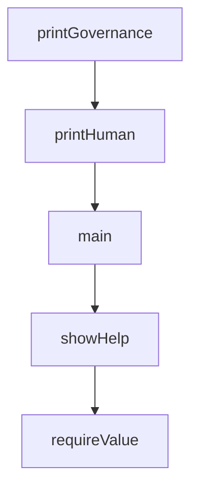

# Chapter 8: Contribution Workflow and Governance

Welcome to **Chapter 8: Contribution Workflow and Governance**. In this part of **Everything Claude Code Tutorial: Production Configuration Patterns for Claude Code**, you will build an intuitive mental model first, then move into concrete implementation details and practical production tradeoffs.


This chapter explains how to contribute new components while preserving quality and consistency.

## Learning Goals

- contribute agents, skills, hooks, and commands with proper structure
- follow PR quality expectations and testing checklists
- maintain compatibility across ecosystem targets
- enforce governance for long-term maintainability

## Contribution Flow

1. pick a focused contribution type
2. follow folder/template conventions
3. test locally and in Claude Code runtime
4. submit PR with clear summary and verification

## Governance Priorities

- consistent naming and structure
- high-signal documentation for every new component
- backward compatibility where possible
- explicit deprecation notes when behavior changes

## Source References

- [Contributing Guide](https://github.com/affaan-m/everything-claude-code/blob/main/CONTRIBUTING.md)
- [README Contribution Section](https://github.com/affaan-m/everything-claude-code/blob/main/README.md#-contributing)
- [Releases](https://github.com/affaan-m/everything-claude-code/releases)

## Summary

You now have an end-to-end model for adopting and contributing to Everything Claude Code.

Next steps:

- establish a team baseline command/skill stack
- codify verification gates for all workflow changes
- contribute one focused component with tests and docs

## Depth Expansion Playbook

## Source Code Walkthrough

### `scripts/status.js`

The `printGovernance` function in [`scripts/status.js`](https://github.com/affaan-m/everything-claude-code/blob/HEAD/scripts/status.js) handles a key part of this chapter's functionality:

```js
}

function printGovernance(section) {
  console.log(`Pending governance events: ${section.pendingCount}`);
  if (section.events.length === 0) {
    console.log('  - none');
    return;
  }

  for (const event of section.events) {
    console.log(`  - ${event.id} ${event.eventType}`);
    console.log(`    Session: ${event.sessionId || '(none)'}`);
    console.log(`    Created: ${event.createdAt}`);
  }
}

function printHuman(payload) {
  console.log('ECC status\n');
  console.log(`Database: ${payload.dbPath}\n`);
  printActiveSessions(payload.activeSessions);
  console.log();
  printSkillRuns(payload.skillRuns);
  console.log();
  printInstallHealth(payload.installHealth);
  console.log();
  printGovernance(payload.governance);
}

async function main() {
  let store = null;

  try {
```

This function is important because it defines how Everything Claude Code Tutorial: Production Configuration Patterns for Claude Code implements the patterns covered in this chapter.

### `scripts/status.js`

The `printHuman` function in [`scripts/status.js`](https://github.com/affaan-m/everything-claude-code/blob/HEAD/scripts/status.js) handles a key part of this chapter's functionality:

```js
}

function printHuman(payload) {
  console.log('ECC status\n');
  console.log(`Database: ${payload.dbPath}\n`);
  printActiveSessions(payload.activeSessions);
  console.log();
  printSkillRuns(payload.skillRuns);
  console.log();
  printInstallHealth(payload.installHealth);
  console.log();
  printGovernance(payload.governance);
}

async function main() {
  let store = null;

  try {
    const options = parseArgs(process.argv);
    if (options.help) {
      showHelp(0);
    }

    store = await createStateStore({
      dbPath: options.dbPath,
      homeDir: process.env.HOME,
    });

    const payload = {
      dbPath: store.dbPath,
      ...store.getStatus({
        activeLimit: options.limit,
```

This function is important because it defines how Everything Claude Code Tutorial: Production Configuration Patterns for Claude Code implements the patterns covered in this chapter.

### `scripts/status.js`

The `main` function in [`scripts/status.js`](https://github.com/affaan-m/everything-claude-code/blob/HEAD/scripts/status.js) handles a key part of this chapter's functionality:

```js
}

async function main() {
  let store = null;

  try {
    const options = parseArgs(process.argv);
    if (options.help) {
      showHelp(0);
    }

    store = await createStateStore({
      dbPath: options.dbPath,
      homeDir: process.env.HOME,
    });

    const payload = {
      dbPath: store.dbPath,
      ...store.getStatus({
        activeLimit: options.limit,
        recentSkillRunLimit: 20,
        pendingLimit: options.limit,
      }),
    };

    if (options.json) {
      console.log(JSON.stringify(payload, null, 2));
    } else {
      printHuman(payload);
    }
  } catch (error) {
    console.error(`Error: ${error.message}`);
```

This function is important because it defines how Everything Claude Code Tutorial: Production Configuration Patterns for Claude Code implements the patterns covered in this chapter.

### `scripts/skills-health.js`

The `showHelp` function in [`scripts/skills-health.js`](https://github.com/affaan-m/everything-claude-code/blob/HEAD/scripts/skills-health.js) handles a key part of this chapter's functionality:

```js
const { renderDashboard } = require('./lib/skill-evolution/dashboard');

function showHelp() {
  console.log(`
Usage: node scripts/skills-health.js [options]

Options:
  --json                  Emit machine-readable JSON
  --skills-root <path>    Override curated skills root
  --learned-root <path>   Override learned skills root
  --imported-root <path>  Override imported skills root
  --home <path>           Override home directory for learned/imported skill roots
  --runs-file <path>      Override skill run JSONL path
  --now <timestamp>       Override current time for deterministic reports
  --dashboard             Show rich health dashboard with charts
  --panel <name>          Show only a specific panel (success-rate, failures, amendments, versions)
  --warn-threshold <n>    Decline sensitivity threshold (default: 0.1)
  --help                  Show this help text
`);
}

function requireValue(argv, index, argName) {
  const value = argv[index + 1];
  if (!value || value.startsWith('--')) {
    throw new Error(`Missing value for ${argName}`);
  }

  return value;
}

function parseArgs(argv) {
  const options = {};
```

This function is important because it defines how Everything Claude Code Tutorial: Production Configuration Patterns for Claude Code implements the patterns covered in this chapter.


## How These Components Connect


