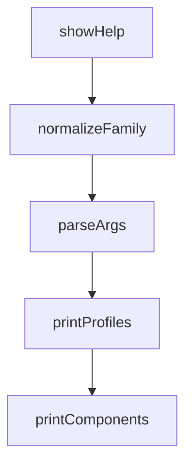

# Chapter 8: Contribution Workflow and Governance

Welcome to **Chapter 8: Contribution Workflow and Governance**. In this part of **Everything Claude Code Tutorial: Production Configuration Patterns for Claude Code**, you will build an intuitive mental model first, then move into concrete implementation details and practical production tradeoffs.


This chapter explains how to contribute new components while preserving quality and consistency.

## Learning Goals

- contribute agents, skills, hooks, and commands with proper structure
- follow PR quality expectations and testing checklists
- maintain compatibility across ecosystem targets
- enforce governance for long-term maintainability

## Contribution Flow

1. pick a focused contribution type
2. follow folder/template conventions
3. test locally and in Claude Code runtime
4. submit PR with clear summary and verification

## Governance Priorities

- consistent naming and structure
- high-signal documentation for every new component
- backward compatibility where possible
- explicit deprecation notes when behavior changes

## Source References

- [Contributing Guide](https://github.com/affaan-m/everything-claude-code/blob/main/CONTRIBUTING.md)
- [README Contribution Section](https://github.com/affaan-m/everything-claude-code/blob/main/README.md#-contributing)
- [Releases](https://github.com/affaan-m/everything-claude-code/releases)

## Summary

You now have an end-to-end model for adopting and contributing to Everything Claude Code.

Next steps:

- establish a team baseline command/skill stack
- codify verification gates for all workflow changes
- contribute one focused component with tests and docs

## Source Code Walkthrough

### `scripts/catalog.js`

The `showHelp` function in [`scripts/catalog.js`](https://github.com/affaan-m/everything-claude-code/blob/HEAD/scripts/catalog.js) handles a key part of this chapter's functionality:

```js
});

function showHelp(exitCode = 0) {
  console.log(`
Discover ECC install components and profiles

Usage:
  node scripts/catalog.js profiles [--json]
  node scripts/catalog.js components [--family <family>] [--target <target>] [--json]
  node scripts/catalog.js show <component-id> [--json]

Examples:
  node scripts/catalog.js profiles
  node scripts/catalog.js components --family language
  node scripts/catalog.js show framework:nextjs
`);

  process.exit(exitCode);
}

function normalizeFamily(value) {
  if (!value) {
    return null;
  }

  const normalized = String(value).trim().toLowerCase();
  return FAMILY_ALIASES[normalized] || normalized;
}

function parseArgs(argv) {
  const args = argv.slice(2);
  const parsed = {
```

This function is important because it defines how Everything Claude Code Tutorial: Production Configuration Patterns for Claude Code implements the patterns covered in this chapter.

### `scripts/catalog.js`

The `normalizeFamily` function in [`scripts/catalog.js`](https://github.com/affaan-m/everything-claude-code/blob/HEAD/scripts/catalog.js) handles a key part of this chapter's functionality:

```js
}

function normalizeFamily(value) {
  if (!value) {
    return null;
  }

  const normalized = String(value).trim().toLowerCase();
  return FAMILY_ALIASES[normalized] || normalized;
}

function parseArgs(argv) {
  const args = argv.slice(2);
  const parsed = {
    command: null,
    componentId: null,
    family: null,
    target: null,
    json: false,
    help: false,
  };

  if (args.length === 0 || args[0] === '--help' || args[0] === '-h') {
    parsed.help = true;
    return parsed;
  }

  parsed.command = args[0];

  for (let index = 1; index < args.length; index += 1) {
    const arg = args[index];

```

This function is important because it defines how Everything Claude Code Tutorial: Production Configuration Patterns for Claude Code implements the patterns covered in this chapter.

### `scripts/catalog.js`

The `parseArgs` function in [`scripts/catalog.js`](https://github.com/affaan-m/everything-claude-code/blob/HEAD/scripts/catalog.js) handles a key part of this chapter's functionality:

```js
}

function parseArgs(argv) {
  const args = argv.slice(2);
  const parsed = {
    command: null,
    componentId: null,
    family: null,
    target: null,
    json: false,
    help: false,
  };

  if (args.length === 0 || args[0] === '--help' || args[0] === '-h') {
    parsed.help = true;
    return parsed;
  }

  parsed.command = args[0];

  for (let index = 1; index < args.length; index += 1) {
    const arg = args[index];

    if (arg === '--help' || arg === '-h') {
      parsed.help = true;
    } else if (arg === '--json') {
      parsed.json = true;
    } else if (arg === '--family') {
      if (!args[index + 1]) {
        throw new Error('Missing value for --family');
      }
      parsed.family = normalizeFamily(args[index + 1]);
```

This function is important because it defines how Everything Claude Code Tutorial: Production Configuration Patterns for Claude Code implements the patterns covered in this chapter.

### `scripts/catalog.js`

The `printProfiles` function in [`scripts/catalog.js`](https://github.com/affaan-m/everything-claude-code/blob/HEAD/scripts/catalog.js) handles a key part of this chapter's functionality:

```js
}

function printProfiles(profiles) {
  console.log('Install profiles:\n');
  for (const profile of profiles) {
    console.log(`- ${profile.id} (${profile.moduleCount} modules)`);
    console.log(`  ${profile.description}`);
  }
}

function printComponents(components) {
  console.log('Install components:\n');
  for (const component of components) {
    console.log(`- ${component.id} [${component.family}]`);
    console.log(`  targets=${component.targets.join(', ')} modules=${component.moduleIds.join(', ')}`);
    console.log(`  ${component.description}`);
  }
}

function printComponent(component) {
  console.log(`Install component: ${component.id}\n`);
  console.log(`Family: ${component.family}`);
  console.log(`Targets: ${component.targets.join(', ')}`);
  console.log(`Modules: ${component.moduleIds.join(', ')}`);
  console.log(`Description: ${component.description}`);

  if (component.modules.length > 0) {
    console.log('\nResolved modules:');
    for (const module of component.modules) {
      console.log(`- ${module.id} [${module.kind}]`);
      console.log(
        `  targets=${module.targets.join(', ')} default=${module.defaultInstall} cost=${module.cost} stability=${module.stability}`
```

This function is important because it defines how Everything Claude Code Tutorial: Production Configuration Patterns for Claude Code implements the patterns covered in this chapter.


## How These Components Connect


