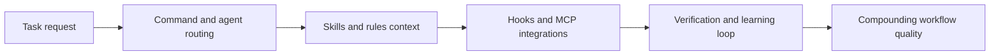

# Everything Claude Code Tutorial: Production Configuration Patterns for Claude Code

> Learn how to use `affaan-m/everything-claude-code` to adopt battle-tested Claude Code agents, skills, hooks, commands, rules, and MCP workflows in a structured, production-oriented way.

## Why This Track Matters

`everything-claude-code` is one of the largest open-source Claude Code configuration collections and a practical reference for running AI-assisted engineering loops with stronger discipline.

This track focuses on:

- reliable plugin install and rules setup
- understanding the full component stack (agents, skills, hooks, commands, MCP)
- adopting verification, learning, and orchestration patterns
- operating the stack safely across multiple toolchains

## Current Snapshot (auto-updated)

- repository: [`affaan-m/everything-claude-code`](https://github.com/affaan-m/everything-claude-code)
- stars: about **44.7k**
- latest release: [`v1.5.0`](https://github.com/affaan-m/everything-claude-code/releases/tag/v1.5.0)
- recent activity: updates on **February 12, 2026**
- project positioning: comprehensive Claude Code configuration collection with cross-platform support

## Mental Model

## Chapter Guide

| Chapter | Key Question | Outcome |
|:--------|:-------------|:--------|
| [01 - Getting Started](01-getting-started.md) | How do I install and use the package quickly? | Working baseline |
| [02 - Architecture and Component Topology](02-architecture-and-component-topology.md) | How are agents, skills, hooks, and rules organized? | Strong architecture model |
| [03 - Installation Modes and Rules Strategy](03-installation-modes-and-rules-strategy.md) | How do plugin and manual installs differ in practice? | Stable install strategy |
| [04 - Agents, Skills, and Command Orchestration](04-agents-skills-and-command-orchestration.md) | How do I orchestrate capabilities efficiently? | Better operator throughput |
| [05 - Hooks, MCP, and Continuous Learning Loops](05-hooks-mcp-and-continuous-learning-loops.md) | How do I automate feedback and memory loops safely? | Strong automation baseline |
| [06 - Cross-Platform Workflows (Cursor and OpenCode)](06-cross-platform-workflows-cursor-and-opencode.md) | How do I port workflows across tooling ecosystems? | Better portability |
| [07 - Testing, Verification, and Troubleshooting](07-testing-verification-and-troubleshooting.md) | How do I keep quality high and recover quickly? | Reliability playbook |
| [08 - Contribution Workflow and Governance](08-contribution-workflow-and-governance.md) | How do I contribute high-quality components? | Contributor readiness |

## What You Will Learn

- how to adopt a full-stack Claude Code workflow system safely
- how to balance flexibility with governance and repeatability
- how to run verification and continuous learning loops in daily work
- how to contribute compatible components back to the ecosystem

## Source References

- [Everything Claude Code Repository](https://github.com/affaan-m/everything-claude-code)
- [README](https://github.com/affaan-m/everything-claude-code/blob/main/README.md)
- [Contributing Guide](https://github.com/affaan-m/everything-claude-code/blob/main/CONTRIBUTING.md)
- [Rules Guide](https://github.com/affaan-m/everything-claude-code/blob/main/rules/README.md)
- [OpenCode Support](https://github.com/affaan-m/everything-claude-code/blob/main/.opencode/README.md)

## Related Tutorials

- [Claude Code Tutorial](../claude-code-tutorial/)
- [Wshobson Agents Tutorial](../wshobson-agents-tutorial/)
- [OpenCode Tutorial](../opencode-tutorial/)
- [Codex CLI Tutorial](../codex-cli-tutorial/)

---

Start with [Chapter 1: Getting Started](01-getting-started.md).

## Navigation & Backlinks

- [Start Here: Chapter 1: Getting Started](01-getting-started.md)
- [Back to Main Catalog](../../README.md#-tutorial-catalog)
- [Browse A-Z Tutorial Directory](../../discoverability/tutorial-directory.md)
- [Search by Intent](../../discoverability/query-hub.md)
- [Explore Category Hubs](../../README.md#category-hubs)

## Full Chapter Map

1. [Chapter 1: Getting Started](01-getting-started.md)
2. [Chapter 2: Architecture and Component Topology](02-architecture-and-component-topology.md)
3. [Chapter 3: Installation Modes and Rules Strategy](03-installation-modes-and-rules-strategy.md)
4. [Chapter 4: Agents, Skills, and Command Orchestration](04-agents-skills-and-command-orchestration.md)
5. [Chapter 5: Hooks, MCP, and Continuous Learning Loops](05-hooks-mcp-and-continuous-learning-loops.md)
6. [Chapter 6: Cross-Platform Workflows (Cursor and OpenCode)](06-cross-platform-workflows-cursor-and-opencode.md)
7. [Chapter 7: Testing, Verification, and Troubleshooting](07-testing-verification-and-troubleshooting.md)
8. [Chapter 8: Contribution Workflow and Governance](08-contribution-workflow-and-governance.md)

*Generated by [AI Codebase Knowledge Builder](https://github.com/The-Pocket/Tutorial-Codebase-Knowledge)*
