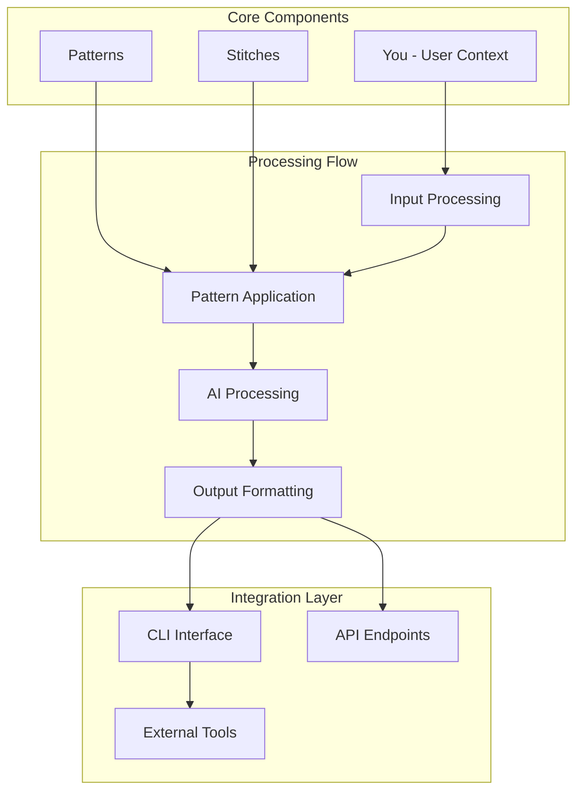

# Chapter 1: Getting Started with Fabric

Welcome to Fabric! This chapter will guide you through installing and setting up Fabric, understanding its core concepts, and running your first AI-augmented task.

## 🎯 What You'll Learn

- Fabric installation and setup
- Core concepts (Patterns, Stitches, You)
- Basic command-line usage
- First pattern execution
- Configuration and API setup

## 🏗️ Fabric Architecture

Fabric consists of three main components working together:



### Core Concepts

1. **Patterns**: Reusable prompt engineering templates
2. **Stitches**: Combinations of patterns for complex workflows
3. **You**: User context and preferences
4. **Wisdom**: Extracted knowledge and insights

## 🚀 Installation Methods

### Method 1: pip Installation (Recommended)

```bash
# Install Fabric via pip
pip install fabric-ai

# Verify installation
fabric --version

# Update to latest version
pip install --upgrade fabric-ai
```

**What's installed:**
- Fabric CLI tool
- Core pattern library
- Python dependencies
- Configuration system

### Method 2: Source Installation

```bash
# Clone the repository
git clone https://github.com/danielmiessler/Fabric.git
cd Fabric

# Install dependencies
pip install -r requirements.txt

# Optional: Install in development mode
pip install -e .

# Verify installation
python -m fabric --version
```

**Development benefits:**
- Latest features and bug fixes
- Ability to contribute patterns
- Access to development tools

### Method 3: Docker Installation

```bash
# Pull Docker image
docker pull ghcr.io/danielmiessler/fabric:latest

# Run Fabric in container
docker run -it --rm \
  -v $(pwd)/patterns:/app/patterns \
  -e OPENAI_API_KEY=$OPENAI_API_KEY \
  ghcr.io/danielmiessler/fabric:latest

# Or use Docker Compose
curl https://raw.githubusercontent.com/danielmiessler/Fabric/main/docker-compose.yml -o docker-compose.yml
docker-compose up -d
```

**Container benefits:**
- Isolated environment
- Easy dependency management
- Cross-platform compatibility

## ⚙️ Configuration

### API Key Setup

```bash
# Set OpenAI API key
export OPENAI_API_KEY="your_openai_api_key_here"

# Or set Anthropic Claude key
export ANTHROPIC_API_KEY="your_anthropic_key_here"

# For local models (Ollama)
export OLLAMA_BASE_URL="http://localhost:11434"

# Save to shell profile
echo 'export OPENAI_API_KEY="your_key_here"' >> ~/.bashrc
source ~/.bashrc
```

### Configuration File

```yaml
# ~/.config/fabric/config.yaml
api:
  provider: openai
  model: gpt-4
  temperature: 0.7
  max_tokens: 2048

output:
  format: markdown
  directory: ~/fabric_output
  overwrite: false

patterns:
  directory: ~/.config/fabric/patterns
  auto_update: true

logging:
  level: info
  file: ~/.config/fabric/fabric.log
```

### Environment Validation

```bash
# Check API connectivity
fabric --test-connection

# List available models
fabric --list-models

# Check pattern library
fabric --list-patterns
```

## 🏃‍♂️ Your First Fabric Command

### Basic Pattern Usage

```bash
# Use the summarize pattern
echo "Your text here..." | fabric -p summarize

# Process a file
fabric -p extract_wisdom -o article.txt

# Use with a URL
fabric -p summarize_url -u "https://example.com/article"

# Interactive mode
fabric -p analyze_text
# (Then paste your text and press Ctrl+D)
```

### Example Workflow

```bash
# Step 1: Extract wisdom from a document
fabric -p extract_wisdom -o research_paper.pdf > wisdom.md

# Step 2: Summarize the extracted wisdom
cat wisdom.md | fabric -p summarize > summary.md

# Step 3: Create action items
cat summary.md | fabric -p create_next_actions > actions.md

# View the results
cat actions.md
```

## 📊 Understanding Patterns

### Core Pattern Categories

```
Pattern Categories
├── Analysis Patterns
│   ├── extract_wisdom - Extract key insights
│   ├── summarize - Create concise summaries
│   ├── analyze_text - Deep text analysis
│   └── critique - Provide constructive feedback
├── Creation Patterns
│   ├── write_essay - Essay writing assistance
│   ├── create_micro - Create social media content
│   ├── write_prd - Product requirements document
│   └── create_video - Video script creation
├── Communication Patterns
│   ├── email - Professional email writing
│   ├── meeting_notes - Meeting summary and action items
│   └── explain_terms - Explain technical concepts
└── Utility Patterns
    ├── code_review - Code review and suggestions
    ├── debug - Debugging assistance
    ├── research - Research planning and execution
    └── teach - Educational content creation
```

### Pattern Structure

```yaml
# Example pattern file structure
patterns/
├── extract_wisdom/
│   ├── system.md      # System instructions
│   ├── user.md        # User prompt template
│   └── config.yaml    # Pattern configuration
└── summarize/
    ├── system.md
    ├── user.md
    └── config.yaml
```

## 🔧 Command-Line Interface

### Basic Commands

```bash
# Get help
fabric --help

# List available patterns
fabric --list-patterns

# Use a specific pattern
fabric -p pattern_name [options]

# Process input from stdin
echo "text" | fabric -p pattern_name

# Process a file
fabric -p pattern_name -o input.txt

# Process a URL
fabric -p pattern_name -u "https://example.com"

# Output to file
fabric -p pattern_name -o input.txt > output.md

# Use custom model
fabric -p pattern_name --model gpt-3.5-turbo

# Set temperature
fabric -p pattern_name --temperature 0.5
```

### Advanced Options

```bash
# Batch processing multiple files
fabric -p extract_wisdom -o file1.txt file2.txt file3.txt

# Use custom pattern directory
fabric -p my_pattern --patterns-dir /path/to/patterns

# Enable streaming output
fabric -p summarize --stream

# Set custom output format
fabric -p analyze --format json

# Use specific API provider
fabric -p summarize --provider anthropic

# Set context window
fabric -p research --max-context 8192
```

## 🎯 Working with "You"

### Understanding User Context

```bash
# Set your context for better personalization
export FABRIC_USER_CONTEXT="I am a software developer with 5 years of experience, specializing in Python and AI/ML. I prefer practical, actionable advice over theoretical explanations."

# Use context-aware patterns
fabric -p career_advice -o my_resume.md

# Update context dynamically
fabric --set-context "I am currently learning about AI safety and ethics. Please consider this in your responses."
```

### Context File

```yaml
# ~/.config/fabric/you.yaml
name: "Your Name"
role: "Software Developer"
experience: "5 years"
specialties:
  - Python
  - Machine Learning
  - AI Ethics
preferences:
  communication_style: "direct and practical"
  detail_level: "comprehensive but concise"
  examples: "always include code examples"
goals:
  - "Improve AI development skills"
  - "Contribute to open source projects"
  - "Learn about AI safety"
```

## 📊 Output Management

### Output Formats

```bash
# Markdown output (default)
fabric -p summarize -o article.txt > summary.md

# JSON output
fabric -p analyze_text --format json > analysis.json

# Plain text output
fabric -p extract_wisdom --format text > wisdom.txt

# Custom template output
fabric -p create_report --template business_report > report.md
```

### Output Directory

```bash
# Set default output directory
export FABRIC_OUTPUT_DIR="~/fabric_output"

# Organize by date
fabric -p summarize --output-dir ./output/2024-01-15/

# Create subdirectories by pattern
fabric -p extract_wisdom --output-dir ./wisdom/$(date +%Y-%m-%d)/
```

## 🔧 Troubleshooting

### Common Issues

#### API Key Problems
```bash
# Check API key is set
echo $OPENAI_API_KEY

# Test API connection
curl -H "Authorization: Bearer $OPENAI_API_KEY" \
     https://api.openai.com/v1/models

# Use different API provider
export ANTHROPIC_API_KEY="your_anthropic_key"
fabric -p summarize --provider anthropic
```

#### Pattern Not Found
```bash
# List available patterns
fabric --list-patterns

# Check pattern directory
ls ~/.config/fabric/patterns/

# Update patterns
fabric --update-patterns

# Use full path to custom pattern
fabric -p /path/to/my/pattern
```

#### Memory Issues
```bash
# Reduce context window
fabric -p summarize --max-context 2048

# Process in chunks
split -l 1000 large_file.txt chunk_
for chunk in chunk_*; do
    fabric -p summarize -o $chunk >> summary.md
done

# Use streaming
fabric -p analyze_text --stream
```

### Performance Optimization

```bash
# Use faster model
fabric -p summarize --model gpt-3.5-turbo

# Reduce temperature for consistency
fabric -p extract_wisdom --temperature 0.1

# Cache results
fabric -p summarize --cache --cache-dir ~/.fabric_cache/

# Parallel processing
fabric -p extract_wisdom -o file1.txt &
fabric -p extract_wisdom -o file2.txt &
wait
```

## 📊 Monitoring and Logging

### Basic Monitoring

```bash
# Enable verbose logging
fabric -p summarize --verbose

# Check logs
tail -f ~/.config/fabric/fabric.log

# Performance metrics
time fabric -p analyze_text -o large_document.txt
```

### Usage Statistics

```bash
# View usage statistics
fabric --stats

# Export usage data
fabric --export-stats > usage.json

# Reset statistics
fabric --reset-stats
```

## 🎯 Key Concepts Summary

### Patterns
- **Purpose**: Reusable templates for AI interactions
- **Components**: System prompt + user template
- **Usage**: `fabric -p pattern_name`
- **Customization**: Edit pattern files directly

### Input Methods
- **Stdin**: `echo "text" | fabric -p pattern`
- **Files**: `fabric -p pattern -o file.txt`
- **URLs**: `fabric -p pattern -u "https://example.com"`
- **Interactive**: `fabric -p pattern` then paste text

### Output Control
- **Format**: Markdown, JSON, text
- **Destination**: Stdout, files, directories
- **Streaming**: Real-time output for long responses

## 🏆 Achievement Unlocked!

Congratulations! 🎉 You've successfully:

- ✅ Installed Fabric using your preferred method
- ✅ Configured API keys for AI providers
- ✅ Executed your first pattern on text input
- ✅ Explored different input and output methods
- ✅ Set up basic configuration and logging

## 🚀 What's Next?

Ready to explore patterns? Let's dive into [Chapter 2: Pattern System](02-pattern-system.md) to learn about Fabric's powerful pattern library and how to use them effectively.

---

**Practice what you've learned:**
1. Experiment with different installation methods
2. Configure multiple AI providers
3. Try various input methods (stdin, files, URLs)
4. Explore different output formats
5. Set up logging and monitoring

*What type of task are you most excited to augment with Fabric?* 🤖

## What Problem Does This Solve?

Most teams struggle here because the hard part is not writing more code, but deciding clear boundaries for `fabric`, `patterns`, `summarize` so behavior stays predictable as complexity grows.

In practical terms, this chapter helps you avoid three common failures:

- coupling core logic too tightly to one implementation path
- missing the handoff boundaries between setup, execution, and validation
- shipping changes without clear rollback or observability strategy

After working through this chapter, you should be able to reason about `Chapter 1: Getting Started with Fabric` as an operating subsystem inside **Fabric Tutorial: Open-Source Framework for Augmenting Humans with AI**, with explicit contracts for inputs, state transitions, and outputs.

Use the implementation notes around `output`, `extract_wisdom`, `config` as your checklist when adapting these patterns to your own repository.

## How it Works Under the Hood

Under the hood, `Chapter 1: Getting Started with Fabric` usually follows a repeatable control path:

1. **Context bootstrap**: initialize runtime config and prerequisites for `fabric`.
2. **Input normalization**: shape incoming data so `patterns` receives stable contracts.
3. **Core execution**: run the main logic branch and propagate intermediate state through `summarize`.
4. **Policy and safety checks**: enforce limits, auth scopes, and failure boundaries.
5. **Output composition**: return canonical result payloads for downstream consumers.
6. **Operational telemetry**: emit logs/metrics needed for debugging and performance tuning.

When debugging, walk this sequence in order and confirm each stage has explicit success/failure conditions.

## Source Walkthrough

Use the following upstream sources to verify implementation details while reading this chapter:

- [GitHub Repository](https://github.com/danielmiessler/Fabric)
  Why it matters: authoritative reference on `GitHub Repository` (github.com).
- [Pattern Library](https://github.com/danielmiessler/fabric/tree/main/data/patterns)
  Why it matters: authoritative reference on `Pattern Library` (github.com).
- [Community Patterns](https://github.com/danielmiessler/Fabric#community-patterns)
  Why it matters: authoritative reference on `Community Patterns` (github.com).
- [AI Codebase Knowledge Builder](https://github.com/johnxie/awesome-code-docs)
  Why it matters: authoritative reference on `AI Codebase Knowledge Builder` (github.com).

Suggested trace strategy:
- search upstream code for `fabric` and `patterns` to map concrete implementation paths
- compare docs claims against actual runtime/config code before reusing patterns in production

## Chapter Connections

- [Tutorial Index](index.md)
- [Next Chapter: Chapter 2: Pattern System](02-pattern-system.md)
- [Main Catalog](../../README.md#-tutorial-catalog)
- [A-Z Tutorial Directory](../../discoverability/tutorial-directory.md)
