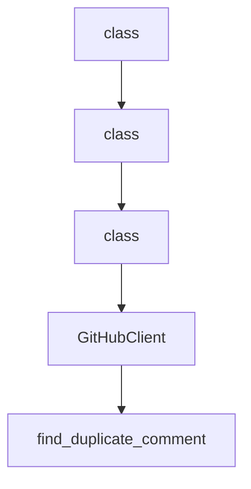

# Chapter 2: Core Abstractions: Components, Providers, Transforms

Welcome to **Chapter 2: Core Abstractions: Components, Providers, Transforms**. In this part of **FastMCP Tutorial: Building and Operating MCP Servers with Pythonic Control**, you will build an intuitive mental model first, then move into concrete implementation details and practical production tradeoffs.


This chapter explains FastMCP's core abstraction model and how to use it to keep systems composable.

## Learning Goals

- map business capabilities to MCP components clearly
- choose provider sources that support maintainability
- apply transforms to shape client-visible surfaces safely
- avoid coupling protocol mechanics to business logic

## Abstraction Model

FastMCP's core model can be used as a design checkpoint:

- components define what you expose (tools, resources, prompts)
- providers define where capabilities come from (functions, files, remote sources)
- transforms define how capabilities are presented and constrained

## Practical Design Rule

Treat each component set as a product surface with explicit ownership, versioning expectations, and test coverage. This prevents accidental growth into ungovernable tool catalogs.

## Source References

- [README: Why FastMCP](https://github.com/jlowin/fastmcp/blob/main/README.md)
- [FastMCP Development Guidelines](https://github.com/jlowin/fastmcp/blob/main/AGENTS.md)

## Summary

You now have a design vocabulary for building maintainable FastMCP surfaces.

Next: [Chapter 3: Server Runtime and Transports](03-server-runtime-and-transports.md)

## Depth Expansion Playbook

## Source Code Walkthrough

### `scripts/auto_close_duplicates.py`

The `class` class in [`scripts/auto_close_duplicates.py`](https://github.com/jlowin/fastmcp/blob/HEAD/scripts/auto_close_duplicates.py) handles a key part of this chapter's functionality:

```py

import os
from dataclasses import dataclass
from datetime import datetime, timedelta, timezone

import httpx


@dataclass
class Issue:
    """Represents a GitHub issue."""

    number: int
    title: str
    state: str
    created_at: str
    user_id: int
    user_login: str


@dataclass
class Comment:
    """Represents a GitHub comment."""

    id: int
    body: str
    created_at: str
    user_id: int
    user_login: str
    user_type: str


```

This class is important because it defines how FastMCP Tutorial: Building and Operating MCP Servers with Pythonic Control implements the patterns covered in this chapter.

### `scripts/auto_close_duplicates.py`

The `class` class in [`scripts/auto_close_duplicates.py`](https://github.com/jlowin/fastmcp/blob/HEAD/scripts/auto_close_duplicates.py) handles a key part of this chapter's functionality:

```py

import os
from dataclasses import dataclass
from datetime import datetime, timedelta, timezone

import httpx


@dataclass
class Issue:
    """Represents a GitHub issue."""

    number: int
    title: str
    state: str
    created_at: str
    user_id: int
    user_login: str


@dataclass
class Comment:
    """Represents a GitHub comment."""

    id: int
    body: str
    created_at: str
    user_id: int
    user_login: str
    user_type: str


```

This class is important because it defines how FastMCP Tutorial: Building and Operating MCP Servers with Pythonic Control implements the patterns covered in this chapter.

### `scripts/auto_close_duplicates.py`

The `class` class in [`scripts/auto_close_duplicates.py`](https://github.com/jlowin/fastmcp/blob/HEAD/scripts/auto_close_duplicates.py) handles a key part of this chapter's functionality:

```py

import os
from dataclasses import dataclass
from datetime import datetime, timedelta, timezone

import httpx


@dataclass
class Issue:
    """Represents a GitHub issue."""

    number: int
    title: str
    state: str
    created_at: str
    user_id: int
    user_login: str


@dataclass
class Comment:
    """Represents a GitHub comment."""

    id: int
    body: str
    created_at: str
    user_id: int
    user_login: str
    user_type: str


```

This class is important because it defines how FastMCP Tutorial: Building and Operating MCP Servers with Pythonic Control implements the patterns covered in this chapter.

### `scripts/auto_close_duplicates.py`

The `GitHubClient` class in [`scripts/auto_close_duplicates.py`](https://github.com/jlowin/fastmcp/blob/HEAD/scripts/auto_close_duplicates.py) handles a key part of this chapter's functionality:

```py


class GitHubClient:
    """Client for interacting with GitHub API."""

    def __init__(self, token: str, owner: str, repo: str):
        self.token = token
        self.owner = owner
        self.repo = repo
        self.headers = {
            "Authorization": f"token {token}",
            "Accept": "application/vnd.github.v3+json",
        }
        self.base_url = f"https://api.github.com/repos/{owner}/{repo}"

    def get_potential_duplicate_issues(self) -> list[Issue]:
        """Fetch open issues with the potential-duplicate label."""
        url = f"{self.base_url}/issues"
        issues = []

        with httpx.Client() as client:
            page = 1
            while page <= 10:  # Safety limit
                response = client.get(
                    url,
                    headers=self.headers,
                    params={
                        "state": "open",
                        "labels": "potential-duplicate",
                        "per_page": 100,
                        "page": page,
                    },
```

This class is important because it defines how FastMCP Tutorial: Building and Operating MCP Servers with Pythonic Control implements the patterns covered in this chapter.


## How These Components Connect


