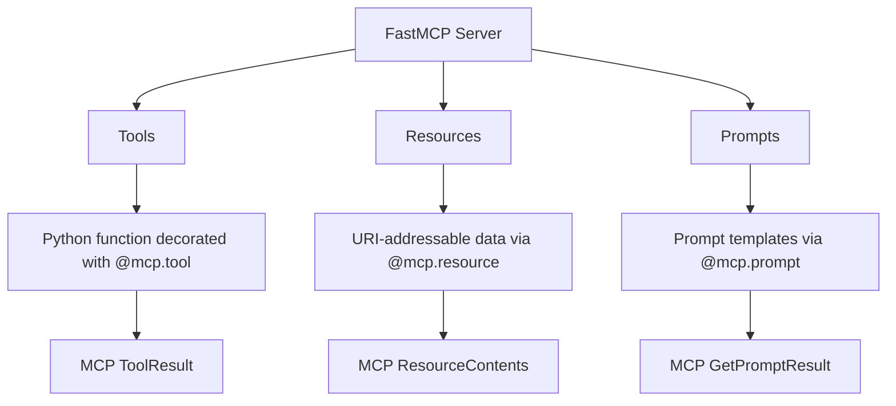

# Chapter 2: Core Abstractions: Components, Providers, Transforms

Welcome to **Chapter 2: Core Abstractions: Components, Providers, Transforms**. In this part of **FastMCP Tutorial: Building and Operating MCP Servers with Pythonic Control**, you will build an intuitive mental model first, then move into concrete implementation details and practical production tradeoffs.

This chapter explains FastMCP's core abstraction model and how to use it to keep systems composable.

## Learning Goals

- map business capabilities to MCP components clearly
- choose provider sources that support maintainability
- apply transforms to shape client-visible surfaces safely
- avoid coupling protocol mechanics to business logic

## Abstraction Model

FastMCP's core model can be used as a design checkpoint:

- components define what you expose (tools, resources, prompts)
- providers define where capabilities come from (functions, files, remote sources)
- transforms define how capabilities are presented and constrained

## Practical Design Rule

Treat each component set as a product surface with explicit ownership, versioning expectations, and test coverage. This prevents accidental growth into ungovernable tool catalogs.

## Source References

- [README: Why FastMCP](https://github.com/jlowin/fastmcp/blob/main/README.md)
- [FastMCP Development Guidelines](https://github.com/jlowin/fastmcp/blob/main/AGENTS.md)

## Summary

You now have a design vocabulary for building maintainable FastMCP surfaces.

Next: [Chapter 3: Server Runtime and Transports](03-server-runtime-and-transports.md)

## How These Components Connect

