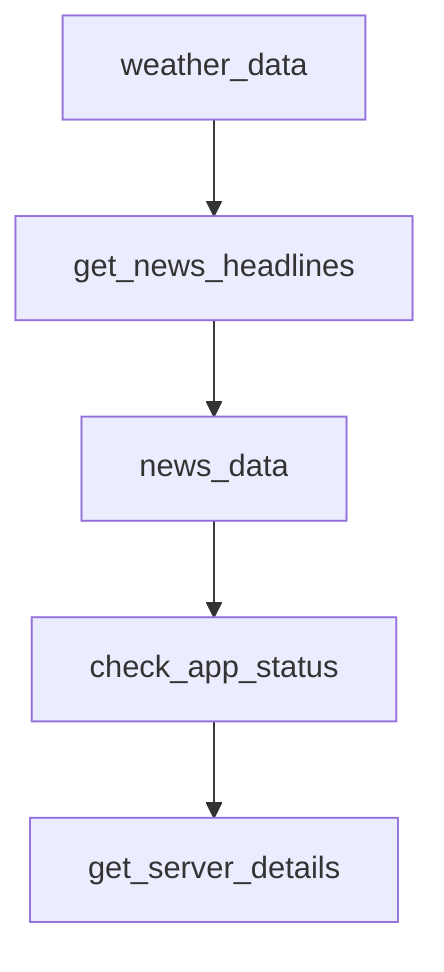

# Chapter 3: Server Runtime and Transports

Welcome to **Chapter 3: Server Runtime and Transports**. In this part of **FastMCP Tutorial: Building and Operating MCP Servers with Pythonic Control**, you will build an intuitive mental model first, then move into concrete implementation details and practical production tradeoffs.


This chapter covers runtime behavior and transport selection across local and networked contexts.

## Learning Goals

- choose between stdio, HTTP, and legacy SSE deliberately
- understand process lifecycle differences across transports
- align runtime mode with host client expectations
- avoid transport-specific production surprises

## Transport Decision Table

| Transport | Best Use Case |
|:----------|:--------------|
| stdio | local agent hosts and desktop workflows |
| HTTP (streamable) | remote/multi-client service deployments |
| SSE (legacy) | compatibility only for older clients |

## Runtime Guardrails

- default to stdio for local integrations unless network access is required
- use HTTP for shared services, access control, and observability
- treat SSE as transitional and avoid for new deployments

## Source References

- [Running Your Server](https://github.com/jlowin/fastmcp/blob/main/docs/deployment/running-server.mdx)
- [Project Configuration](https://github.com/jlowin/fastmcp/blob/main/docs/deployment/server-configuration.mdx)

## Summary

You now have a transport selection framework that aligns with operational reality.

Next: [Chapter 4: Client Architecture and Transport Patterns](04-client-architecture-and-transport-patterns.md)

## Depth Expansion Playbook

## Source Code Walkthrough

### `examples/mount_example.py`

The `weather_data` function in [`examples/mount_example.py`](https://github.com/jlowin/fastmcp/blob/HEAD/examples/mount_example.py) handles a key part of this chapter's functionality:

```py

@weather_app.resource(uri="weather://forecast")
async def weather_data():
    """Return current weather data."""
    return {"temperature": 72, "conditions": "sunny", "humidity": 45, "wind_speed": 5}


# News sub-application
news_app = FastMCP("News App")


@news_app.tool
def get_news_headlines() -> list[str]:
    """Get the latest news headlines."""
    return [
        "Tech company launches new product",
        "Local team wins championship",
        "Scientists make breakthrough discovery",
    ]


@news_app.resource(uri="news://headlines")
async def news_data():
    """Return latest news data."""
    return {
        "top_story": "Breaking news: Important event happened",
        "categories": ["politics", "sports", "technology"],
        "sources": ["AP", "Reuters", "Local Sources"],
    }


# Main application
```

This function is important because it defines how FastMCP Tutorial: Building and Operating MCP Servers with Pythonic Control implements the patterns covered in this chapter.

### `examples/mount_example.py`

The `get_news_headlines` function in [`examples/mount_example.py`](https://github.com/jlowin/fastmcp/blob/HEAD/examples/mount_example.py) handles a key part of this chapter's functionality:

```py

@news_app.tool
def get_news_headlines() -> list[str]:
    """Get the latest news headlines."""
    return [
        "Tech company launches new product",
        "Local team wins championship",
        "Scientists make breakthrough discovery",
    ]


@news_app.resource(uri="news://headlines")
async def news_data():
    """Return latest news data."""
    return {
        "top_story": "Breaking news: Important event happened",
        "categories": ["politics", "sports", "technology"],
        "sources": ["AP", "Reuters", "Local Sources"],
    }


# Main application
app = FastMCP("Main App")


@app.tool
def check_app_status() -> dict[str, str]:
    """Check the status of the main application."""
    return {"status": "running", "version": "1.0.0", "uptime": "3h 24m"}


# Mount sub-applications
```

This function is important because it defines how FastMCP Tutorial: Building and Operating MCP Servers with Pythonic Control implements the patterns covered in this chapter.

### `examples/mount_example.py`

The `news_data` function in [`examples/mount_example.py`](https://github.com/jlowin/fastmcp/blob/HEAD/examples/mount_example.py) handles a key part of this chapter's functionality:

```py

@news_app.resource(uri="news://headlines")
async def news_data():
    """Return latest news data."""
    return {
        "top_story": "Breaking news: Important event happened",
        "categories": ["politics", "sports", "technology"],
        "sources": ["AP", "Reuters", "Local Sources"],
    }


# Main application
app = FastMCP("Main App")


@app.tool
def check_app_status() -> dict[str, str]:
    """Check the status of the main application."""
    return {"status": "running", "version": "1.0.0", "uptime": "3h 24m"}


# Mount sub-applications
app.mount(server=weather_app, prefix="weather")

app.mount(server=news_app, prefix="news")


async def get_server_details():
    """Print information about mounted resources."""
    # Print available tools
    tools = await app.list_tools()
    print(f"\nAvailable tools ({len(tools)}):")
```

This function is important because it defines how FastMCP Tutorial: Building and Operating MCP Servers with Pythonic Control implements the patterns covered in this chapter.

### `examples/mount_example.py`

The `check_app_status` function in [`examples/mount_example.py`](https://github.com/jlowin/fastmcp/blob/HEAD/examples/mount_example.py) handles a key part of this chapter's functionality:

```py

@app.tool
def check_app_status() -> dict[str, str]:
    """Check the status of the main application."""
    return {"status": "running", "version": "1.0.0", "uptime": "3h 24m"}


# Mount sub-applications
app.mount(server=weather_app, prefix="weather")

app.mount(server=news_app, prefix="news")


async def get_server_details():
    """Print information about mounted resources."""
    # Print available tools
    tools = await app.list_tools()
    print(f"\nAvailable tools ({len(tools)}):")
    for tool in tools:
        print(f"  - {tool.name}: {tool.description}")

    # Print available resources
    print("\nAvailable resources:")

    # Distinguish between native and imported resources
    # Native resources would be those directly in the main app (not prefixed)

    resources = await app.list_resources()

    native_resources = [
        str(r.uri)
        for r in resources
```

This function is important because it defines how FastMCP Tutorial: Building and Operating MCP Servers with Pythonic Control implements the patterns covered in this chapter.


## How These Components Connect


