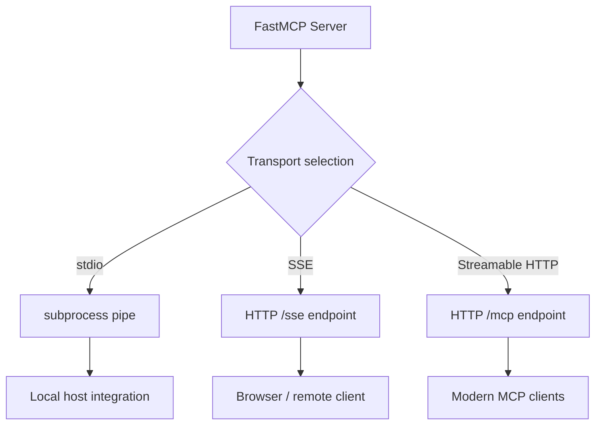

# Chapter 3: Server Runtime and Transports

Welcome to **Chapter 3: Server Runtime and Transports**. In this part of **FastMCP Tutorial: Building and Operating MCP Servers with Pythonic Control**, you will build an intuitive mental model first, then move into concrete implementation details and practical production tradeoffs.

This chapter covers runtime behavior and transport selection across local and networked contexts.

## Learning Goals

- choose between stdio, HTTP, and legacy SSE deliberately
- understand process lifecycle differences across transports
- align runtime mode with host client expectations
- avoid transport-specific production surprises

## Transport Decision Table

| Transport | Best Use Case |
|:----------|:--------------|
| stdio | local agent hosts and desktop workflows |
| HTTP (streamable) | remote/multi-client service deployments |
| SSE (legacy) | compatibility only for older clients |

## Runtime Guardrails

- default to stdio for local integrations unless network access is required
- use HTTP for shared services, access control, and observability
- treat SSE as transitional and avoid for new deployments

## Source References

- [Running Your Server](https://github.com/jlowin/fastmcp/blob/main/docs/deployment/running-server.mdx)
- [Project Configuration](https://github.com/jlowin/fastmcp/blob/main/docs/deployment/server-configuration.mdx)

## Summary

You now have a transport selection framework that aligns with operational reality.

Next: [Chapter 4: Client Architecture and Transport Patterns](04-client-architecture-and-transport-patterns.md)

## How These Components Connect

