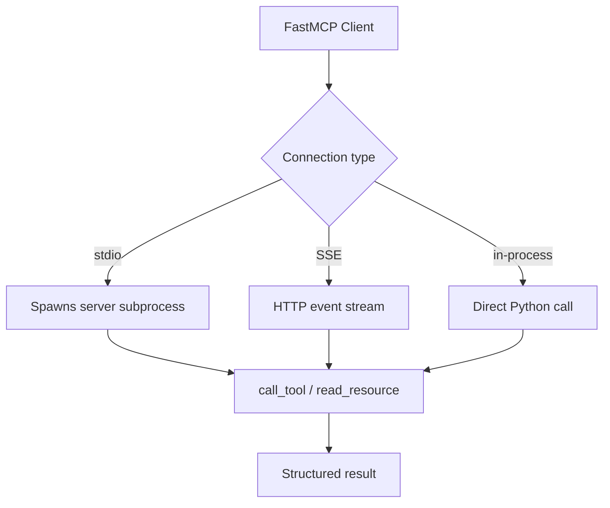

# Chapter 4: Client Architecture and Transport Patterns

Welcome to **Chapter 4: Client Architecture and Transport Patterns**. In this part of **FastMCP Tutorial: Building and Operating MCP Servers with Pythonic Control**, you will build an intuitive mental model first, then move into concrete implementation details and practical production tradeoffs.

This chapter focuses on client-side design patterns for reliable server communication.

## Learning Goals

- apply client lifecycle and context patterns correctly
- configure transport inference intentionally
- manage multi-server and environment-specific connection logic
- structure callback and error pathways for production diagnostics

## Client Design Checklist

| Area | Baseline Practice |
|:-----|:------------------|
| connection lifecycle | use explicit async contexts and cleanup |
| transport config | avoid implicit assumptions in mixed environments |
| multi-server routing | isolate server responsibilities by workflow |
| error handling | preserve structured error detail for observability |

## Source References

- [Client Guide](https://github.com/jlowin/fastmcp/blob/main/docs/clients/client.mdx)
- [Client Transports](https://github.com/jlowin/fastmcp/blob/main/docs/clients/transports.mdx)

## Summary

You now have a client architecture baseline for robust FastMCP integrations.

Next: [Chapter 5: Integrations: Claude Code, Cursor, and Tooling](05-integrations-claude-code-cursor-and-tooling.md)

## How These Components Connect

