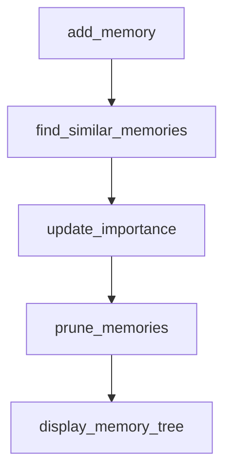

# Chapter 5: Integrations: Claude Code, Cursor, and Tooling

Welcome to **Chapter 5: Integrations: Claude Code, Cursor, and Tooling**. In this part of **FastMCP Tutorial: Building and Operating MCP Servers with Pythonic Control**, you will build an intuitive mental model first, then move into concrete implementation details and practical production tradeoffs.


This chapter explains host integration workflows for coding assistants and local IDE tooling.

## Learning Goals

- install FastMCP servers into Claude Code and Cursor workflows
- manage dependency and environment requirements per host
- choose between CLI-generated and manual configuration approaches
- reduce day-to-day friction in local coding-agent usage

## Integration Pattern

1. define server entrypoint and dependencies
2. install via CLI helpers where available
3. verify scoped configuration (workspace/user/project)
4. run a deterministic smoke task before broader usage

## Source References

- [Claude Code Integration](https://github.com/jlowin/fastmcp/blob/main/docs/integrations/claude-code.mdx)
- [Cursor Integration](https://github.com/jlowin/fastmcp/blob/main/docs/integrations/cursor.mdx)
- [CLI Pattern Guide](https://github.com/jlowin/fastmcp/blob/main/docs/patterns/cli.mdx)

## Summary

You now have practical host integration patterns for daily coding workflows.

Next: [Chapter 6: Configuration, Auth, and Deployment](06-configuration-auth-and-deployment.md)

## Depth Expansion Playbook

## Source Code Walkthrough

### `examples/memory.py`

The `add_memory` function in [`examples/memory.py`](https://github.com/jlowin/fastmcp/blob/HEAD/examples/memory.py) handles a key part of this chapter's functionality:

```py


async def add_memory(content: str, deps: Deps):
    new_memory = await MemoryNode.from_content(content, deps)
    await new_memory.save(deps)

    similar_memories = await find_similar_memories(new_memory.embedding, deps)
    for memory in similar_memories:
        if memory.id != new_memory.id:
            await new_memory.merge_with(memory, deps)

    await update_importance(new_memory.embedding, deps)

    await prune_memories(deps)

    return f"Remembered: {content}"


async def find_similar_memories(embedding: list[float], deps: Deps) -> list[MemoryNode]:
    async with deps.pool.acquire() as conn:
        rows = await conn.fetch(
            """
            SELECT id, content, summary, importance, access_count, timestamp, embedding
            FROM memories
            ORDER BY embedding <-> $1
            LIMIT 5
            """,
            embedding,
        )
    memories = [
        MemoryNode(
            id=row["id"],
```

This function is important because it defines how FastMCP Tutorial: Building and Operating MCP Servers with Pythonic Control implements the patterns covered in this chapter.

### `examples/memory.py`

The `find_similar_memories` function in [`examples/memory.py`](https://github.com/jlowin/fastmcp/blob/HEAD/examples/memory.py) handles a key part of this chapter's functionality:

```py
    await new_memory.save(deps)

    similar_memories = await find_similar_memories(new_memory.embedding, deps)
    for memory in similar_memories:
        if memory.id != new_memory.id:
            await new_memory.merge_with(memory, deps)

    await update_importance(new_memory.embedding, deps)

    await prune_memories(deps)

    return f"Remembered: {content}"


async def find_similar_memories(embedding: list[float], deps: Deps) -> list[MemoryNode]:
    async with deps.pool.acquire() as conn:
        rows = await conn.fetch(
            """
            SELECT id, content, summary, importance, access_count, timestamp, embedding
            FROM memories
            ORDER BY embedding <-> $1
            LIMIT 5
            """,
            embedding,
        )
    memories = [
        MemoryNode(
            id=row["id"],
            content=row["content"],
            summary=row["summary"],
            importance=row["importance"],
            access_count=row["access_count"],
```

This function is important because it defines how FastMCP Tutorial: Building and Operating MCP Servers with Pythonic Control implements the patterns covered in this chapter.

### `examples/memory.py`

The `update_importance` function in [`examples/memory.py`](https://github.com/jlowin/fastmcp/blob/HEAD/examples/memory.py) handles a key part of this chapter's functionality:

```py
            await new_memory.merge_with(memory, deps)

    await update_importance(new_memory.embedding, deps)

    await prune_memories(deps)

    return f"Remembered: {content}"


async def find_similar_memories(embedding: list[float], deps: Deps) -> list[MemoryNode]:
    async with deps.pool.acquire() as conn:
        rows = await conn.fetch(
            """
            SELECT id, content, summary, importance, access_count, timestamp, embedding
            FROM memories
            ORDER BY embedding <-> $1
            LIMIT 5
            """,
            embedding,
        )
    memories = [
        MemoryNode(
            id=row["id"],
            content=row["content"],
            summary=row["summary"],
            importance=row["importance"],
            access_count=row["access_count"],
            timestamp=row["timestamp"],
            embedding=row["embedding"],
        )
        for row in rows
    ]
```

This function is important because it defines how FastMCP Tutorial: Building and Operating MCP Servers with Pythonic Control implements the patterns covered in this chapter.

### `examples/memory.py`

The `prune_memories` function in [`examples/memory.py`](https://github.com/jlowin/fastmcp/blob/HEAD/examples/memory.py) handles a key part of this chapter's functionality:

```py
    await update_importance(new_memory.embedding, deps)

    await prune_memories(deps)

    return f"Remembered: {content}"


async def find_similar_memories(embedding: list[float], deps: Deps) -> list[MemoryNode]:
    async with deps.pool.acquire() as conn:
        rows = await conn.fetch(
            """
            SELECT id, content, summary, importance, access_count, timestamp, embedding
            FROM memories
            ORDER BY embedding <-> $1
            LIMIT 5
            """,
            embedding,
        )
    memories = [
        MemoryNode(
            id=row["id"],
            content=row["content"],
            summary=row["summary"],
            importance=row["importance"],
            access_count=row["access_count"],
            timestamp=row["timestamp"],
            embedding=row["embedding"],
        )
        for row in rows
    ]
    return memories

```

This function is important because it defines how FastMCP Tutorial: Building and Operating MCP Servers with Pythonic Control implements the patterns covered in this chapter.


## How These Components Connect


