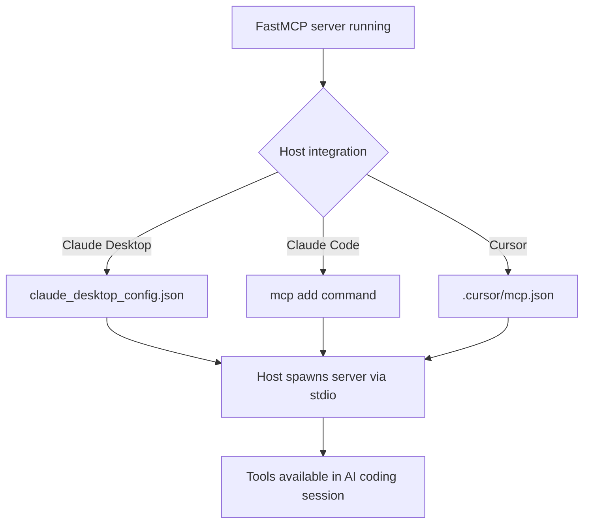

# Chapter 5: Integrations: Claude Code, Cursor, and Tooling

Welcome to **Chapter 5: Integrations: Claude Code, Cursor, and Tooling**. In this part of **FastMCP Tutorial: Building and Operating MCP Servers with Pythonic Control**, you will build an intuitive mental model first, then move into concrete implementation details and practical production tradeoffs.

This chapter explains host integration workflows for coding assistants and local IDE tooling.

## Learning Goals

- install FastMCP servers into Claude Code and Cursor workflows
- manage dependency and environment requirements per host
- choose between CLI-generated and manual configuration approaches
- reduce day-to-day friction in local coding-agent usage

## Integration Pattern

1. define server entrypoint and dependencies
2. install via CLI helpers where available
3. verify scoped configuration (workspace/user/project)
4. run a deterministic smoke task before broader usage

## Source References

- [Claude Code Integration](https://github.com/jlowin/fastmcp/blob/main/docs/integrations/claude-code.mdx)
- [Cursor Integration](https://github.com/jlowin/fastmcp/blob/main/docs/integrations/cursor.mdx)
- [CLI Pattern Guide](https://github.com/jlowin/fastmcp/blob/main/docs/patterns/cli.mdx)

## Summary

You now have practical host integration patterns for daily coding workflows.

Next: [Chapter 6: Configuration, Auth, and Deployment](06-configuration-auth-and-deployment.md)

## How These Components Connect

