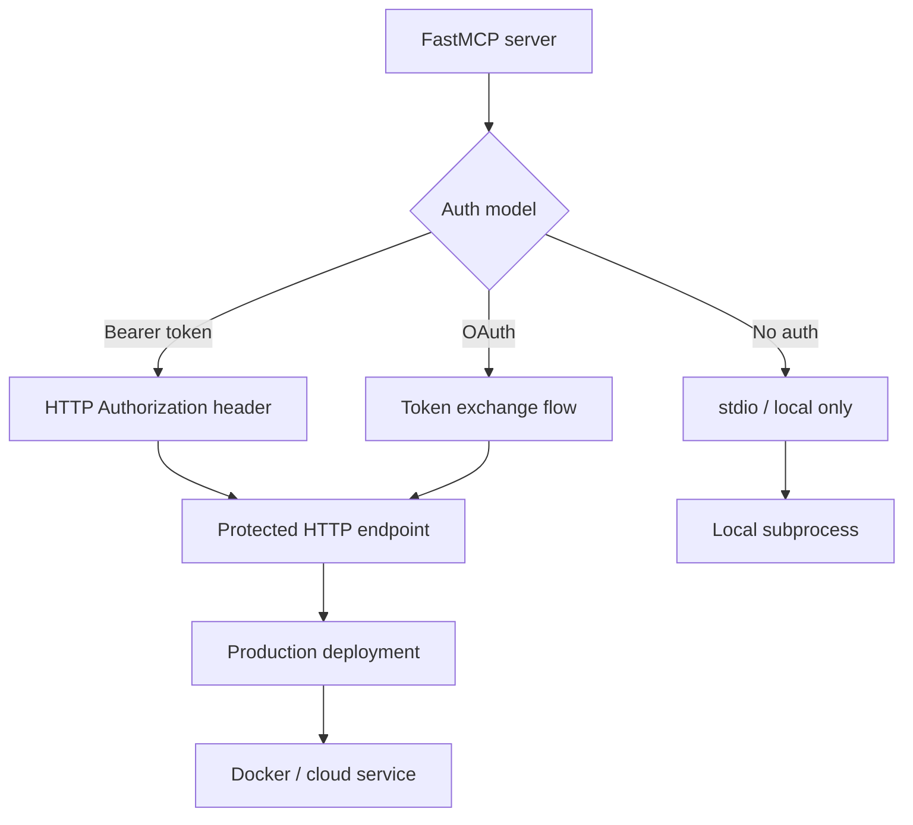

# Chapter 6: Configuration, Auth, and Deployment

Welcome to **Chapter 6: Configuration, Auth, and Deployment**. In this part of **FastMCP Tutorial: Building and Operating MCP Servers with Pythonic Control**, you will build an intuitive mental model first, then move into concrete implementation details and practical production tradeoffs.

This chapter covers standardized project configuration, auth controls, and deployment choices.

## Learning Goals

- use project-level configuration (`fastmcp.json`) predictably
- set auth and environment behavior with less drift
- design deployment paths for local, hosted, and managed environments
- keep runtime setup reproducible across teams

## Configuration and Auth Baseline

- centralize runtime settings in configuration files when possible
- treat auth providers and token handling as first-class design concerns
- document environment variable requirements per deployment target
- prebuild/validate environments before promoting to production

## Source References

- [Project Configuration](https://github.com/jlowin/fastmcp/blob/main/docs/deployment/server-configuration.mdx)
- [Auth Guides](https://github.com/jlowin/fastmcp/tree/main/docs/clients/auth)
- [HTTP Deployment](https://github.com/jlowin/fastmcp/blob/main/docs/deployment/http.mdx)

## Summary

You now have a deployment-ready configuration and auth approach for FastMCP systems.

Next: [Chapter 7: Testing, Contributing, and Upgrade Strategy](07-testing-contributing-and-upgrade-strategy.md)

## How These Components Connect

