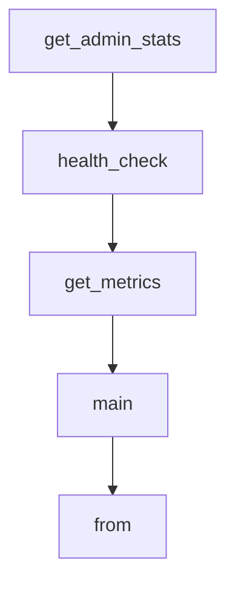

# Chapter 6: Configuration, Auth, and Deployment

Welcome to **Chapter 6: Configuration, Auth, and Deployment**. In this part of **FastMCP Tutorial: Building and Operating MCP Servers with Pythonic Control**, you will build an intuitive mental model first, then move into concrete implementation details and practical production tradeoffs.


This chapter covers standardized project configuration, auth controls, and deployment choices.

## Learning Goals

- use project-level configuration (`fastmcp.json`) predictably
- set auth and environment behavior with less drift
- design deployment paths for local, hosted, and managed environments
- keep runtime setup reproducible across teams

## Configuration and Auth Baseline

- centralize runtime settings in configuration files when possible
- treat auth providers and token handling as first-class design concerns
- document environment variable requirements per deployment target
- prebuild/validate environments before promoting to production

## Source References

- [Project Configuration](https://github.com/jlowin/fastmcp/blob/main/docs/deployment/server-configuration.mdx)
- [Auth Guides](https://github.com/jlowin/fastmcp/tree/main/docs/clients/auth)
- [HTTP Deployment](https://github.com/jlowin/fastmcp/blob/main/docs/deployment/http.mdx)

## Summary

You now have a deployment-ready configuration and auth approach for FastMCP systems.

Next: [Chapter 7: Testing, Contributing, and Upgrade Strategy](07-testing-contributing-and-upgrade-strategy.md)

## Depth Expansion Playbook

## Source Code Walkthrough

### `examples/tags_example.py`

The `get_admin_stats` function in [`examples/tags_example.py`](https://github.com/jlowin/fastmcp/blob/HEAD/examples/tags_example.py) handles a key part of this chapter's functionality:

```py

@app.get("/admin/stats", tags=["admin", "internal"])
async def get_admin_stats():
    """Get admin statistics - internal use"""
    return {"total_users": 100, "active_sessions": 25}


@app.get("/health", tags=["public"])
async def health_check():
    """Public health check"""
    return {"status": "healthy"}


@app.get("/metrics")
async def get_metrics():
    """Metrics endpoint with no tags"""
    return {"requests": 1000, "errors": 5}


async def main():
    """Demonstrate different tag-based routing strategies."""

    print("=== Example 1: Make admin-tagged routes tools ===")

    # Strategy 1: Convert admin-tagged routes to tools
    mcp1 = FastMCP.from_fastapi(
        app=app,
        route_maps=[
            RouteMap(methods="*", pattern=r".*", mcp_type=MCPType.TOOL, tags={"admin"}),
            RouteMap(methods=["GET"], pattern=r".*", mcp_type=MCPType.RESOURCE),
        ],
    )
```

This function is important because it defines how FastMCP Tutorial: Building and Operating MCP Servers with Pythonic Control implements the patterns covered in this chapter.

### `examples/tags_example.py`

The `health_check` function in [`examples/tags_example.py`](https://github.com/jlowin/fastmcp/blob/HEAD/examples/tags_example.py) handles a key part of this chapter's functionality:

```py

@app.get("/health", tags=["public"])
async def health_check():
    """Public health check"""
    return {"status": "healthy"}


@app.get("/metrics")
async def get_metrics():
    """Metrics endpoint with no tags"""
    return {"requests": 1000, "errors": 5}


async def main():
    """Demonstrate different tag-based routing strategies."""

    print("=== Example 1: Make admin-tagged routes tools ===")

    # Strategy 1: Convert admin-tagged routes to tools
    mcp1 = FastMCP.from_fastapi(
        app=app,
        route_maps=[
            RouteMap(methods="*", pattern=r".*", mcp_type=MCPType.TOOL, tags={"admin"}),
            RouteMap(methods=["GET"], pattern=r".*", mcp_type=MCPType.RESOURCE),
        ],
    )

    tools = await mcp1.list_tools()
    resources = await mcp1.list_resources()

    print(f"Tools ({len(tools)}): {', '.join(t.name for t in tools)}")
    print(f"Resources ({len(resources)}): {', '.join(str(r.uri) for r in resources)}")
```

This function is important because it defines how FastMCP Tutorial: Building and Operating MCP Servers with Pythonic Control implements the patterns covered in this chapter.

### `examples/tags_example.py`

The `get_metrics` function in [`examples/tags_example.py`](https://github.com/jlowin/fastmcp/blob/HEAD/examples/tags_example.py) handles a key part of this chapter's functionality:

```py

@app.get("/metrics")
async def get_metrics():
    """Metrics endpoint with no tags"""
    return {"requests": 1000, "errors": 5}


async def main():
    """Demonstrate different tag-based routing strategies."""

    print("=== Example 1: Make admin-tagged routes tools ===")

    # Strategy 1: Convert admin-tagged routes to tools
    mcp1 = FastMCP.from_fastapi(
        app=app,
        route_maps=[
            RouteMap(methods="*", pattern=r".*", mcp_type=MCPType.TOOL, tags={"admin"}),
            RouteMap(methods=["GET"], pattern=r".*", mcp_type=MCPType.RESOURCE),
        ],
    )

    tools = await mcp1.list_tools()
    resources = await mcp1.list_resources()

    print(f"Tools ({len(tools)}): {', '.join(t.name for t in tools)}")
    print(f"Resources ({len(resources)}): {', '.join(str(r.uri) for r in resources)}")

    print("\n=== Example 2: Exclude internal routes ===")

    # Strategy 2: Exclude internal routes entirely
    mcp2 = FastMCP.from_fastapi(
        app=app,
```

This function is important because it defines how FastMCP Tutorial: Building and Operating MCP Servers with Pythonic Control implements the patterns covered in this chapter.

### `examples/tags_example.py`

The `main` function in [`examples/tags_example.py`](https://github.com/jlowin/fastmcp/blob/HEAD/examples/tags_example.py) handles a key part of this chapter's functionality:

```py


async def main():
    """Demonstrate different tag-based routing strategies."""

    print("=== Example 1: Make admin-tagged routes tools ===")

    # Strategy 1: Convert admin-tagged routes to tools
    mcp1 = FastMCP.from_fastapi(
        app=app,
        route_maps=[
            RouteMap(methods="*", pattern=r".*", mcp_type=MCPType.TOOL, tags={"admin"}),
            RouteMap(methods=["GET"], pattern=r".*", mcp_type=MCPType.RESOURCE),
        ],
    )

    tools = await mcp1.list_tools()
    resources = await mcp1.list_resources()

    print(f"Tools ({len(tools)}): {', '.join(t.name for t in tools)}")
    print(f"Resources ({len(resources)}): {', '.join(str(r.uri) for r in resources)}")

    print("\n=== Example 2: Exclude internal routes ===")

    # Strategy 2: Exclude internal routes entirely
    mcp2 = FastMCP.from_fastapi(
        app=app,
        route_maps=[
            RouteMap(
                methods="*", pattern=r".*", mcp_type=MCPType.EXCLUDE, tags={"internal"}
            ),
            RouteMap(methods=["GET"], pattern=r".*", mcp_type=MCPType.RESOURCE),
```

This function is important because it defines how FastMCP Tutorial: Building and Operating MCP Servers with Pythonic Control implements the patterns covered in this chapter.


## How These Components Connect


