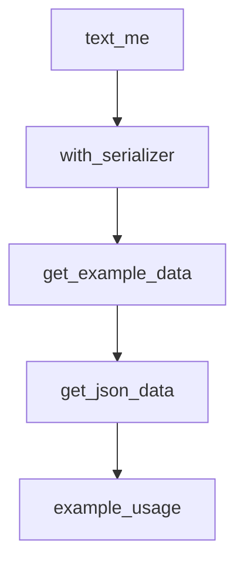

# Chapter 7: Testing, Contributing, and Upgrade Strategy

Welcome to **Chapter 7: Testing, Contributing, and Upgrade Strategy**. In this part of **FastMCP Tutorial: Building and Operating MCP Servers with Pythonic Control**, you will build an intuitive mental model first, then move into concrete implementation details and practical production tradeoffs.


This chapter covers change safety: test strategy, contributor workflow, and version migration.

## Learning Goals

- apply fast feedback loops for transport and tool behavior changes
- follow contributor expectations for clean review cycles
- handle breaking changes intentionally during upgrades
- keep documentation and tests synchronized with runtime behavior

## Change-Safety Workflow

| Stage | Focus |
|:------|:------|
| local test loop | in-memory and targeted integration tests |
| PR quality gate | lint, test markers, docs consistency |
| upgrade review | explicit migration notes and breaking-change checks |
| rollout | staged validation before production promotion |

## Source References

- [Tests Guide](https://github.com/jlowin/fastmcp/blob/main/docs/development/tests.mdx)
- [Contributing Guide](https://github.com/jlowin/fastmcp/blob/main/docs/development/contributing.mdx)
- [Upgrade Guide](https://github.com/jlowin/fastmcp/blob/main/docs/development/upgrade-guide.mdx)

## Summary

You now have a safer maintenance model for evolving FastMCP server/client systems.

Next: [Chapter 8: Production Operations and Governance](08-production-operations-and-governance.md)

## Depth Expansion Playbook

## Source Code Walkthrough

### `examples/text_me.py`

The `text_me` function in [`examples/text_me.py`](https://github.com/jlowin/fastmcp/blob/HEAD/examples/text_me.py) handles a key part of this chapter's functionality:

```py

@mcp.tool(name="textme", description="Send a text message to me")
def text_me(text_content: str) -> str:
    """Send a text message to a phone number via https://surgemsg.com/"""
    with httpx.Client() as client:
        response = client.post(
            "https://api.surgemsg.com/messages",
            headers={
                "Authorization": f"Bearer {surge_settings.api_key}",
                "Surge-Account": surge_settings.account_id,
                "Content-Type": "application/json",
            },
            json={
                "body": text_content,
                "conversation": {
                    "contact": {
                        "first_name": surge_settings.my_first_name,
                        "last_name": surge_settings.my_last_name,
                        "phone_number": surge_settings.my_phone_number,
                    }
                },
            },
        )
        response.raise_for_status()
        return f"Message sent: {text_content}"

```

This function is important because it defines how FastMCP Tutorial: Building and Operating MCP Servers with Pythonic Control implements the patterns covered in this chapter.

### `examples/custom_tool_serializer_decorator.py`

The `with_serializer` function in [`examples/custom_tool_serializer_decorator.py`](https://github.com/jlowin/fastmcp/blob/HEAD/examples/custom_tool_serializer_decorator.py) handles a key part of this chapter's functionality:

```py


def with_serializer(serializer: Callable[[Any], str]):
    """Decorator to apply custom serialization to tool output."""

    def decorator(fn):
        @wraps(fn)
        def wrapper(*args, **kwargs):
            result = fn(*args, **kwargs)
            return ToolResult(content=serializer(result), structured_content=result)

        @wraps(fn)
        async def async_wrapper(*args, **kwargs):
            result = await fn(*args, **kwargs)
            return ToolResult(content=serializer(result), structured_content=result)

        return async_wrapper if inspect.iscoroutinefunction(fn) else wrapper

    return decorator


# Create reusable serializer decorators
with_yaml = with_serializer(lambda d: yaml.dump(d, width=100, sort_keys=False))

server = FastMCP(name="CustomSerializerExample")


@server.tool
@with_yaml
def get_example_data() -> dict:
    """Returns some example data serialized as YAML."""
    return {"name": "Test", "value": 123, "status": True}
```

This function is important because it defines how FastMCP Tutorial: Building and Operating MCP Servers with Pythonic Control implements the patterns covered in this chapter.

### `examples/custom_tool_serializer_decorator.py`

The `get_example_data` function in [`examples/custom_tool_serializer_decorator.py`](https://github.com/jlowin/fastmcp/blob/HEAD/examples/custom_tool_serializer_decorator.py) handles a key part of this chapter's functionality:

```py
@server.tool
@with_yaml
def get_example_data() -> dict:
    """Returns some example data serialized as YAML."""
    return {"name": "Test", "value": 123, "status": True}


@server.tool
def get_json_data() -> dict:
    """Returns data with default JSON serialization."""
    return {"format": "json", "data": [1, 2, 3]}


async def example_usage():
    # YAML serialized tool
    yaml_result = await server._call_tool_mcp("get_example_data", {})
    print("YAML Tool Result:")
    print(yaml_result)
    print()

    # Default JSON serialized tool
    json_result = await server._call_tool_mcp("get_json_data", {})
    print("JSON Tool Result:")
    print(json_result)


if __name__ == "__main__":
    asyncio.run(example_usage())
    server.run()

```

This function is important because it defines how FastMCP Tutorial: Building and Operating MCP Servers with Pythonic Control implements the patterns covered in this chapter.

### `examples/custom_tool_serializer_decorator.py`

The `get_json_data` function in [`examples/custom_tool_serializer_decorator.py`](https://github.com/jlowin/fastmcp/blob/HEAD/examples/custom_tool_serializer_decorator.py) handles a key part of this chapter's functionality:

```py

@server.tool
def get_json_data() -> dict:
    """Returns data with default JSON serialization."""
    return {"format": "json", "data": [1, 2, 3]}


async def example_usage():
    # YAML serialized tool
    yaml_result = await server._call_tool_mcp("get_example_data", {})
    print("YAML Tool Result:")
    print(yaml_result)
    print()

    # Default JSON serialized tool
    json_result = await server._call_tool_mcp("get_json_data", {})
    print("JSON Tool Result:")
    print(json_result)


if __name__ == "__main__":
    asyncio.run(example_usage())
    server.run()

```

This function is important because it defines how FastMCP Tutorial: Building and Operating MCP Servers with Pythonic Control implements the patterns covered in this chapter.


## How These Components Connect


