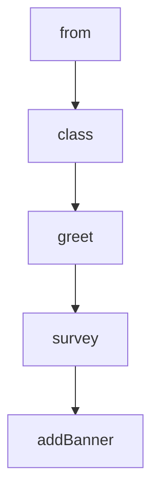

# Chapter 8: Production Operations and Governance

Welcome to **Chapter 8: Production Operations and Governance**. In this part of **FastMCP Tutorial: Building and Operating MCP Servers with Pythonic Control**, you will build an intuitive mental model first, then move into concrete implementation details and practical production tradeoffs.


This chapter consolidates day-2 operations, governance, and reliability practices for team-scale FastMCP deployments.

## Learning Goals

- define ownership and review rules for exposed MCP surfaces
- monitor and limit operational risk from tool misuse or drift
- establish rollback and incident workflows for degraded integrations
- keep runtime, docs, and configuration baselines aligned

## Governance Controls

1. define approved component catalogs by environment
2. require versioned configuration and test artifacts for changes
3. enforce least-privilege auth and transport choices
4. run periodic upgrade and deprecation reviews

## Source References

- [FastMCP Development Guidelines](https://github.com/jlowin/fastmcp/blob/main/AGENTS.md)
- [Releases](https://github.com/jlowin/fastmcp/releases)
- [Prefect Horizon Deployment](https://github.com/jlowin/fastmcp/blob/main/docs/deployment/prefect-horizon.mdx)

## Summary

You now have an end-to-end framework for designing, integrating, and operating FastMCP systems in production.

## Depth Expansion Playbook

## Source Code Walkthrough

### `examples/elicitation.py`

The `from` class in [`examples/elicitation.py`](https://github.com/jlowin/fastmcp/blob/HEAD/examples/elicitation.py) handles a key part of this chapter's functionality:

```py
"""

from dataclasses import dataclass

from fastmcp import Context, FastMCP

mcp = FastMCP("Elicitation Demo")


@mcp.tool
async def greet(ctx: Context) -> str:
    """Greet the user by name (asks for their name)."""
    result = await ctx.elicit("What is your name?", response_type=str)

    if result.action == "accept":
        return f"Hello, {result.data}!"
    return "Maybe next time!"


@mcp.tool
async def survey(ctx: Context) -> str:
    """Run a short survey collecting structured info."""

    @dataclass
    class SurveyResponse:
        favorite_color: str
        lucky_number: int

    result = await ctx.elicit(
        "Quick survey — tell us about yourself:",
        response_type=SurveyResponse,
    )
```

This class is important because it defines how FastMCP Tutorial: Building and Operating MCP Servers with Pythonic Control implements the patterns covered in this chapter.

### `examples/elicitation.py`

The `class` class in [`examples/elicitation.py`](https://github.com/jlowin/fastmcp/blob/HEAD/examples/elicitation.py) handles a key part of this chapter's functionality:

```py
"""

from dataclasses import dataclass

from fastmcp import Context, FastMCP

mcp = FastMCP("Elicitation Demo")


@mcp.tool
async def greet(ctx: Context) -> str:
    """Greet the user by name (asks for their name)."""
    result = await ctx.elicit("What is your name?", response_type=str)

    if result.action == "accept":
        return f"Hello, {result.data}!"
    return "Maybe next time!"


@mcp.tool
async def survey(ctx: Context) -> str:
    """Run a short survey collecting structured info."""

    @dataclass
    class SurveyResponse:
        favorite_color: str
        lucky_number: int

    result = await ctx.elicit(
        "Quick survey — tell us about yourself:",
        response_type=SurveyResponse,
    )
```

This class is important because it defines how FastMCP Tutorial: Building and Operating MCP Servers with Pythonic Control implements the patterns covered in this chapter.

### `examples/elicitation.py`

The `greet` function in [`examples/elicitation.py`](https://github.com/jlowin/fastmcp/blob/HEAD/examples/elicitation.py) handles a key part of this chapter's functionality:

```py

    fastmcp list examples/elicitation.py
    fastmcp call examples/elicitation.py greet
    fastmcp call examples/elicitation.py survey
"""

from dataclasses import dataclass

from fastmcp import Context, FastMCP

mcp = FastMCP("Elicitation Demo")


@mcp.tool
async def greet(ctx: Context) -> str:
    """Greet the user by name (asks for their name)."""
    result = await ctx.elicit("What is your name?", response_type=str)

    if result.action == "accept":
        return f"Hello, {result.data}!"
    return "Maybe next time!"


@mcp.tool
async def survey(ctx: Context) -> str:
    """Run a short survey collecting structured info."""

    @dataclass
    class SurveyResponse:
        favorite_color: str
        lucky_number: int

```

This function is important because it defines how FastMCP Tutorial: Building and Operating MCP Servers with Pythonic Control implements the patterns covered in this chapter.

### `examples/elicitation.py`

The `survey` function in [`examples/elicitation.py`](https://github.com/jlowin/fastmcp/blob/HEAD/examples/elicitation.py) handles a key part of this chapter's functionality:

```py
    fastmcp list examples/elicitation.py
    fastmcp call examples/elicitation.py greet
    fastmcp call examples/elicitation.py survey
"""

from dataclasses import dataclass

from fastmcp import Context, FastMCP

mcp = FastMCP("Elicitation Demo")


@mcp.tool
async def greet(ctx: Context) -> str:
    """Greet the user by name (asks for their name)."""
    result = await ctx.elicit("What is your name?", response_type=str)

    if result.action == "accept":
        return f"Hello, {result.data}!"
    return "Maybe next time!"


@mcp.tool
async def survey(ctx: Context) -> str:
    """Run a short survey collecting structured info."""

    @dataclass
    class SurveyResponse:
        favorite_color: str
        lucky_number: int

    result = await ctx.elicit(
```

This function is important because it defines how FastMCP Tutorial: Building and Operating MCP Servers with Pythonic Control implements the patterns covered in this chapter.


## How These Components Connect


