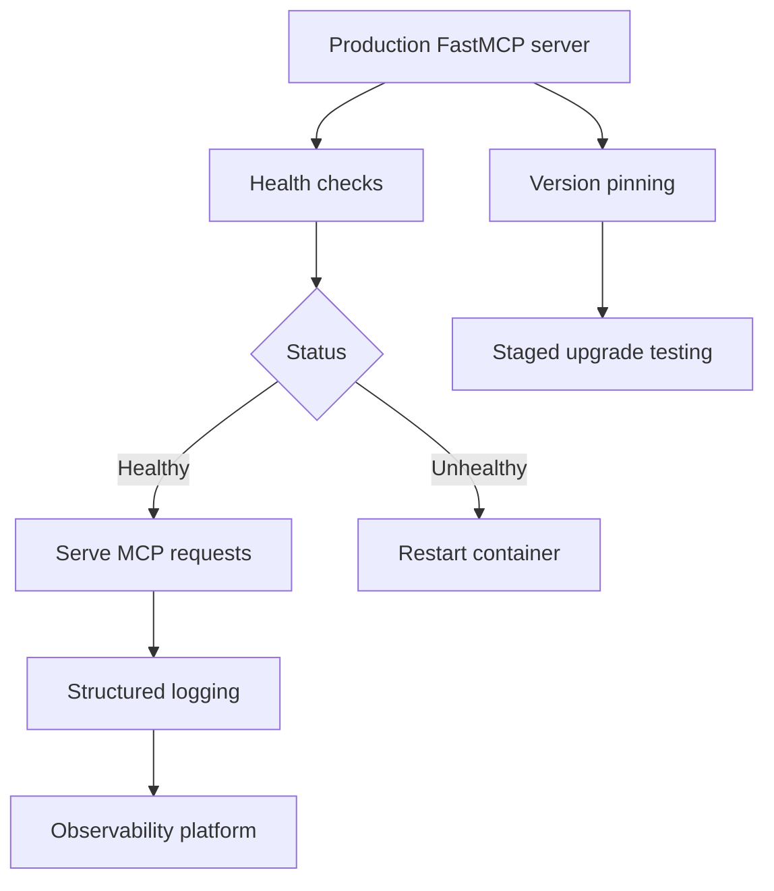

# Chapter 8: Production Operations and Governance

Welcome to **Chapter 8: Production Operations and Governance**. In this part of **FastMCP Tutorial: Building and Operating MCP Servers with Pythonic Control**, you will build an intuitive mental model first, then move into concrete implementation details and practical production tradeoffs.

This chapter consolidates day-2 operations, governance, and reliability practices for team-scale FastMCP deployments.

## Learning Goals

- define ownership and review rules for exposed MCP surfaces
- monitor and limit operational risk from tool misuse or drift
- establish rollback and incident workflows for degraded integrations
- keep runtime, docs, and configuration baselines aligned

## Governance Controls

1. define approved component catalogs by environment
2. require versioned configuration and test artifacts for changes
3. enforce least-privilege auth and transport choices
4. run periodic upgrade and deprecation reviews

## Source References

- [FastMCP Development Guidelines](https://github.com/jlowin/fastmcp/blob/main/AGENTS.md)
- [Releases](https://github.com/jlowin/fastmcp/releases)
- [Prefect Horizon Deployment](https://github.com/jlowin/fastmcp/blob/main/docs/deployment/prefect-horizon.mdx)

## Summary

You now have an end-to-end framework for designing, integrating, and operating FastMCP systems in production.

## How These Components Connect

