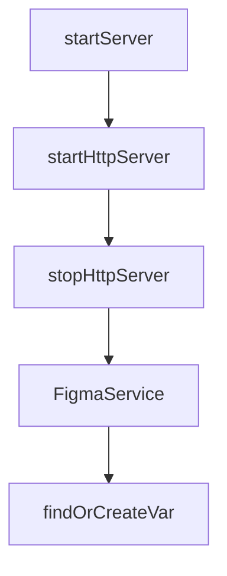

# Chapter 1: Getting Started

Welcome to **Chapter 1: Getting Started**. In this part of **Figma Context MCP Tutorial: Design-to-Code Workflows for Coding Agents**, you will build an intuitive mental model first, then move into concrete implementation details and practical production tradeoffs.


This chapter gets Figma Context MCP connected to your coding client with a working token and first design fetch.

## Learning Goals

- create and configure a Figma personal access token
- register MCP server in client config
- fetch context from a Figma frame URL
- validate first design-to-code prompt roundtrip

## Minimal MCP Config (macOS/Linux)

```json
{
  "mcpServers": {
    "Framelink MCP for Figma": {
      "command": "npx",
      "args": ["-y", "figma-developer-mcp", "--figma-api-key=YOUR-KEY", "--stdio"]
    }
  }
}
```

## Source References

- [Framelink Quickstart](https://www.framelink.ai/docs/quickstart)
- [Figma Token Docs](https://help.figma.com/hc/en-us/articles/8085703771159-Manage-personal-access-tokens)

## Summary

You now have a working MCP bridge between Figma and your coding assistant.

Next: [Chapter 2: Architecture and Context Translation](02-architecture-and-context-translation.md)

## Depth Expansion Playbook

## Source Code Walkthrough

### `src/server.ts`

The `startServer` function in [`src/server.ts`](https://github.com/GLips/Figma-Context-MCP/blob/HEAD/src/server.ts) handles a key part of this chapter's functionality:

```ts
 * Start the MCP server in either stdio or HTTP mode.
 */
export async function startServer(): Promise<void> {
  const config = getServerConfig();

  const serverOptions = {
    isHTTP: !config.isStdioMode,
    outputFormat: config.outputFormat as "yaml" | "json",
    skipImageDownloads: config.skipImageDownloads,
    imageDir: config.imageDir,
  };

  if (config.isStdioMode) {
    const server = createServer(config.auth, serverOptions);
    const transport = new StdioServerTransport();
    await server.connect(transport);
  } else {
    const createMcpServer = () => createServer(config.auth, serverOptions);
    console.log(`Initializing Figma MCP Server in HTTP mode on ${config.host}:${config.port}...`);
    await startHttpServer(config.host, config.port, createMcpServer);

    process.on("SIGINT", async () => {
      Logger.log("Shutting down server...");
      await stopHttpServer();
      Logger.log("Server shutdown complete");
      process.exit(0);
    });
  }
}

export async function startHttpServer(
  host: string,
```

This function is important because it defines how Figma Context MCP Tutorial: Design-to-Code Workflows for Coding Agents implements the patterns covered in this chapter.

### `src/server.ts`

The `startHttpServer` function in [`src/server.ts`](https://github.com/GLips/Figma-Context-MCP/blob/HEAD/src/server.ts) handles a key part of this chapter's functionality:

```ts
    const createMcpServer = () => createServer(config.auth, serverOptions);
    console.log(`Initializing Figma MCP Server in HTTP mode on ${config.host}:${config.port}...`);
    await startHttpServer(config.host, config.port, createMcpServer);

    process.on("SIGINT", async () => {
      Logger.log("Shutting down server...");
      await stopHttpServer();
      Logger.log("Server shutdown complete");
      process.exit(0);
    });
  }
}

export async function startHttpServer(
  host: string,
  port: number,
  createMcpServer: () => McpServer,
): Promise<Server> {
  if (httpServer) {
    throw new Error("HTTP server is already running");
  }

  const app = express();

  // Parse JSON requests for the Streamable HTTP endpoint only, will break SSE endpoint
  app.use("/mcp", express.json());

  // Modern Streamable HTTP endpoint
  app.post("/mcp", async (req, res) => {
    Logger.log("Received StreamableHTTP request");
    const sessionId = req.headers["mcp-session-id"] as string | undefined;
    let transport: StreamableHTTPServerTransport;
```

This function is important because it defines how Figma Context MCP Tutorial: Design-to-Code Workflows for Coding Agents implements the patterns covered in this chapter.

### `src/server.ts`

The `stopHttpServer` function in [`src/server.ts`](https://github.com/GLips/Figma-Context-MCP/blob/HEAD/src/server.ts) handles a key part of this chapter's functionality:

```ts
    process.on("SIGINT", async () => {
      Logger.log("Shutting down server...");
      await stopHttpServer();
      Logger.log("Server shutdown complete");
      process.exit(0);
    });
  }
}

export async function startHttpServer(
  host: string,
  port: number,
  createMcpServer: () => McpServer,
): Promise<Server> {
  if (httpServer) {
    throw new Error("HTTP server is already running");
  }

  const app = express();

  // Parse JSON requests for the Streamable HTTP endpoint only, will break SSE endpoint
  app.use("/mcp", express.json());

  // Modern Streamable HTTP endpoint
  app.post("/mcp", async (req, res) => {
    Logger.log("Received StreamableHTTP request");
    const sessionId = req.headers["mcp-session-id"] as string | undefined;
    let transport: StreamableHTTPServerTransport;

    if (sessionId && sessions[sessionId]) {
      // Reuse existing transport
      Logger.log("Reusing existing StreamableHTTP transport for sessionId", sessionId);
```

This function is important because it defines how Figma Context MCP Tutorial: Design-to-Code Workflows for Coding Agents implements the patterns covered in this chapter.

### `src/services/figma.ts`

The `FigmaService` class in [`src/services/figma.ts`](https://github.com/GLips/Figma-Context-MCP/blob/HEAD/src/services/figma.ts) handles a key part of this chapter's functionality:

```ts
};

export class FigmaService {
  private readonly apiKey: string;
  private readonly oauthToken: string;
  private readonly useOAuth: boolean;
  private readonly baseUrl = "https://api.figma.com/v1";

  constructor({ figmaApiKey, figmaOAuthToken, useOAuth }: FigmaAuthOptions) {
    this.apiKey = figmaApiKey || "";
    this.oauthToken = figmaOAuthToken || "";
    this.useOAuth = !!useOAuth && !!this.oauthToken;
  }

  private getAuthHeaders(): Record<string, string> {
    if (this.useOAuth) {
      Logger.log("Using OAuth Bearer token for authentication");
      return { Authorization: `Bearer ${this.oauthToken}` };
    } else {
      Logger.log("Using Personal Access Token for authentication");
      return { "X-Figma-Token": this.apiKey };
    }
  }

  /**
   * Filters out null values from Figma image responses. This ensures we only work with valid image URLs.
   */
  private filterValidImages(
    images: { [key: string]: string | null } | undefined,
  ): Record<string, string> {
    if (!images) return {};
    return Object.fromEntries(Object.entries(images).filter(([, value]) => !!value)) as Record<
```

This class is important because it defines how Figma Context MCP Tutorial: Design-to-Code Workflows for Coding Agents implements the patterns covered in this chapter.


## How These Components Connect


