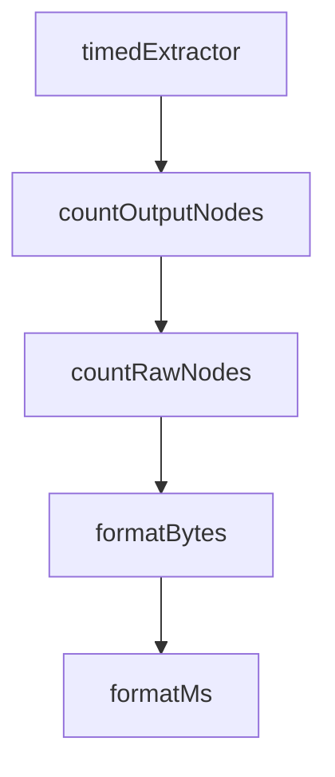

# Chapter 1: Getting Started

Welcome to **Chapter 1: Getting Started**. In this part of **Figma Context MCP Tutorial: Design-to-Code Workflows for Coding Agents**, you will build an intuitive mental model first, then move into concrete implementation details and practical production tradeoffs.


This chapter gets Figma Context MCP connected to your coding client with a working token and first design fetch.

## Learning Goals

- create and configure a Figma personal access token
- register MCP server in client config
- fetch context from a Figma frame URL
- validate first design-to-code prompt roundtrip

## Minimal MCP Config (macOS/Linux)

```json
{
  "mcpServers": {
    "Framelink MCP for Figma": {
      "command": "npx",
      "args": ["-y", "figma-developer-mcp", "--figma-api-key=YOUR-KEY", "--stdio"]
    }
  }
}
```

## Source References

- [Framelink Quickstart](https://www.framelink.ai/docs/quickstart)
- [Figma Token Docs](https://help.figma.com/hc/en-us/articles/8085703771159-Manage-personal-access-tokens)

## Summary

You now have a working MCP bridge between Figma and your coding assistant.

Next: [Chapter 2: Architecture and Context Translation](02-architecture-and-context-translation.md)

## Source Code Walkthrough

### `scripts/benchmark-simplify.ts`

The `timedExtractor` function in [`scripts/benchmark-simplify.ts`](https://github.com/GLips/Figma-Context-MCP/blob/HEAD/scripts/benchmark-simplify.ts) handles a key part of this chapter's functionality:

```ts
}

function timedExtractor(fn: ExtractorFn, timing: ExtractorTiming): ExtractorFn {
  return (node, result, context) => {
    const start = performance.now();
    fn(node, result, context);
    timing.totalMs += performance.now() - start;
    timing.calls++;
  };
}

function countOutputNodes(nodes: SimplifiedNode[]): number {
  let count = 0;
  for (const node of nodes) {
    count++;
    if (node.children) {
      count += countOutputNodes(node.children);
    }
  }
  return count;
}

/** Count objects with id+type fields recursively — rough estimate of Figma node count. */
function countRawNodes(obj: unknown): number {
  if (!obj || typeof obj !== "object") return 0;
  const record = obj as Record<string, unknown>;
  let count = 0;

  if ("id" in record && "type" in record) count = 1;

  for (const value of Object.values(record)) {
    if (Array.isArray(value)) {
```

This function is important because it defines how Figma Context MCP Tutorial: Design-to-Code Workflows for Coding Agents implements the patterns covered in this chapter.

### `scripts/benchmark-simplify.ts`

The `countOutputNodes` function in [`scripts/benchmark-simplify.ts`](https://github.com/GLips/Figma-Context-MCP/blob/HEAD/scripts/benchmark-simplify.ts) handles a key part of this chapter's functionality:

```ts
}

function countOutputNodes(nodes: SimplifiedNode[]): number {
  let count = 0;
  for (const node of nodes) {
    count++;
    if (node.children) {
      count += countOutputNodes(node.children);
    }
  }
  return count;
}

/** Count objects with id+type fields recursively — rough estimate of Figma node count. */
function countRawNodes(obj: unknown): number {
  if (!obj || typeof obj !== "object") return 0;
  const record = obj as Record<string, unknown>;
  let count = 0;

  if ("id" in record && "type" in record) count = 1;

  for (const value of Object.values(record)) {
    if (Array.isArray(value)) {
      for (const item of value) count += countRawNodes(item);
    } else if (value && typeof value === "object") {
      count += countRawNodes(value);
    }
  }

  return count;
}

```

This function is important because it defines how Figma Context MCP Tutorial: Design-to-Code Workflows for Coding Agents implements the patterns covered in this chapter.

### `scripts/benchmark-simplify.ts`

The `countRawNodes` function in [`scripts/benchmark-simplify.ts`](https://github.com/GLips/Figma-Context-MCP/blob/HEAD/scripts/benchmark-simplify.ts) handles a key part of this chapter's functionality:

```ts

/** Count objects with id+type fields recursively — rough estimate of Figma node count. */
function countRawNodes(obj: unknown): number {
  if (!obj || typeof obj !== "object") return 0;
  const record = obj as Record<string, unknown>;
  let count = 0;

  if ("id" in record && "type" in record) count = 1;

  for (const value of Object.values(record)) {
    if (Array.isArray(value)) {
      for (const item of value) count += countRawNodes(item);
    } else if (value && typeof value === "object") {
      count += countRawNodes(value);
    }
  }

  return count;
}

function formatBytes(bytes: number): string {
  if (bytes < 1024) return `${bytes} B`;
  if (bytes < 1024 * 1024) return `${(bytes / 1024).toFixed(1)} KB`;
  return `${(bytes / (1024 * 1024)).toFixed(1)} MB`;
}

function formatMs(ms: number): string {
  if (ms < 1000) return `${ms.toFixed(1)} ms`;
  return `${(ms / 1000).toFixed(2)} s`;
}

async function main() {
```

This function is important because it defines how Figma Context MCP Tutorial: Design-to-Code Workflows for Coding Agents implements the patterns covered in this chapter.

### `scripts/benchmark-simplify.ts`

The `formatBytes` function in [`scripts/benchmark-simplify.ts`](https://github.com/GLips/Figma-Context-MCP/blob/HEAD/scripts/benchmark-simplify.ts) handles a key part of this chapter's functionality:

```ts
}

function formatBytes(bytes: number): string {
  if (bytes < 1024) return `${bytes} B`;
  if (bytes < 1024 * 1024) return `${(bytes / 1024).toFixed(1)} KB`;
  return `${(bytes / (1024 * 1024)).toFixed(1)} MB`;
}

function formatMs(ms: number): string {
  if (ms < 1000) return `${ms.toFixed(1)} ms`;
  return `${(ms / 1000).toFixed(2)} s`;
}

async function main() {
  if (!existsSync(INPUT_PATH)) {
    console.error(
      `Input file not found: ${INPUT_PATH}\n\n` +
        `Run the server in dev mode and fetch a Figma file first.\n` +
        `The server writes raw API responses to logs/figma-raw.json.`,
    );
    process.exit(1);
  }

  let session: Session | undefined;
  if (PROFILE_FLAG) {
    session = new Session();
    session.connect();
    await session.post("Profiler.enable");
    await session.post("Profiler.start");
    console.log("CPU profiler started\n");
  }

```

This function is important because it defines how Figma Context MCP Tutorial: Design-to-Code Workflows for Coding Agents implements the patterns covered in this chapter.


## How These Components Connect


