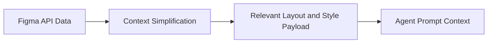

# Chapter 2: Architecture and Context Translation

The server's core value is context translation: raw Figma API responses are simplified before being sent to the model.

## Translation Pipeline

## Why Simplification Matters

- reduces irrelevant payload noise
- lowers token usage
- improves design fidelity in generated code

## Source References

- [Figma Context MCP README](https://github.com/GLips/Figma-Context-MCP)

## Summary

You now understand the transformation layer that makes MCP design context effective for coding agents.

Next: [Chapter 3: Frame Targeting and Context Scope](03-frame-targeting-and-context-scope.md)
