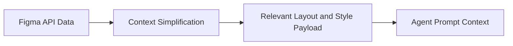
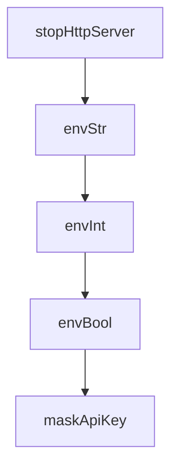

# Chapter 2: Architecture and Context Translation

Welcome to **Chapter 2: Architecture and Context Translation**. In this part of **Figma Context MCP Tutorial: Design-to-Code Workflows for Coding Agents**, you will build an intuitive mental model first, then move into concrete implementation details and practical production tradeoffs.


The server's core value is context translation: raw Figma API responses are simplified before being sent to the model.

## Translation Pipeline


```mermaid
flowchart LR
    A[Figma API Data] --> B[Context Simplification]
    B --> C[Relevant Layout and Style Payload]
    C --> D[Agent Prompt Context]
```

## Why Simplification Matters

- reduces irrelevant payload noise
- lowers token usage
- improves design fidelity in generated code

## Source References

- [Figma Context MCP README](https://github.com/GLips/Figma-Context-MCP)

## Summary

You now understand the transformation layer that makes MCP design context effective for coding agents.

Next: [Chapter 3: Frame Targeting and Context Scope](03-frame-targeting-and-context-scope.md)

## Source Code Walkthrough

### `src/server.ts`

The `stopHttpServer` function in [`src/server.ts`](https://github.com/GLips/Figma-Context-MCP/blob/HEAD/src/server.ts) handles a key part of this chapter's functionality:

```ts
    process.on("SIGINT", async () => {
      Logger.log("Shutting down server...");
      await stopHttpServer();
      Logger.log("Server shutdown complete");
      process.exit(0);
    });
  }
}

export async function startHttpServer(
  host: string,
  port: number,
  createMcpServer: () => McpServer,
): Promise<Server> {
  if (httpServer) {
    throw new Error("HTTP server is already running");
  }

  const app = createMcpExpressApp({ host });

  const handlePost = async (req: Request, res: Response) => {
    Logger.log("Received StreamableHTTP request");
    const transport = new StreamableHTTPServerTransport({ sessionIdGenerator: undefined });
    const mcpServer = createMcpServer();
    const conn: ActiveConnection = { transport, server: mcpServer };
    activeConnections.add(conn);
    res.on("close", () => {
      activeConnections.delete(conn);
      transport.close();
      mcpServer.close();
    });
    await mcpServer.connect(transport);
```

This function is important because it defines how Figma Context MCP Tutorial: Design-to-Code Workflows for Coding Agents implements the patterns covered in this chapter.

### `src/config.ts`

The `envStr` function in [`src/config.ts`](https://github.com/GLips/Figma-Context-MCP/blob/HEAD/src/config.ts) handles a key part of this chapter's functionality:

```ts
}

function envStr(name: string): string | undefined {
  return process.env[name] || undefined;
}

function envInt(...names: string[]): number | undefined {
  for (const name of names) {
    const val = process.env[name];
    if (val) return parseInt(val, 10);
  }
  return undefined;
}

function envBool(name: string): boolean | undefined {
  const val = process.env[name];
  if (val === "true") return true;
  if (val === "false") return false;
  return undefined;
}

function maskApiKey(key: string): string {
  if (!key || key.length <= 4) return "****";
  return `****${key.slice(-4)}`;
}

export function getServerConfig(): ServerConfig {
  const argv = cli({
    name: "figma-developer-mcp",
    version: process.env.NPM_PACKAGE_VERSION ?? "unknown",
    flags: {
      figmaApiKey: {
```

This function is important because it defines how Figma Context MCP Tutorial: Design-to-Code Workflows for Coding Agents implements the patterns covered in this chapter.

### `src/config.ts`

The `envInt` function in [`src/config.ts`](https://github.com/GLips/Figma-Context-MCP/blob/HEAD/src/config.ts) handles a key part of this chapter's functionality:

```ts
}

function envInt(...names: string[]): number | undefined {
  for (const name of names) {
    const val = process.env[name];
    if (val) return parseInt(val, 10);
  }
  return undefined;
}

function envBool(name: string): boolean | undefined {
  const val = process.env[name];
  if (val === "true") return true;
  if (val === "false") return false;
  return undefined;
}

function maskApiKey(key: string): string {
  if (!key || key.length <= 4) return "****";
  return `****${key.slice(-4)}`;
}

export function getServerConfig(): ServerConfig {
  const argv = cli({
    name: "figma-developer-mcp",
    version: process.env.NPM_PACKAGE_VERSION ?? "unknown",
    flags: {
      figmaApiKey: {
        type: String,
        description: "Figma API key (Personal Access Token)",
      },
      figmaOauthToken: {
```

This function is important because it defines how Figma Context MCP Tutorial: Design-to-Code Workflows for Coding Agents implements the patterns covered in this chapter.

### `src/config.ts`

The `envBool` function in [`src/config.ts`](https://github.com/GLips/Figma-Context-MCP/blob/HEAD/src/config.ts) handles a key part of this chapter's functionality:

```ts
}

function envBool(name: string): boolean | undefined {
  const val = process.env[name];
  if (val === "true") return true;
  if (val === "false") return false;
  return undefined;
}

function maskApiKey(key: string): string {
  if (!key || key.length <= 4) return "****";
  return `****${key.slice(-4)}`;
}

export function getServerConfig(): ServerConfig {
  const argv = cli({
    name: "figma-developer-mcp",
    version: process.env.NPM_PACKAGE_VERSION ?? "unknown",
    flags: {
      figmaApiKey: {
        type: String,
        description: "Figma API key (Personal Access Token)",
      },
      figmaOauthToken: {
        type: String,
        description: "Figma OAuth Bearer token",
      },
      env: {
        type: String,
        description: "Path to custom .env file to load environment variables from",
      },
      port: {
```

This function is important because it defines how Figma Context MCP Tutorial: Design-to-Code Workflows for Coding Agents implements the patterns covered in this chapter.


## How These Components Connect


```mermaid
flowchart TD
    A[stopHttpServer]
    B[envStr]
    C[envInt]
    D[envBool]
    E[maskApiKey]
    A --> B
    B --> C
    C --> D
    D --> E
```
