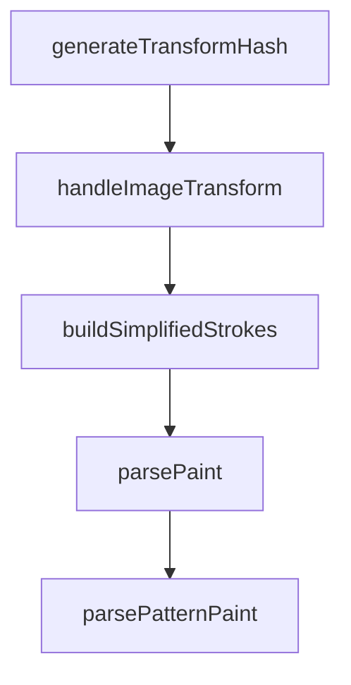

# Chapter 3: Frame Targeting and Context Scope

Welcome to **Chapter 3: Frame Targeting and Context Scope**. In this part of **Figma Context MCP Tutorial: Design-to-Code Workflows for Coding Agents**, you will build an intuitive mental model first, then move into concrete implementation details and practical production tradeoffs.


Accurate implementation depends on precise frame selection and scoped context extraction.

## Scope Rules

| Rule | Benefit |
|:-----|:--------|
| target specific frame/group URLs | avoids over-broad context |
| split large designs into segments | improves determinism |
| align scope with component boundaries | cleaner generated structure |

## Summary

You now have practical scoping techniques that improve one-shot implementation quality.

Next: [Chapter 4: Prompt Patterns for One-Shot UI Implementation](04-prompt-patterns-for-one-shot-ui-implementation.md)

## Depth Expansion Playbook

## Source Code Walkthrough

### `src/transformers/style.ts`

The `generateTransformHash` function in [`src/transformers/style.ts`](https://github.com/GLips/Figma-Context-MCP/blob/HEAD/src/transformers/style.ts) handles a key part of this chapter's functionality:

```ts
 * @returns Short hash string for filename suffix
 */
function generateTransformHash(transform: Transform): string {
  const values = transform.flat();
  const hash = values.reduce((acc, val) => {
    // Simple hash function - convert to string and create checksum
    const str = val.toString();
    for (let i = 0; i < str.length; i++) {
      acc = ((acc << 5) - acc + str.charCodeAt(i)) & 0xffffffff;
    }
    return acc;
  }, 0);

  // Convert to positive hex string, take first 6 chars
  return Math.abs(hash).toString(16).substring(0, 6);
}

/**
 * Handle imageTransform for post-processing (not CSS translation)
 *
 * When Figma includes an imageTransform matrix, it means the image is cropped/transformed.
 * This function converts the transform into processing instructions for Sharp.
 *
 * @param imageTransform - Figma's 2x3 transform matrix [[scaleX, skewX, translateX], [skewY, scaleY, translateY]]
 * @returns Processing metadata for image cropping
 */
function handleImageTransform(
  imageTransform: Transform,
): NonNullable<SimplifiedImageFill["imageDownloadArguments"]> {
  const transformHash = generateTransformHash(imageTransform);
  return {
    needsCropping: true,
```

This function is important because it defines how Figma Context MCP Tutorial: Design-to-Code Workflows for Coding Agents implements the patterns covered in this chapter.

### `src/transformers/style.ts`

The `handleImageTransform` function in [`src/transformers/style.ts`](https://github.com/GLips/Figma-Context-MCP/blob/HEAD/src/transformers/style.ts) handles a key part of this chapter's functionality:

```ts
 * @returns Processing metadata for image cropping
 */
function handleImageTransform(
  imageTransform: Transform,
): NonNullable<SimplifiedImageFill["imageDownloadArguments"]> {
  const transformHash = generateTransformHash(imageTransform);
  return {
    needsCropping: true,
    requiresImageDimensions: false,
    cropTransform: imageTransform,
    filenameSuffix: `${transformHash}`,
  };
}

/**
 * Build simplified stroke information from a Figma node
 *
 * @param n - The Figma node to extract stroke information from
 * @param hasChildren - Whether the node has children (affects paint processing)
 * @returns Simplified stroke object with colors and properties
 */
export function buildSimplifiedStrokes(
  n: FigmaDocumentNode,
  hasChildren: boolean = false,
): SimplifiedStroke {
  let strokes: SimplifiedStroke = { colors: [] };
  if (hasValue("strokes", n) && Array.isArray(n.strokes) && n.strokes.length) {
    strokes.colors = n.strokes.filter(isVisible).map((stroke) => parsePaint(stroke, hasChildren));
  }

  if (hasValue("strokeWeight", n) && typeof n.strokeWeight === "number" && n.strokeWeight > 0) {
    strokes.strokeWeight = `${n.strokeWeight}px`;
```

This function is important because it defines how Figma Context MCP Tutorial: Design-to-Code Workflows for Coding Agents implements the patterns covered in this chapter.

### `src/transformers/style.ts`

The `buildSimplifiedStrokes` function in [`src/transformers/style.ts`](https://github.com/GLips/Figma-Context-MCP/blob/HEAD/src/transformers/style.ts) handles a key part of this chapter's functionality:

```ts
 * @returns Simplified stroke object with colors and properties
 */
export function buildSimplifiedStrokes(
  n: FigmaDocumentNode,
  hasChildren: boolean = false,
): SimplifiedStroke {
  let strokes: SimplifiedStroke = { colors: [] };
  if (hasValue("strokes", n) && Array.isArray(n.strokes) && n.strokes.length) {
    strokes.colors = n.strokes.filter(isVisible).map((stroke) => parsePaint(stroke, hasChildren));
  }

  if (hasValue("strokeWeight", n) && typeof n.strokeWeight === "number" && n.strokeWeight > 0) {
    strokes.strokeWeight = `${n.strokeWeight}px`;
  }

  if (hasValue("strokeDashes", n) && Array.isArray(n.strokeDashes) && n.strokeDashes.length) {
    strokes.strokeDashes = n.strokeDashes;
  }

  if (hasValue("individualStrokeWeights", n, isStrokeWeights)) {
    strokes.strokeWeight = generateCSSShorthand(n.individualStrokeWeights);
  }

  return strokes;
}

/**
 * Convert a Figma paint (solid, image, gradient) to a SimplifiedFill
 * @param raw - The Figma paint to convert
 * @param hasChildren - Whether the node has children (determines CSS properties)
 * @returns The converted SimplifiedFill
 */
```

This function is important because it defines how Figma Context MCP Tutorial: Design-to-Code Workflows for Coding Agents implements the patterns covered in this chapter.

### `src/transformers/style.ts`

The `parsePaint` function in [`src/transformers/style.ts`](https://github.com/GLips/Figma-Context-MCP/blob/HEAD/src/transformers/style.ts) handles a key part of this chapter's functionality:

```ts
  let strokes: SimplifiedStroke = { colors: [] };
  if (hasValue("strokes", n) && Array.isArray(n.strokes) && n.strokes.length) {
    strokes.colors = n.strokes.filter(isVisible).map((stroke) => parsePaint(stroke, hasChildren));
  }

  if (hasValue("strokeWeight", n) && typeof n.strokeWeight === "number" && n.strokeWeight > 0) {
    strokes.strokeWeight = `${n.strokeWeight}px`;
  }

  if (hasValue("strokeDashes", n) && Array.isArray(n.strokeDashes) && n.strokeDashes.length) {
    strokes.strokeDashes = n.strokeDashes;
  }

  if (hasValue("individualStrokeWeights", n, isStrokeWeights)) {
    strokes.strokeWeight = generateCSSShorthand(n.individualStrokeWeights);
  }

  return strokes;
}

/**
 * Convert a Figma paint (solid, image, gradient) to a SimplifiedFill
 * @param raw - The Figma paint to convert
 * @param hasChildren - Whether the node has children (determines CSS properties)
 * @returns The converted SimplifiedFill
 */
export function parsePaint(raw: Paint, hasChildren: boolean = false): SimplifiedFill {
  if (raw.type === "IMAGE") {
    const baseImageFill: SimplifiedImageFill = {
      type: "IMAGE",
      imageRef: raw.imageRef,
      ...(raw.gifRef ? { gifRef: raw.gifRef } : {}),
```

This function is important because it defines how Figma Context MCP Tutorial: Design-to-Code Workflows for Coding Agents implements the patterns covered in this chapter.


## How These Components Connect


