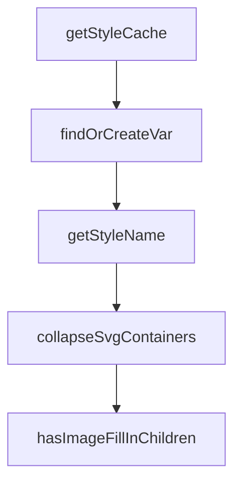

# Chapter 3: Frame Targeting and Context Scope

Welcome to **Chapter 3: Frame Targeting and Context Scope**. In this part of **Figma Context MCP Tutorial: Design-to-Code Workflows for Coding Agents**, you will build an intuitive mental model first, then move into concrete implementation details and practical production tradeoffs.


Accurate implementation depends on precise frame selection and scoped context extraction.

## Scope Rules

| Rule | Benefit |
|:-----|:--------|
| target specific frame/group URLs | avoids over-broad context |
| split large designs into segments | improves determinism |
| align scope with component boundaries | cleaner generated structure |

## Summary

You now have practical scoping techniques that improve one-shot implementation quality.

Next: [Chapter 4: Prompt Patterns for One-Shot UI Implementation](04-prompt-patterns-for-one-shot-ui-implementation.md)

## Source Code Walkthrough

### `src/extractors/built-in.ts`

The `getStyleCache` function in [`src/extractors/built-in.ts`](https://github.com/GLips/Figma-Context-MCP/blob/HEAD/src/extractors/built-in.ts) handles a key part of this chapter's functionality:

```ts
const styleCaches = new WeakMap<GlobalVars, Map<string, string>>();

function getStyleCache(globalVars: GlobalVars): Map<string, string> {
  let cache = styleCaches.get(globalVars);
  if (!cache) {
    cache = new Map();
    styleCaches.set(globalVars, cache);
  }
  return cache;
}

/**
 * Find an existing global style variable with the same value, or create one.
 */
function findOrCreateVar(globalVars: GlobalVars, value: StyleTypes, prefix: string): string {
  const cache = getStyleCache(globalVars);
  const key = JSON.stringify(value);

  const existing = cache.get(key);
  if (existing) return existing;

  const varId = generateVarId(prefix);
  globalVars.styles[varId] = value;
  cache.set(key, varId);
  return varId;
}

/**
 * Extracts layout-related properties from a node.
 */
export const layoutExtractor: ExtractorFn = (node, result, context) => {
  const layout = buildSimplifiedLayout(node, context.parent);
```

This function is important because it defines how Figma Context MCP Tutorial: Design-to-Code Workflows for Coding Agents implements the patterns covered in this chapter.

### `src/extractors/built-in.ts`

The `findOrCreateVar` function in [`src/extractors/built-in.ts`](https://github.com/GLips/Figma-Context-MCP/blob/HEAD/src/extractors/built-in.ts) handles a key part of this chapter's functionality:

```ts
 * Find an existing global style variable with the same value, or create one.
 */
function findOrCreateVar(globalVars: GlobalVars, value: StyleTypes, prefix: string): string {
  const cache = getStyleCache(globalVars);
  const key = JSON.stringify(value);

  const existing = cache.get(key);
  if (existing) return existing;

  const varId = generateVarId(prefix);
  globalVars.styles[varId] = value;
  cache.set(key, varId);
  return varId;
}

/**
 * Extracts layout-related properties from a node.
 */
export const layoutExtractor: ExtractorFn = (node, result, context) => {
  const layout = buildSimplifiedLayout(node, context.parent);
  if (Object.keys(layout).length > 1) {
    result.layout = findOrCreateVar(context.globalVars, layout, "layout");
  }
};

/**
 * Extracts text content and text styling from a node.
 */
export const textExtractor: ExtractorFn = (node, result, context) => {
  // Extract text content
  if (isTextNode(node)) {
    result.text = extractNodeText(node);
```

This function is important because it defines how Figma Context MCP Tutorial: Design-to-Code Workflows for Coding Agents implements the patterns covered in this chapter.

### `src/extractors/built-in.ts`

The `getStyleName` function in [`src/extractors/built-in.ts`](https://github.com/GLips/Figma-Context-MCP/blob/HEAD/src/extractors/built-in.ts) handles a key part of this chapter's functionality:

```ts
    if (textStyle) {
      // Prefer Figma named style when available
      const styleName = getStyleName(node, context, ["text", "typography"]);
      if (styleName) {
        context.globalVars.styles[styleName] = textStyle;
        result.textStyle = styleName;
      } else {
        result.textStyle = findOrCreateVar(context.globalVars, textStyle, "style");
      }
    }
  }
};

/**
 * Extracts visual appearance properties (fills, strokes, effects, opacity, border radius).
 */
export const visualsExtractor: ExtractorFn = (node, result, context) => {
  // Check if node has children to determine CSS properties
  const hasChildren =
    hasValue("children", node) && Array.isArray(node.children) && node.children.length > 0;

  // fills
  if (hasValue("fills", node) && Array.isArray(node.fills) && node.fills.length) {
    const fills = node.fills.map((fill) => parsePaint(fill, hasChildren)).reverse();
    const styleName = getStyleName(node, context, ["fill", "fills"]);
    if (styleName) {
      context.globalVars.styles[styleName] = fills;
      result.fills = styleName;
    } else {
      result.fills = findOrCreateVar(context.globalVars, fills, "fill");
    }
  }
```

This function is important because it defines how Figma Context MCP Tutorial: Design-to-Code Workflows for Coding Agents implements the patterns covered in this chapter.

### `src/extractors/built-in.ts`

The `collapseSvgContainers` function in [`src/extractors/built-in.ts`](https://github.com/GLips/Figma-Context-MCP/blob/HEAD/src/extractors/built-in.ts) handles a key part of this chapter's functionality:

```ts
 * @returns Children to include (empty array if collapsed)
 */
export function collapseSvgContainers(
  node: FigmaDocumentNode,
  result: SimplifiedNode,
  children: SimplifiedNode[],
): SimplifiedNode[] {
  const allChildrenAreSvgEligible = children.every((child) => SVG_ELIGIBLE_TYPES.has(child.type));

  if (
    (node.type === "FRAME" ||
      node.type === "GROUP" ||
      node.type === "INSTANCE" ||
      node.type === "BOOLEAN_OPERATION") &&
    allChildrenAreSvgEligible &&
    !hasImageFillInChildren(node)
  ) {
    // Collapse to IMAGE-SVG and omit children
    result.type = "IMAGE-SVG";
    return [];
  }

  // Include all children normally
  return children;
}

/**
 * Check whether a node or its direct children have image fills.
 *
 * Only direct children need checking because afterChildren runs bottom-up:
 * if a deeper descendant has image fills, its parent won't collapse (stays FRAME),
 * and FRAME isn't SVG-eligible, so the chain breaks naturally at each level.
```

This function is important because it defines how Figma Context MCP Tutorial: Design-to-Code Workflows for Coding Agents implements the patterns covered in this chapter.


## How These Components Connect


