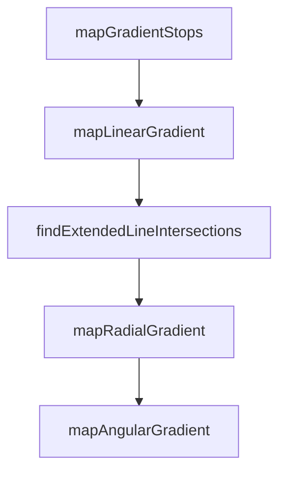

# Chapter 4: Prompt Patterns for One-Shot UI Implementation

Welcome to **Chapter 4: Prompt Patterns for One-Shot UI Implementation**. In this part of **Figma Context MCP Tutorial: Design-to-Code Workflows for Coding Agents**, you will build an intuitive mental model first, then move into concrete implementation details and practical production tradeoffs.


Prompt quality is the multiplier for design context quality.

## High-Value Prompt Structure

1. include frame URL and target framework
2. request semantic component decomposition
3. specify responsive behavior and constraints
4. require accessibility and design token alignment

## Common Prompt Mistakes

- asking for full app generation from entire file root
- omitting framework or styling constraints
- ignoring spacing, typography, and state variants

## Summary

You now have prompt patterns that convert design context into higher-fidelity code output.

Next: [Chapter 5: MCP Client Integrations](05-mcp-client-integrations.md)

## Depth Expansion Playbook

## Source Code Walkthrough

### `src/transformers/style.ts`

The `mapGradientStops` function in [`src/transformers/style.ts`](https://github.com/GLips/Figma-Context-MCP/blob/HEAD/src/transformers/style.ts) handles a key part of this chapter's functionality:

```ts
 * Map gradient stops from Figma's handle-based coordinate system to CSS percentages
 */
function mapGradientStops(
  gradient: Extract<
    Paint,
    { type: "GRADIENT_LINEAR" | "GRADIENT_RADIAL" | "GRADIENT_ANGULAR" | "GRADIENT_DIAMOND" }
  >,
  elementBounds: { width: number; height: number } = { width: 1, height: 1 },
): { stops: string; cssGeometry: string } {
  const handles = gradient.gradientHandlePositions;
  if (!handles || handles.length < 2) {
    const stops = gradient.gradientStops
      .map(({ position, color }) => {
        const cssColor = formatRGBAColor(color, 1);
        return `${cssColor} ${Math.round(position * 100)}%`;
      })
      .join(", ");
    return { stops, cssGeometry: "0deg" };
  }

  const [handle1, handle2, handle3] = handles;

  switch (gradient.type) {
    case "GRADIENT_LINEAR": {
      return mapLinearGradient(gradient.gradientStops, handle1, handle2, elementBounds);
    }
    case "GRADIENT_RADIAL": {
      return mapRadialGradient(gradient.gradientStops, handle1, handle2, handle3, elementBounds);
    }
    case "GRADIENT_ANGULAR": {
      return mapAngularGradient(gradient.gradientStops, handle1, handle2, handle3, elementBounds);
    }
```

This function is important because it defines how Figma Context MCP Tutorial: Design-to-Code Workflows for Coding Agents implements the patterns covered in this chapter.

### `src/transformers/style.ts`

The `mapLinearGradient` function in [`src/transformers/style.ts`](https://github.com/GLips/Figma-Context-MCP/blob/HEAD/src/transformers/style.ts) handles a key part of this chapter's functionality:

```ts
  switch (gradient.type) {
    case "GRADIENT_LINEAR": {
      return mapLinearGradient(gradient.gradientStops, handle1, handle2, elementBounds);
    }
    case "GRADIENT_RADIAL": {
      return mapRadialGradient(gradient.gradientStops, handle1, handle2, handle3, elementBounds);
    }
    case "GRADIENT_ANGULAR": {
      return mapAngularGradient(gradient.gradientStops, handle1, handle2, handle3, elementBounds);
    }
    case "GRADIENT_DIAMOND": {
      return mapDiamondGradient(gradient.gradientStops, handle1, handle2, handle3, elementBounds);
    }
    default: {
      const stops = gradient.gradientStops
        .map(({ position, color }) => {
          const cssColor = formatRGBAColor(color, 1);
          return `${cssColor} ${Math.round(position * 100)}%`;
        })
        .join(", ");
      return { stops, cssGeometry: "0deg" };
    }
  }
}

/**
 * Map linear gradient from Figma handles to CSS
 */
function mapLinearGradient(
  gradientStops: { position: number; color: RGBA }[],
  start: Vector,
  end: Vector,
```

This function is important because it defines how Figma Context MCP Tutorial: Design-to-Code Workflows for Coding Agents implements the patterns covered in this chapter.

### `src/transformers/style.ts`

The `findExtendedLineIntersections` function in [`src/transformers/style.ts`](https://github.com/GLips/Figma-Context-MCP/blob/HEAD/src/transformers/style.ts) handles a key part of this chapter's functionality:

```ts

  // Find where the extended gradient line intersects the element boundaries
  const extendedIntersections = findExtendedLineIntersections(start, end);

  if (extendedIntersections.length >= 2) {
    // The gradient line extended to fill the element
    const fullLineStart = Math.min(extendedIntersections[0], extendedIntersections[1]);
    const fullLineEnd = Math.max(extendedIntersections[0], extendedIntersections[1]);
    // Map gradient stops from the Figma line segment to the full CSS line
    const mappedStops = gradientStops.map(({ position, color }) => {
      const cssColor = formatRGBAColor(color, 1);

      // Position along the Figma gradient line (0 = start handle, 1 = end handle)
      const figmaLinePosition = position;

      // The Figma line spans from t=0 to t=1
      // The full extended line spans from fullLineStart to fullLineEnd
      // Map the figma position to the extended line
      const tOnExtendedLine = figmaLinePosition * (1 - 0) + 0; // This is just figmaLinePosition
      const extendedPosition = (tOnExtendedLine - fullLineStart) / (fullLineEnd - fullLineStart);
      const clampedPosition = Math.max(0, Math.min(1, extendedPosition));

      return `${cssColor} ${Math.round(clampedPosition * 100)}%`;
    });

    return {
      stops: mappedStops.join(", "),
      cssGeometry: `${Math.round(angle)}deg`,
    };
  }

  // Fallback to simple gradient if intersection calculation fails
```

This function is important because it defines how Figma Context MCP Tutorial: Design-to-Code Workflows for Coding Agents implements the patterns covered in this chapter.

### `src/transformers/style.ts`

The `mapRadialGradient` function in [`src/transformers/style.ts`](https://github.com/GLips/Figma-Context-MCP/blob/HEAD/src/transformers/style.ts) handles a key part of this chapter's functionality:

```ts
    }
    case "GRADIENT_RADIAL": {
      return mapRadialGradient(gradient.gradientStops, handle1, handle2, handle3, elementBounds);
    }
    case "GRADIENT_ANGULAR": {
      return mapAngularGradient(gradient.gradientStops, handle1, handle2, handle3, elementBounds);
    }
    case "GRADIENT_DIAMOND": {
      return mapDiamondGradient(gradient.gradientStops, handle1, handle2, handle3, elementBounds);
    }
    default: {
      const stops = gradient.gradientStops
        .map(({ position, color }) => {
          const cssColor = formatRGBAColor(color, 1);
          return `${cssColor} ${Math.round(position * 100)}%`;
        })
        .join(", ");
      return { stops, cssGeometry: "0deg" };
    }
  }
}

/**
 * Map linear gradient from Figma handles to CSS
 */
function mapLinearGradient(
  gradientStops: { position: number; color: RGBA }[],
  start: Vector,
  end: Vector,
  _elementBounds: { width: number; height: number },
): { stops: string; cssGeometry: string } {
  // Calculate the gradient line in element space
```

This function is important because it defines how Figma Context MCP Tutorial: Design-to-Code Workflows for Coding Agents implements the patterns covered in this chapter.


## How These Components Connect


