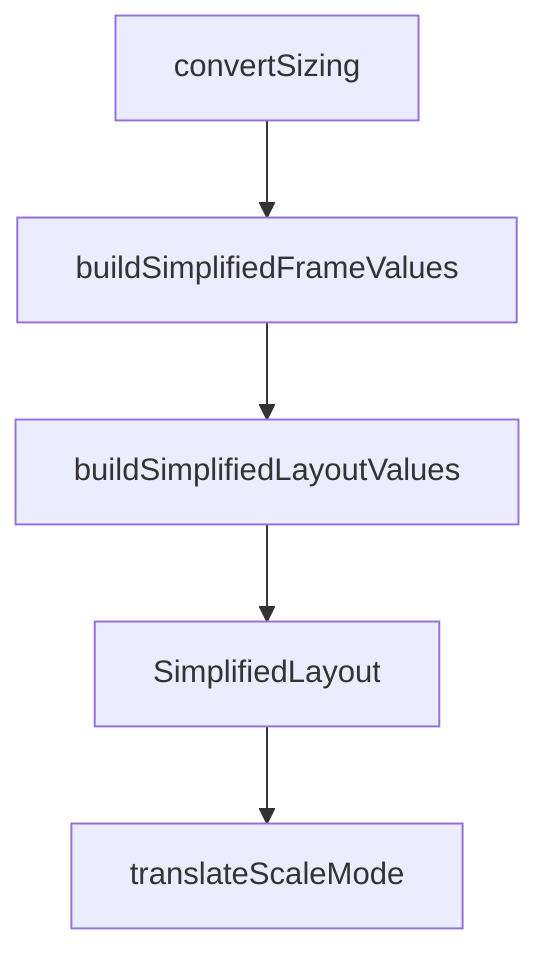

# Chapter 4: Prompt Patterns for One-Shot UI Implementation

Welcome to **Chapter 4: Prompt Patterns for One-Shot UI Implementation**. In this part of **Figma Context MCP Tutorial: Design-to-Code Workflows for Coding Agents**, you will build an intuitive mental model first, then move into concrete implementation details and practical production tradeoffs.


Prompt quality is the multiplier for design context quality.

## High-Value Prompt Structure

1. include frame URL and target framework
2. request semantic component decomposition
3. specify responsive behavior and constraints
4. require accessibility and design token alignment

## Common Prompt Mistakes

- asking for full app generation from entire file root
- omitting framework or styling constraints
- ignoring spacing, typography, and state variants

## Summary

You now have prompt patterns that convert design context into higher-fidelity code output.

Next: [Chapter 5: MCP Client Integrations](05-mcp-client-integrations.md)

## Source Code Walkthrough

### `src/transformers/layout.ts`

The `convertSizing` function in [`src/transformers/layout.ts`](https://github.com/GLips/Figma-Context-MCP/blob/HEAD/src/transformers/layout.ts) handles a key part of this chapter's functionality:

```ts

// interpret sizing
function convertSizing(
  s?: HasLayoutTrait["layoutSizingHorizontal"] | HasLayoutTrait["layoutSizingVertical"],
) {
  if (s === "FIXED") return "fixed";
  if (s === "FILL") return "fill";
  if (s === "HUG") return "hug";
  return undefined;
}

function buildSimplifiedFrameValues(n: FigmaDocumentNode): SimplifiedLayout | { mode: "none" } {
  if (!isFrame(n)) {
    return { mode: "none" };
  }

  const frameValues: SimplifiedLayout = {
    mode:
      !n.layoutMode || n.layoutMode === "NONE"
        ? "none"
        : n.layoutMode === "HORIZONTAL"
          ? "row"
          : "column",
  };

  const overflowScroll: SimplifiedLayout["overflowScroll"] = [];
  if (n.overflowDirection?.includes("HORIZONTAL")) overflowScroll.push("x");
  if (n.overflowDirection?.includes("VERTICAL")) overflowScroll.push("y");
  if (overflowScroll.length > 0) frameValues.overflowScroll = overflowScroll;

  if (frameValues.mode === "none") {
    return frameValues;
```

This function is important because it defines how Figma Context MCP Tutorial: Design-to-Code Workflows for Coding Agents implements the patterns covered in this chapter.

### `src/transformers/layout.ts`

The `buildSimplifiedFrameValues` function in [`src/transformers/layout.ts`](https://github.com/GLips/Figma-Context-MCP/blob/HEAD/src/transformers/layout.ts) handles a key part of this chapter's functionality:

```ts
  parent?: FigmaDocumentNode,
): SimplifiedLayout {
  const frameValues = buildSimplifiedFrameValues(n);
  const layoutValues = buildSimplifiedLayoutValues(n, parent, frameValues.mode) || {};

  return { ...frameValues, ...layoutValues };
}

function convertJustifyContent(align?: HasFramePropertiesTrait["primaryAxisAlignItems"]) {
  switch (align) {
    case "MIN":
      return undefined;
    case "MAX":
      return "flex-end";
    case "CENTER":
      return "center";
    case "SPACE_BETWEEN":
      return "space-between";
    default:
      return undefined;
  }
}

function convertAlignItems(
  align: HasFramePropertiesTrait["counterAxisAlignItems"] | undefined,
  children: FigmaDocumentNode[],
  mode: "row" | "column",
) {
  // Row cross-axis is vertical; column cross-axis is horizontal
  const crossSizing = mode === "row" ? "layoutSizingVertical" : "layoutSizingHorizontal";
  const allStretch =
    children.length > 0 &&
```

This function is important because it defines how Figma Context MCP Tutorial: Design-to-Code Workflows for Coding Agents implements the patterns covered in this chapter.

### `src/transformers/layout.ts`

The `buildSimplifiedLayoutValues` function in [`src/transformers/layout.ts`](https://github.com/GLips/Figma-Context-MCP/blob/HEAD/src/transformers/layout.ts) handles a key part of this chapter's functionality:

```ts
): SimplifiedLayout {
  const frameValues = buildSimplifiedFrameValues(n);
  const layoutValues = buildSimplifiedLayoutValues(n, parent, frameValues.mode) || {};

  return { ...frameValues, ...layoutValues };
}

function convertJustifyContent(align?: HasFramePropertiesTrait["primaryAxisAlignItems"]) {
  switch (align) {
    case "MIN":
      return undefined;
    case "MAX":
      return "flex-end";
    case "CENTER":
      return "center";
    case "SPACE_BETWEEN":
      return "space-between";
    default:
      return undefined;
  }
}

function convertAlignItems(
  align: HasFramePropertiesTrait["counterAxisAlignItems"] | undefined,
  children: FigmaDocumentNode[],
  mode: "row" | "column",
) {
  // Row cross-axis is vertical; column cross-axis is horizontal
  const crossSizing = mode === "row" ? "layoutSizingVertical" : "layoutSizingHorizontal";
  const allStretch =
    children.length > 0 &&
    children.every(
```

This function is important because it defines how Figma Context MCP Tutorial: Design-to-Code Workflows for Coding Agents implements the patterns covered in this chapter.

### `src/transformers/layout.ts`

The `SimplifiedLayout` interface in [`src/transformers/layout.ts`](https://github.com/GLips/Figma-Context-MCP/blob/HEAD/src/transformers/layout.ts) handles a key part of this chapter's functionality:

```ts
import { generateCSSShorthand, pixelRound } from "~/utils/common.js";

export interface SimplifiedLayout {
  mode: "none" | "row" | "column";
  justifyContent?: "flex-start" | "flex-end" | "center" | "space-between" | "baseline" | "stretch";
  alignItems?: "flex-start" | "flex-end" | "center" | "space-between" | "baseline" | "stretch";
  alignSelf?: "flex-start" | "flex-end" | "center" | "stretch";
  wrap?: boolean;
  gap?: string;
  locationRelativeToParent?: {
    x: number;
    y: number;
  };
  dimensions?: {
    width?: number;
    height?: number;
    aspectRatio?: number;
  };
  padding?: string;
  sizing?: {
    horizontal?: "fixed" | "fill" | "hug";
    vertical?: "fixed" | "fill" | "hug";
  };
  overflowScroll?: ("x" | "y")[];
  position?: "absolute";
}

// Convert Figma's layout config into a more typical flex-like schema
export function buildSimplifiedLayout(
  n: FigmaDocumentNode,
  parent?: FigmaDocumentNode,
): SimplifiedLayout {
```

This interface is important because it defines how Figma Context MCP Tutorial: Design-to-Code Workflows for Coding Agents implements the patterns covered in this chapter.


## How These Components Connect


