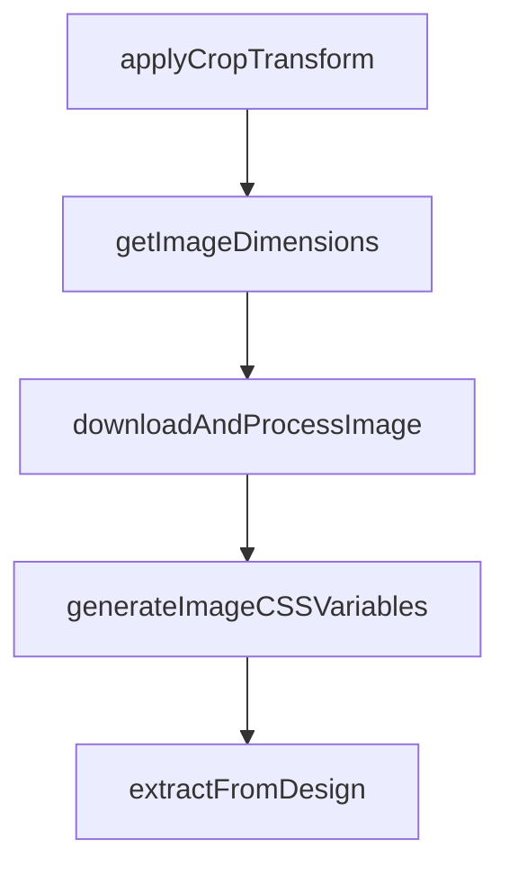

# Chapter 5: MCP Client Integrations

Welcome to **Chapter 5: MCP Client Integrations**. In this part of **Figma Context MCP Tutorial: Design-to-Code Workflows for Coding Agents**, you will build an intuitive mental model first, then move into concrete implementation details and practical production tradeoffs.


Figma Context MCP can be integrated into Cursor and other MCP-capable clients through standard configuration patterns.

## Integration Checklist

- register MCP server with token handling
- verify tool discovery in client
- test with known Figma frame
- establish local team config template

## Summary

You now know how to operationalize Figma Context MCP across coding-agent clients.

Next: [Chapter 6: Performance and Token Optimization](06-performance-and-token-optimization.md)

## Depth Expansion Playbook

## Source Code Walkthrough

### `src/utils/image-processing.ts`

The `applyCropTransform` function in [`src/utils/image-processing.ts`](https://github.com/GLips/Figma-Context-MCP/blob/HEAD/src/utils/image-processing.ts) handles a key part of this chapter's functionality:

```ts
 * @returns Promise<string> - Path to the cropped image
 */
export async function applyCropTransform(
  imagePath: string,
  cropTransform: Transform,
): Promise<string> {
  const { Logger } = await import("./logger.js");

  try {
    // Extract transform values (skew values intentionally unused for now)
    const scaleX = cropTransform[0]?.[0] ?? 1;
    const translateX = cropTransform[0]?.[2] ?? 0;
    const scaleY = cropTransform[1]?.[1] ?? 1;
    const translateY = cropTransform[1]?.[2] ?? 0;

    const image = await Jimp.read(imagePath);
    const { width, height } = image;

    // Calculate crop region based on transform matrix
    // Figma's transform matrix represents how the image is positioned within its container
    // We need to extract the visible portion based on the scaling and translation

    // The transform matrix defines the visible area as:
    // - scaleX/scaleY: how much of the original image is visible (0-1)
    // - translateX/translateY: offset of the visible area (0-1, relative to image size)

    const cropLeft = Math.max(0, Math.round(translateX * width));
    const cropTop = Math.max(0, Math.round(translateY * height));
    const cropWidth = Math.min(width - cropLeft, Math.round(scaleX * width));
    const cropHeight = Math.min(height - cropTop, Math.round(scaleY * height));

    if (cropWidth <= 0 || cropHeight <= 0) {
```

This function is important because it defines how Figma Context MCP Tutorial: Design-to-Code Workflows for Coding Agents implements the patterns covered in this chapter.

### `src/utils/image-processing.ts`

The `getImageDimensions` function in [`src/utils/image-processing.ts`](https://github.com/GLips/Figma-Context-MCP/blob/HEAD/src/utils/image-processing.ts) handles a key part of this chapter's functionality:

```ts
 * @returns Promise<{width: number, height: number}>
 */
export async function getImageDimensions(imagePath: string): Promise<{
  width: number;
  height: number;
}> {
  const image = await Jimp.read(imagePath);
  return { width: image.width, height: image.height };
}

export type ImageProcessingResult = {
  filePath: string;
  originalDimensions: { width: number; height: number };
  finalDimensions: { width: number; height: number };
  wasCropped: boolean;
  cropRegion?: { left: number; top: number; width: number; height: number };
  cssVariables?: string;
  processingLog: string[];
};

/**
 * Enhanced image download with post-processing
 * @param fileName - The filename to save as
 * @param localPath - The local path to save to
 * @param imageUrl - Image URL
 * @param needsCropping - Whether to apply crop transform
 * @param cropTransform - Transform matrix for cropping
 * @param requiresImageDimensions - Whether to generate dimension metadata
 * @returns Promise<ImageProcessingResult> - Detailed processing information
 */
export async function downloadAndProcessImage(
  fileName: string,
```

This function is important because it defines how Figma Context MCP Tutorial: Design-to-Code Workflows for Coding Agents implements the patterns covered in this chapter.

### `src/utils/image-processing.ts`

The `downloadAndProcessImage` function in [`src/utils/image-processing.ts`](https://github.com/GLips/Figma-Context-MCP/blob/HEAD/src/utils/image-processing.ts) handles a key part of this chapter's functionality:

```ts
 * @returns Promise<ImageProcessingResult> - Detailed processing information
 */
export async function downloadAndProcessImage(
  fileName: string,
  localPath: string,
  imageUrl: string,
  needsCropping: boolean = false,
  cropTransform?: Transform,
  requiresImageDimensions: boolean = false,
): Promise<ImageProcessingResult> {
  const { Logger } = await import("./logger.js");
  const processingLog: string[] = [];

  // First download the original image
  const { downloadFigmaImage } = await import("./common.js");
  const originalPath = await downloadFigmaImage(fileName, localPath, imageUrl);
  Logger.log(`Downloaded original image: ${originalPath}`);

  // SVGs are vector — jimp can't read them and cropping/dimensions don't apply
  const isSvg = fileName.toLowerCase().endsWith(".svg");
  if (isSvg) {
    return {
      filePath: originalPath,
      originalDimensions: { width: 0, height: 0 },
      finalDimensions: { width: 0, height: 0 },
      wasCropped: false,
      processingLog,
    };
  }

  // Get original dimensions before any processing
  const originalDimensions = await getImageDimensions(originalPath);
```

This function is important because it defines how Figma Context MCP Tutorial: Design-to-Code Workflows for Coding Agents implements the patterns covered in this chapter.

### `src/utils/image-processing.ts`

The `generateImageCSSVariables` function in [`src/utils/image-processing.ts`](https://github.com/GLips/Figma-Context-MCP/blob/HEAD/src/utils/image-processing.ts) handles a key part of this chapter's functionality:

```ts
  let cssVariables: string | undefined;
  if (requiresImageDimensions) {
    cssVariables = generateImageCSSVariables(finalDimensions);
  }

  return {
    filePath: finalPath,
    originalDimensions,
    finalDimensions,
    wasCropped,
    cropRegion,
    cssVariables,
    processingLog,
  };
}

/**
 * Create CSS custom properties for image dimensions
 * @param imagePath - Path to the image file
 * @returns Promise<string> - CSS custom properties
 */
export function generateImageCSSVariables({
  width,
  height,
}: {
  width: number;
  height: number;
}): string {
  return `--original-width: ${width}px; --original-height: ${height}px;`;
}

```

This function is important because it defines how Figma Context MCP Tutorial: Design-to-Code Workflows for Coding Agents implements the patterns covered in this chapter.


## How These Components Connect


